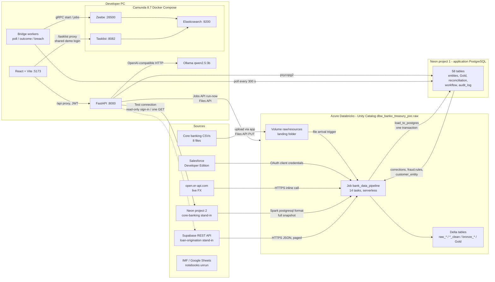
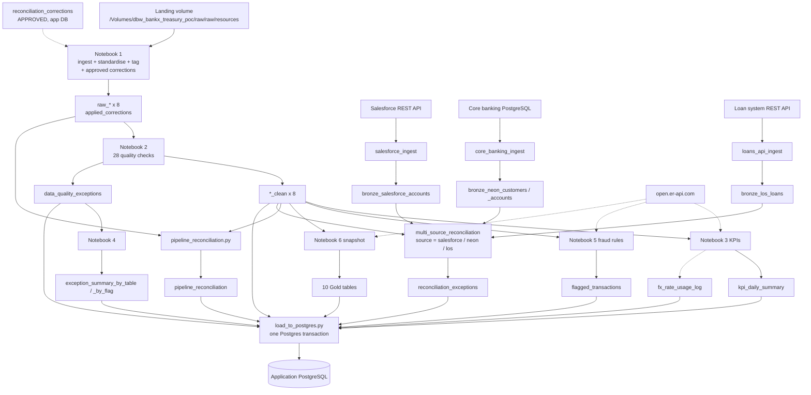
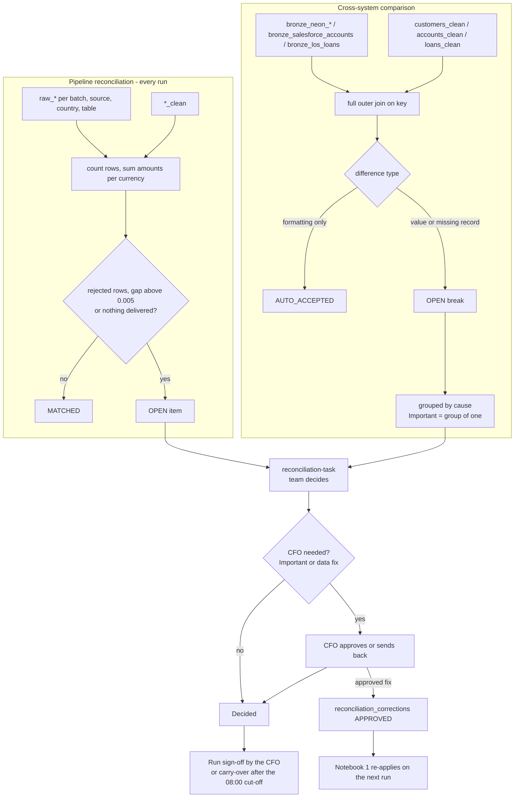
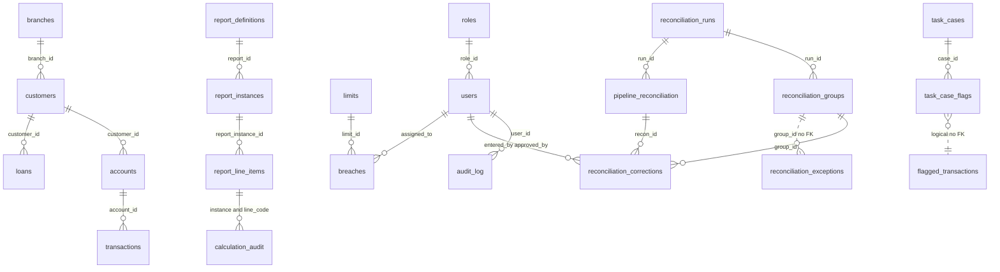
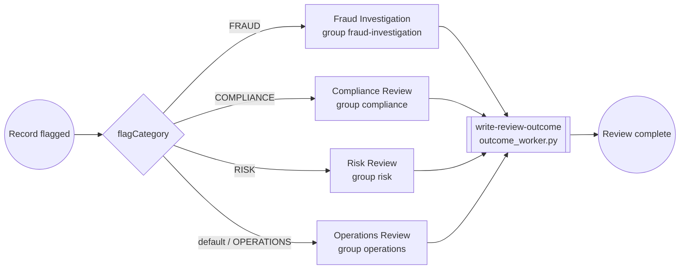
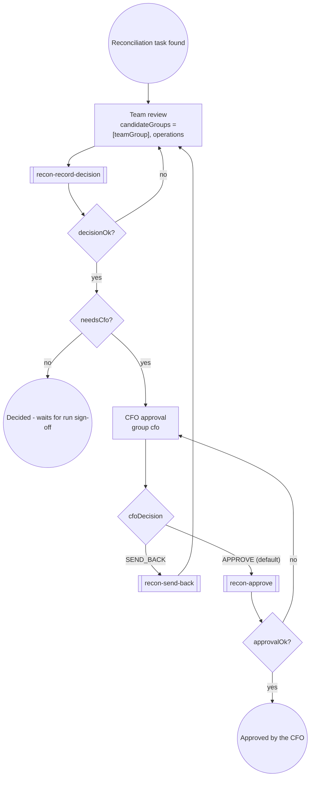
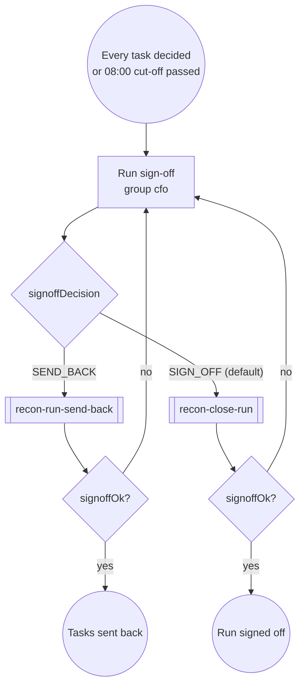
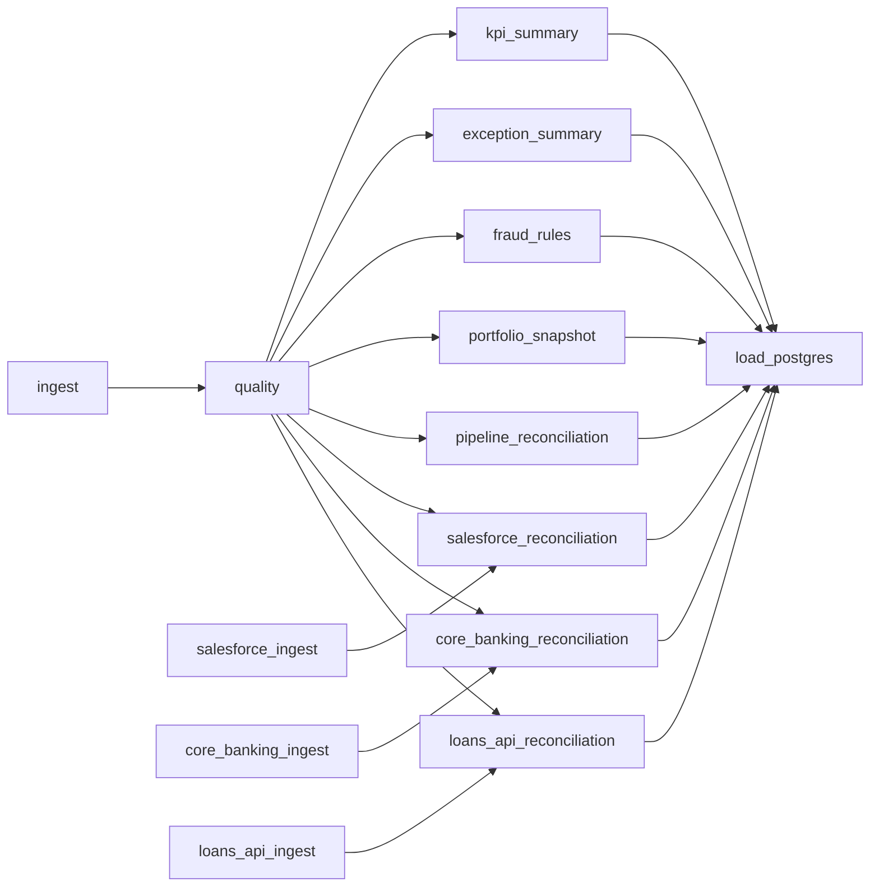

# Bank Data Platform - Technical Specification

Multi-source bank data reconciliation, verification and regulatory reporting platform.

| | |
|---|---|
| Document date | 2026-10-08 (first issued 2026-10-01) |
| Repository state | `main` at commit `7db563b` |
| Source of truth for scope | `project-docs/Middle East bank data cleaning and reporting.md` |
| Plan being executed | `project-docs/3-WEEK-POC-PLAN.md` |
| Companion documents | `project-docs/REGULATORY-COMPLIANCE-GAPS.md` (2026-10-07; section 10.5); `project-docs/Platform-Performance-at-Scale-Summary.docx` (2026-10-07; performance as data grows, with prepared client answers) |
| Method | Every statement is taken from the code, configuration or specs in this repository and cites the file. Where code and documentation disagree, the code is described and the difference is listed in section 10.4. |

### Changes since the 2026-10-01 issue

| Change | Commits | Sections |
|---|---|---|
| The core banking database is connected from the Data ingestion tab as **PostgreSQL** and runs **in the job** (`core_banking_ingest` -> `core_banking_reconciliation`), taking a full snapshot each run instead of an `updated_at` watermark. Run live 2026-10-08 | `121f88a`, `7db563b` | 3.3, 4.1.2, 4.4.2, 8.1 |
| A third comparison source, the **loan origination system** (`los`): a Supabase REST API connected as **REST API**, run as `loans_api_ingest` -> `loans_api_reconciliation` against `loans_clean`. Replaces the Mockaroo plan. Run live 2026-10-08 | `b48b937` | 4.1.2, 4.4.2, 4.4.5, 8.1 |
| "Test connection" signs in for real for PostgreSQL and the REST API; the PostgreSQL form refuses the app's own database | `121f88a`, `b48b937` | 4.1.2, Appendix C |
| Serverless fix: the core banking pull no longer caches its read (`NOT_SUPPORTED_WITH_SERVERLESS`) | `7db563b` | 8.2 |
| The job grows from 10 to 14 tasks | `121f88a`, `b48b937` | 8.1 |
| Regulatory compliance gap list and the performance-at-scale summary added | `44039c6`, `5e82ecc`, `852d9f7` | 10.5 |
| REC-9..11 committed to the backlog (were uncommitted) | `0101d4e` | 4.4.6, 10.3 |

## How to read this document

Each major section opens with a short plain-language summary for a non-technical reader, followed by the technical detail.

Every component carries one of these status labels:

| Label | Meaning |
|---|---|
| **Verified live** | Ran against the real Databricks workspace, the Neon database and/or the local Camunda stack, with the outcome recorded in a spec, the backlog or a commit. |
| **Built and tested locally** | Code exists and passes automated tests (pytest / vitest) or a local run, but has not been run end to end live, or not checked in a browser. |
| **Spec only** | Designed in a spec file; no running code (or code written but never run - stated each time). |
| **Future phase** | Explicitly out of current scope; architecture documented only. |
| **Placeholder assumption** | A value or rule the platform uses today that the bank has not confirmed. |

"Not checked in a browser" appears often: most screens have automated tests and their API calls were exercised against Neon, but nobody has yet walked through them in a browser against the live data (`project-docs/CLIENT-FEEDBACK-BACKLOG.md`, live-check header).

## Contents

1. Executive summary
2. How it differs from existing approaches
3. Architecture overview
4. End-to-end pipeline, step by step
5. Workflow engine
6. Other features
7. Component-to-technology matrix
8. Orchestration, monitoring and error handling
9. Running the platform
10. Placeholders, open questions, roadmap, known issues, compliance gaps
11. Hosting and running costs (estimate)
- Appendix A - Glossary
- Appendix B - Table catalogue
- Appendix C - API endpoint list

---

## 1. Executive summary

**In plain terms.** The platform collects a bank's data from its systems, checks it, flags anything wrong or suspicious, works out the ratios regulators and the board watch, and shows them on role-specific screens. Every difference it finds between what a source sent and what was kept, or between two systems, becomes a task for a named team; important decisions need the CFO's approval, and every action is written to a log that cannot be edited. Today it runs as a working demo on generated data, with the data pipeline in a real Azure Databricks workspace and the application on a developer PC.

### 1.1 What the platform does

The platform ingests the bank's core data (customers, accounts, loans, transactions, branches, capital positions, daily liquidity and FX rates) into Azure Databricks, standardises it, runs 28 data-quality checks and 9 fraud/business rules, computes eight headline ratios and portfolio, branch and scenario aggregates, reconciles what each source delivered against what was kept, compares the bank's clean data against three other systems (a core banking database, a CRM and a loan origination system - all demo stand-ins), and loads the results into PostgreSQL. A FastAPI back end and a React front end present them on role-specific screens. A Camunda 8 workflow engine, driven by three Python bridge workers, turns exceptions, fraud cases, limit breaches, duplicate-company candidates and reconciliation differences into tasks with owners, due dates, approvals and an insert-only audit trail (`CLAUDE.md`; `databricks.yml`; `camunda/process/`; `backend/app/main.py`).

It is used by seven roles, each with its own home screen, menu and task list, defined in one table (`backend/app/roles.py`; `specs/user-roles.md`):

| Role key | Title | Home screen |
|---|---|---|
| `approver` | Chief Financial Officer (CFO) | `/` Executive Summary |
| `risk` | Chief Risk Officer (CRO) | `/portfolio` |
| `analyst` | Reconciliation Analyst | `/tasks` |
| `preparer` | Regulatory Reporting Officer | `/reports` |
| `compliance` | Compliance Officer | `/tasks` |
| `auditor` | Internal Auditor (read-only) | `/audit-oversight` |
| `admin` | Platform Administrator | `/ingestion` |

On sign-in, every role that can see the Data ingestion screen (CFO, analyst, auditor, admin) lands there first; the others go to their home (`frontend/src/access.js` `landingOf`; commit `940153c`).

### 1.2 The problem it replaces

The original brief (`project-docs/bank-x poc-brief.md`, kept for history only) describes a regional bank with entities in Lebanon, Saudi Arabia, Qatar and elsewhere, whose treasury data arrives from different systems in different formats. "Manual Excel-based reconciliation is the current approach"; the work is "done manually in Excel across multiple team members. It is slow, error-prone, and produces no [audit] trail" (brief sections 1-2). Errors carry regulatory risk with the central banks of Lebanon, Saudi Arabia and Qatar.

The current source-of-truth document widens this to the whole bank: data is scattered across systems, a board question takes "three days pulling numbers ... into Excel", and a what-if scenario takes "a team working for a week in Excel" (`project-docs/Middle East bank data cleaning and reporting.md`, lines 3-5, 19-23). The brief's original architecture (Databricks + Appian) has been superseded by Databricks + FastAPI/React + Camunda (`CLAUDE.md`).

### 1.3 Current build status

| Area | Component | Status | Evidence |
|---|---|---|---|
| Data layer | Notebooks 1-6 (ingestion, quality, KPIs, exception summary, fraud rules, portfolio/branch/scenario snapshot) | Verified live (ran without errors 2026-09-21; later runs to 2026-09-28; outputs not compared row-by-row with the spec traceability tables) | `specs/notebook-0[1-6]-*.md` status lines; `project-docs/CLIENT-FEEDBACK-BACKLOG.md` FLOW-1a, FRD-1..3 |
| Data layer | Live FX utility (`fx_utils.py`) | Verified live (via Notebooks 3, 5, 6) | `specs/fx-realtime-ingestion.md` |
| Data layer | Pipeline reconciliation and completeness check | Verified live (2026-09-28: 72 items over 4 runs, 62 matched, 10 with a gap) | backlog FLOW-3, FLOW-1b |
| Data layer | Databricks job + load to Neon | Verified live 2026-09-22; file-arrival trigger deployed paused on 2026-09-29 | `specs/pipeline-job-and-neon-load.md`; `specs/screen-data-ingestion.md` |
| Data layer | Salesforce CRM ingestion + comparison | Verified live 2026-09-29 (in the job) | `specs/multi-source-reconciliation.md` section 3a |
| Data layer | Core banking (PostgreSQL, Neon project 2) ingestion + comparison | Verified live 2026-10-08 in the job (run 408068064859428: 208 customers, 313 accounts); first run by hand 2026-09-22 | `specs/screen-data-ingestion.md` section 3c |
| Data layer | Loan origination system (REST API, Supabase) ingestion + comparison | Verified live 2026-10-08 in the job (98 loans; every planted difference found) | `specs/screen-data-ingestion.md` section 3d |
| Data layer | IMF, Google Sheets ingestion | Spec only (notebooks written, never run). The Mockaroo notebook is superseded by the loan origination system | `specs/multi-source-ingestion-adf.md`; `specs/multi-source-reconciliation.md` (update 2026-10-08); backlog SRC-5 |
| Data layer | Approved-corrections overlay in Notebook 1 | Built; never exercised live | backlog FLOW-5 |
| Data layer | Notebook 7 (ML fraud scoring) | Future phase | `specs/notebook-07-fraud-ml-future-phase.md` |
| Application | PostgreSQL schema (58 tables, 23 migrations) on Neon | Verified live (migrations applied and read live) | `db/schema.sql`; backlog live-check header |
| Application | FastAPI back end (~75 endpoints) | Built and tested locally (~244 pytest tests); runs against Neon from the dev PC | `backend/tests/` |
| Application | React screens (Executive Summary, Portfolio, Regulatory Reporting, Scenario, Branch & Segment, Reconciliation, Tasks, Data ingestion, Audit & Oversight, AI assistant) | Built and tested locally (28 vitest files); Screen 1 browser-checked on a throwaway database only | `frontend/src/`; `specs/screen-01-executive-summary.md` |
| Workflow | Camunda `transaction-review` process and bridge | Verified live 2026-09-22 | `specs/camunda-bpmn-process-design.md` |
| Workflow | `reconciliation-task` and `reconciliation-run-signoff` processes | Verified live on the local stack 2026-09-30 (41 of 41 checks); not checked in a browser | `specs/reconciliation-approvals.md`; commit `fd4d8c0` |
| Workflow | Regulatory report prepare -> review -> approve -> submit workflow | Spec only (not built) | `backend/app/roles.py`; `specs/user-roles.md` line 13 |
| Application | AI assistant ("Ask a question") | Built and tested locally; evaluated against the real local model; not checked in a browser by a user | `specs/ask-a-question.md` |
| Hosting | Application, Camunda, workers | Run on a developer PC only; no cloud hosting configured | `project-docs/DEPLOYMENT.md`; `scripts/run-local.ps1` |

Data scale: all data is generated demo data. The largest set in the repository has 2,349 transactions (`bank-data/upload-test_2026-10-01/transactions.csv`); the "two million transactions" performance case in the source document has not been tested (section 4.5.4).

---

## 2. How it differs from existing approaches

**In plain terms.** A spreadsheet process has no record of who changed what. A dashboard tool shows numbers but cannot run approvals. A matching tool reconciles but does not compute regulatory ratios. An anti-money-laundering system monitors transactions but does nothing else. This platform joins checking, reconciliation, ratios, scenario modelling, task routing and an audit trail in one place, but each part is shallower than a specialist product, and the regulatory-report approval chain the source document calls its differentiator is not built yet.

### 2.1 Comparison

| Capability | (a) Manual Excel process | (b) BI / dashboard tool alone | (c) Standalone reconciliation / matching tool | (d) Standalone AML monitoring | This platform (status) |
|---|---|---|---|---|---|
| Drill-to-source on regulatory numbers | No | Partial (drill into model data) | No | No | Yes for the one built return (Capital Adequacy): formula, source tables, filters, record count, timestamp per line (`backend/app/routers/reports.py` `/drill`). Built and tested locally |
| Governed prepare -> review -> approve -> submit for regulatory returns | No | No | No | No | **Not built.** Report statuses are seeded static values (`backend/seed_reports.py`) |
| Governed review of exceptions, fraud cases, breaches, reconciliation differences, with maker-checker | No | No | Usually yes, for breaks | Yes, for alerts | Yes (Camunda; section 5). Verified live on local stack |
| Insert-only audit trail | No | No | Varies | Usually | Yes: `audit_log` blocked from UPDATE/DELETE/TRUNCATE by triggers (`db/schema.sql` lines 747-751) |
| Automatic reconciliation of pipeline totals per source (rows and amounts per currency) | Manual | No | Not of the bank's own pipeline | No | Yes (`notebooks/pipeline_reconciliation.py`). Verified live |
| Cross-system comparison | Manual | No | Yes, usually at transaction level | No | Field-level on customers, accounts and loans, against three stand-ins (core banking, CRM, loan origination system), all in the job. No transaction-level matching (REC-6 blocked) |
| Approved corrections applied as a layer over source data | Edited in place | No | Sometimes | No | Yes: approved values re-applied by Notebook 1 while the source still sends the old value; source never written (section 4.4.5). Built; never exercised live |
| Scenario modelling recomputed in the browser | Days in Excel | Usually server-side queries | No | No | Yes: four sliders on a ~50-number snapshot (`frontend/src/scenario/engine.js`). Built and tested locally |
| Role-specific screens and task lists | No | Row-level filters | Partial | Partial | Seven roles (`backend/app/roles.py`). Built and tested locally |
| Fraud / suspicious activity detection | Manual | No | No | Full typologies, case management, regulatory filing | Nine deterministic rules with placeholder thresholds (section 4.3.6) |

### 2.2 Where the platform goes further

- **One chain from raw file to decision.** A rejected row is kept with its full content (`data_quality_exceptions.record_data`), counted in the per-source reconciliation, routed to a team as a task, and - if a corrected value is approved by the CFO - re-applied on the next run without touching the source system (`notebooks/02_data_quality_verification.py`; `notebooks/pipeline_reconciliation.py`; `camunda/bridge/recon_tasks_db.py`; `notebooks/01_ingestion_standardisation.py`).
- **Reconciliation of the bank's own pipeline.** Every run records, per source, country and table, how many rows and how much money (per currency) arrived and how much was kept, and opens a task for any gap. A country that delivered nothing gets a "No rows delivered" item (section 4.4.1).
- **Rules flag, a person decides.** No rule changes data by itself. Fraud flags, quality exceptions, reconciliation breaks and duplicate-company candidates all become tasks; formatting-only differences are the one class cleared automatically (`notebooks/multi_source_reconciliation.py`, `FORMATTING_ONLY`).
- **Browser-side scenarios.** Scenario Modelling fetches one snapshot row and recomputes on every slider move with no database call (`backend/app/routers/scenario.py`: "deliberately no recompute endpoint").

### 2.3 Where it is shallower than a specialist tool

- **Fraud rules are not an AML system.** The nine rules are "illustrative POC rules, not a validated fraud model": no behavioural baselines, no cross-entity view, no ML, no device or beneficiary data, no regulatory reporting (`specs/notebook-05-fraud-business-rules.md` section 3; backlog FRD-3, FRD-4).
- **No transaction-level matching.** Cross-system comparison is at customer, account and loan field level only; matching transactions needs a core-banking transaction export the bank has not supplied (backlog REC-6, blocked).
- **No general-ledger or nostro reconciliation** (listed as "Next" in `project-docs/client-demo/Client-Demo-Overview.html`).
- **Open differences are not auto-closed** when a later delivery fixes them, and fix-at-source tracking is backlog (REC-9..11, todo).
- **One regulatory return.** Only the Capital Adequacy return has figures; some components are demo inputs (`backend/app/reports/capital_adequacy.py`, `is_demo_input`).
- **FX is not an official rate.** One keyless public API, today's rate applied to every transaction (`notebooks/fx_utils.py`; backlog FX-1..3).
- **Identity is demo-grade.** Seeded users with JWT; Camunda Tasklist is reached with one shared login; no SSO, no PostgreSQL row-level security (section 3.4, section 5.4).

---

## 3. Architecture overview

**In plain terms.** There are two halves. Databricks, a cloud data-processing service, does the heavy work each time new files arrive: it reads them, cleans them, checks them and calculates summaries, then copies the results into a PostgreSQL database. The application - a web server and a website - reads that database to draw the screens. A separate workflow engine, Camunda, holds the to-do lists and approval steps; three small Python programs move items between the database and Camunda.

### 3.1 Layers and components

| Layer | Components | Where it runs today | Files |
|---|---|---|---|
| Data layer | 6 numbered notebooks, `pipeline_reconciliation.py`, `fx_utils.py`, 6 `multi_source_*` ingestion notebooks (3 in the job: Salesforce, core banking, loan system), `multi_source_reconciliation.py`, `load_to_postgres.py`; one Databricks job (14 tasks) | Azure Databricks, serverless jobs compute, Unity Catalog `dbw_bankx_treasury_poc.raw` | `notebooks/`, `databricks.yml` |
| Application database | PostgreSQL (58 tables) | Neon (managed Postgres, free tier per docs) | `db/schema.sql`, `db/migrations/001..023` |
| Core-banking stand-in | A second, separate Neon project, connected from the Data ingestion tab as PostgreSQL | Neon | `db/multi_source_demo.env.example`; `scripts/plant_core_system_breaks.py` |
| Loan-origination stand-in | A free Supabase project whose `loans` table Supabase serves as a REST API (read-only to the publishable key by row-level security), connected as REST API | Supabase (free tier; pauses after about a week idle) | `db/loans_api_demo.env.example`; `scripts/seed_loans_api.py` |
| API | FastAPI, psycopg2, PyJWT, ReportLab, openpyxl | Developer PC, port 8000 | `backend/app/` |
| Front end | React 19, React Router 7, Tailwind 4, Recharts 3, Vite 8 | Developer PC, port 5173 (Vite dev server) | `frontend/` |
| Workflow engine | Camunda 8.7.41 Self-Managed: Zeebe, Tasklist, Elasticsearch 8.17.10 (Operate disabled) | Docker Compose on the developer PC | `camunda/docker-compose.yaml`, `camunda/.env.example` |
| Bridge workers | `poll_worker.py`, `outcome_worker.py`, `breach_check.py` (pyzeebe, psycopg2) | Developer PC, started by `scripts/run-local.ps1` | `camunda/bridge/` |
| AI assistant model | Any OpenAI-compatible server; today Ollama with `qwen2.5:3b` on CPU | Developer PC | `backend/app/ask/llm.py`; `specs/ask-a-question.md` section 4 |
| External sources | Salesforce Developer Edition; open.er-api.com (FX); IMF, Google Sheets (notebooks unrun); Mockaroo (notebook superseded) | SaaS | `notebooks/multi_source_*.py`; `notebooks/fx_utils.py` |

### 3.2 Design patterns actually used

| Pattern | How it is implemented | Source |
|---|---|---|
| Medallion layout | Bronze `raw_*` (Notebook 1) -> Silver `*_clean` + `data_quality_exceptions` (Notebook 2) -> enrichment `flagged_transactions` (Notebook 5) -> Gold aggregates (Notebooks 3, 4, 6). All in one schema, `raw`. Separate `bronze_*` tables from connected sources feed only the cross-system comparison, not Notebooks 1-6. | `notebooks/0[1-6]_*.py`; `CLAUDE.md` |
| Batch processing | One Databricks job, started by a file-arrival trigger on the landing volume or on demand ("Run all sources now" / Refresh Now via the Jobs API). No streaming, no Auto Loader, no daily schedule. | `databricks.yml`; `backend/app/routers/refresh.py` |
| Precomputed summary tables | Screens read small Gold tables by latest `calculation_date` (`backend/app/db.py` `latest_rows`), not raw transactions. | `backend/app/routers/*.py` |
| Insert-only, status-preserving merges | `flagged_transactions`, `pipeline_reconciliation` load with `ON CONFLICT DO NOTHING`; `reconciliation_exceptions` updates only `last_seen`/`times_seen`/values and keeps the human status. The pipeline never overwrites a decision. | `notebooks/load_to_postgres.py` lines 165-201 |
| Rules flag, a person decides | Every rule output becomes a task; the only automatic resolution is formatting-only differences with a source system (`AUTO_ACCEPTED`). | `notebooks/multi_source_reconciliation.py` lines 283-303 |
| Configuration in the database | Thresholds for fraud rules, task severity and due dates, reconciliation grouping, sign-off cut-off and duplicate matching live in `app_settings` (JSON), all flagged `is_placeholder`. | `db/schema.sql` lines 832-923 |
| Idempotent re-runs | Overwrite (Notebooks 1, 2, 6), per-date replace (3, 4), insert-only merges (5, pipeline reconciliation), tracking table for Camunda starts. | sections 4 and 8 |

What the platform does not use, although commonly expected: Delta table partitioning, Z-ordering, OPTIMIZE/VACUUM or liquid clustering (no `.partitionBy` on any write); Auto Loader or streaming; slowly-changing-dimension history on entity tables (they are overwritten each run); a data-quality framework such as DLT expectations or Great Expectations (checks are hand-written PySpark); Airflow, Azure Data Factory or Kafka; a dead-letter queue (rejected rows go to `data_quality_exceptions` instead); an ORM or Alembic (plain SQL migrations); APScheduler or Celery (the bridge workers are separate scripts) (grep of `notebooks/*.py`, `databricks.yml`, `backend/requirements.txt`).

### 3.3 The application database and the source-system stand-ins

| | Application database | Core-banking stand-in | Loan-origination stand-in |
|---|---|---|---|
| Product | Neon project 1 | Neon project 2 | Supabase project (REST API over a `loans` table) |
| Role | Holds everything the screens, API and workflow read and write | Plays the bank's core banking system for the cross-system comparison | Plays the bank's loan origination system |
| Written by | `load_to_postgres.py`, FastAPI, bridge workers, the source ingestion notebooks (`ingestion_runs`) | `scripts/plant_core_system_breaks.py` (copies the app's customers/accounts, then plants differences) | `scripts/seed_loans_api.py` (copies the app's loans, then plants one difference per feature) |
| Read by | FastAPI, bridge workers, Notebooks 1, 5, 6 (corrections, fraud thresholds, entity groups) | `notebooks/multi_source_neon_ingestion.py` (job task `core_banking_ingest`); the API's Test connection | `notebooks/multi_source_rest_api_ingestion.py` (job task `loans_api_ingest`); the API's Test connection |
| Databricks secret scope | `neon` (host, database, user, password) | `bank-data-sources`: `postgresql-host`, `-port`, `-database`, `-username`, `-password`, written by the app's Connect & Save. The older hand-made `multi-source-demo` scope is no longer read | `bank-data-sources`: `rest_api-base_url`, `-endpoint`, `-auth_header`, `-api_key` |

They must stay separate because the comparison is only meaningful if the "source" is independent of the copy being checked: pointing the comparison at the app database would compare the bank's data with itself and always match. The planting script syncs from the app and "never writes app DB" (`scripts/plant_core_system_breaks.py` docstring; `project-docs/PREREQUISITES.md` "Dev Tooling"; `CLAUDE.md`). Since 2026-10-08 this is also enforced: Test connection and Connect & Save refuse a PostgreSQL form whose host (Neon's `-pooler` host counts as the same) and database match `DATABASE_URL` (`backend/app/connectors.py` `is_app_database`; 422 on connect).

### 3.4 Access-control mechanics

- **Authentication:** email + password checked against PBKDF2-HMAC-SHA256 hashes (200,000 iterations, 16-byte salt, constant-time compare; a dummy hash is checked for unknown emails so timing does not reveal valid ones). The API returns an HS256 JWT (`sub`, `name`, `role`, `iat`, `exp`; default 480 minutes) sent as a Bearer token; the browser keeps it in `sessionStorage`, per tab (`backend/app/security.py`; `backend/app/routers/auth.py`; `frontend/src/api.js`). No refresh token, logout endpoint or revocation.
- **Authorisation:** the role table in `backend/app/roles.py`. Routers for ingestion, portfolio, scenario, performance, reports and reconciliation carry a `screen(...)` guard (403 for roles without the screen). KPI, workflow, refresh and ask routers have no screen guard; inside workflow, `/audit-log` and `/stats` need the audit screen. The auditor role is refused every non-GET request except sign-in, the assistant and exports (`no_writes_for_read_only`, `backend/app/main.py`). The "read" versus "full" distinction for other roles is a front-end affordance; write endpoints carry their own role checks (`backend/app/routers/ingestion.py` `_can_manage`, `refresh.py`, `reconciliation.py` `resolve`).
- **No PostgreSQL row-level security** is defined; the schema says so explicitly (`db/schema.sql` lines 947-948).
- **Audit log** is protected by two triggers that raise on UPDATE/DELETE (per row) and TRUNCATE (`db/schema.sql` lines 747-751). A superuser can still disable triggers (schema comment).
- **Credentials** for Databricks-side access live in Databricks secret scopes (`neon` for the app database; `bank-data-sources` for every source connected from the app - Salesforce, core banking, loan system; `multi-source-demo` only for the unrun IMF/Google Sheets/Mockaroo notebooks); the app writes connector secrets straight into `bank-data-sources` and stores only field names in Postgres (`backend/app/connectors.py`; `backend/tests/test_source_connectors.py`: "secret never in Postgres or audit log").

### 3.5 Architecture diagram

---

## 4. End-to-end pipeline, step by step

**In plain terms.** Files land in a folder in Databricks. The pipeline reads them, makes dates and numbers consistent, and tags every row with where it came from. It then checks each row against fixed rules; rows that fail are set aside with the reason, not deleted. Clean rows feed the ratio calculations, fraud rules and summaries. The pipeline then counts what came in against what was kept, compares customer details with the CRM, and copies everything into the application database in one go.

### 4.0 Data flow

### 4.1 Step 1 - Ingestion

| | |
|---|---|
| Purpose | Get each source's data into Databricks |
| Inputs | 8 core CSV files; Salesforce Accounts; core banking customers and accounts (PostgreSQL); loan system loans (REST API); live FX rates |
| Outputs | Files in the landing volume; `bronze_salesforce_accounts`; `bronze_neon_customers` / `bronze_neon_accounts`; `bronze_los_loans`; `ingestion_runs` rows |
| Engine | Databricks notebooks (PySpark, Python `requests`); FastAPI for uploads and Test connection |
| Storage | CSV files in a Unity Catalog volume; Delta tables |
| Status | Core CSV path, Salesforce, core banking and loan system: Verified live (the last two on 2026-10-08). IMF and Google Sheets: Spec only (notebooks written, never run) |

#### 4.1.1 Core banking CSVs

Eight files, one per source table. Required columns, enforced by the upload check (`backend/app/routers/ingestion.py` `UPLOAD_FILES`, lines 44-54):

| File | Columns |
|---|---|
| `customers.csv` | customer_id, name, segment, branch_id, onboard_date, risk_rating, country |
| `accounts.csv` | account_id, customer_id, type, currency, balance, open_date |
| `loans.csv` | loan_id, customer_id, product, principal, outstanding, currency, interest_rate, origination_date, maturity_date, days_past_due, stage, provision_amount, collateral_value |
| `transactions.csv` | transaction_id, account_id, date, amount, currency, type, channel |
| `branches.csv` | branch_id, name, region, staff_count, monthly_opex |
| `capital_positions.csv` | month, tier1_capital, tier2_capital, risk_weighted_assets |
| `liquidity_daily.csv` | date, hqla, net_outflows_30d, stable_funding, required_funding |
| `fx_rates.csv` | date, currency_pair, rate |

Landing folder: `/Volumes/dbw_bankx_treasury_poc/raw/raw/resources` (`databricks.yml` line 15; Notebook 1 widget default; `DATABRICKS_LANDING_PATH` default in `backend/app/routers/ingestion.py`).

Files arrive in one of two ways:

1. **Upload in the app** (Data ingestion screen, CFO or admin only). The browser checks the file, then `POST /api/v1/ingestion/upload` sends the raw body with an `X-File-Name` header. The API repeats the checks, writes the file to the volume as `{table}.csv` through the Databricks Files API (`PUT /api/2.0/fs/files{path}?overwrite=true`), writes a `FILE_UPLOADED` audit row, and reports whether the file-arrival trigger is paused. Status: Built and tested locally (`backend/tests/test_file_upload.py`); marked done 2026-09-30 in backlog ING-3.
2. **Direct upload** to the volume through the Databricks UI or CLI (`project-docs/DATABRICKS-SETUP.md` section 6).

**Upload checks** (`backend/app/routers/ingestion.py` `check_upload`, `check_replacement`):

| Check | Rule | Failure |
|---|---|---|
| File type | `.csv` only | 400 |
| File name | Must map to one of the 8 tables (`transactions.csv`, or a prefix such as `Transactions_2026-09-30.csv`) | 400 |
| Size | Non-empty and at most 100 MB (`UPLOAD_MAX_BYTES = 100 * 1024 * 1024`, line 55) | 400 |
| Encoding | UTF-8 (BOM accepted) | 400 |
| Columns | Header contains every required column for that table | 400 |
| Replacement safety | For customers, accounts, loans and branches: the file would drop more than 20% (`REPLACE_WARN_SHARE = 0.2`, line 60) of the record keys currently in Postgres | **409** with an explanation; the browser offers "Send anyway", which resends with `X-Replace-Confirmed: yes` |
| Databricks not configured | `DATABRICKS_HOST` / `DATABRICKS_TOKEN` unset | 503 (Databricks errors return 502) |

There is no virus or malware scan (requested in ING-3; not in code). Notebook 1 does no column validation of its own; a missing CSV makes `spark.read.csv` fail and stops the run before the load (`notebooks/pipeline_reconciliation.py` lines 181-182, comment).

#### 4.1.2 Connected sources

| Source | Stands in for | Notebook | Authentication | Writes | In job? | Status |
|---|---|---|---|---|---|---|
| Salesforce Developer Edition | CRM | `multi_source_salesforce_ingestion.py` | OAuth 2.0 client credentials against the org's My Domain `/services/oauth2/token` (External Client App; replaced username-password on 2026-09-29). Secrets `salesforce-instance_url`, `salesforce-client_id`, `salesforce-client_secret` in scope `bank-data-sources` | `bronze_salesforce_accounts` (Id, AccountNumber, Name, Industry, BillingCountry, CreatedDate, `source_system = 'SALESFORCE'`, ingested_at), overwrite; one `ingestion_runs` row per run | Yes, task `salesforce_ingest` | Verified live 2026-09-29 |
| Neon project 2, connected as **PostgreSQL** | Core banking system | `multi_source_neon_ingestion.py` | Host, port, database, username, password from scope `bank-data-sources` (`postgresql-*`); a read-only user is recommended | Reads `customers` (customer_id, name, segment, risk_rating, branch_id) and `accounts` (account_id, customer_id, type, currency, balance) with Databricks' `postgresql` format; **replaces** `bronze_neon_customers` / `bronze_neon_accounts` - a full snapshot each run (the earlier `updated_at` watermark needed a column the bank may not have, missed deletions and kept an old database's watermark). One `ingestion_runs` row per table, shown as "PostgreSQL · Database" | Yes, task `core_banking_ingest` (since 2026-10-08) | Verified live 2026-10-08 (run 408068064859428: 208 customers, 313 accounts). The first live run (776501334971850) recorded a failure because the read was cached (`.cache()`), which serverless refuses; removed in `7db563b` |
| Supabase project, connected as **REST API** | Loan origination system | `multi_source_rest_api_ingestion.py` | Base URL, endpoint, optional auth header and API key from scope `bank-data-sources` (`rest_api-*`); in the demo header `apikey` with the project's publishable key | A JSON array of loans (or one under `data` / `items` / `records` / `results`) with `loan_id, customer_id, product, currency, principal, outstanding, interest_rate`; pages of 1,000 with `limit` / `offset`, stopping when the API ignores paging; **replaces** `bronze_los_loans`. No loans at all, or a missing field, records a failure rather than turning every loan into a "missing" task. One `ingestion_runs` row, shown as "REST API · API · loans" | Yes, task `loans_api_ingest` (since 2026-10-08) | Verified live 2026-10-08 (98 loans) |
| Mockaroo | Loan origination system (earlier plan) | `multi_source_mockaroo_ingestion.py` | `X-API-Key` from `multi-source-demo/mockaroo_api_key` | `bronze_mockaroo_loans` | No | Superseded by the Supabase REST API (written, never run) |
| IMF SDMX JSON API | Regulatory / macro feed | `multi_source_imf_ingestion.py` | None | `bronze_imf_macro` | No | Spec only (written, never run; whether the legacy endpoint still answers is unverified) |
| Google Sheets | Branch / finance data | `multi_source_google_sheets_ingestion.py` | Service-account JSON in `multi-source-demo` | `bronze_branch_finance` | No | Spec only (written, never run; the notebook has no `%pip install gspread`) |

The Salesforce query is `SELECT Id, AccountNumber, Name, Industry, BillingCountry, CreatedDate FROM Account` (API v60.0, following `nextRecordsUrl`). All three connected-source notebooks behave the same way: if the source is not connected the task exits "skipped"; on an authentication, query or read failure it records a failed `ingestion_runs` row (first line of the error) and exits "failed" **without failing the job**; it sets the task value `status` (loaded / skipped / failed), and the downstream comparison skips itself unless that run "loaded" (`notebooks/multi_source_salesforce_ingestion.py` lines 115-183; `notebooks/multi_source_neon_ingestion.py`; `notebooks/multi_source_rest_api_ingestion.py`; `notebooks/multi_source_reconciliation.py` lines 77-89). A comparison therefore never runs against a snapshot an earlier run left behind.

None of the `bronze_*` tables feeds Notebooks 1-6; their only consumer is the cross-system comparison (section 4.4.2).

**Connector registry.** The Data ingestion screen offers the connector types in `backend/app/connectors.py` `SOURCE_TYPES`: `core_files` (built in), `salesforce`, `postgresql` ("Core banking database: customers and accounts"), `rest_api` ("Loan origination system: loans (JSON)"), `aws_s3`, `snowflake`. Connecting a source validates the form, writes each secret field to the Databricks secret scope `bank-data-sources` as `<source>-<field>`, and stores only the non-secret configuration and the secret field names in `source_connectors` (audited `SOURCE_CONNECTED`). Salesforce, PostgreSQL and REST API have ingestion notebooks in the job; S3 and Snowflake have none (backlog ING-1).

**Test connection** (`POST /api/v1/ingestion/sources/{key}/test`; `backend/app/connectors.py` `test_connection`). Status: Built and tested locally (`backend/tests/test_source_connectors.py`, 20 tests). Both checks were used live on 2026-10-08 to connect the two stand-ins; the PostgreSQL one is recorded as connected and tested in a browser (`specs/screen-data-ingestion.md` sections 3c, 3d).

| Connector | What the check does | Answer (`live`) |
|---|---|---|
| PostgreSQL | Signs in from the API server with `sslmode=require`, `connect_timeout=10`, a read-only session and a 10 s statement timeout; checks that `customers` and `accounts` exist with the columns the notebook reads (`CORE_BANKING_TABLES`) and counts their rows. Refused before signing in if the form points at the app's own database | "Signed in to host/db: found N customers and M accounts", or the database's own first error line (`live: true`) |
| REST API | One `GET {base_url}{endpoint}?limit=1` with `Prefer: count=exact` (15 s timeout); accepts 200 or 206 (Supabase answers 206 Partial Content to a counted request - found live); checks the body is a JSON list of loans with every `LOAN_COLUMNS` field and reads the total from `Content-Range`. A 404 on a `*.supabase.co` URL without `/rest/v1` gets a hint | "Reached …: found N loans with every field the comparison needs", or the status and message, no loans, missing fields, not JSON, unreachable (`live: true`) |
| Salesforce, S3, Snowflake | Form completeness and format only | "… details are complete and well-formed. A live sign-in check isn't enabled in this demo yet." (`live: false`) |

A failed live check answers HTTP 200 with `ok: false`; the form shows the reason and an error toast (`frontend/src/ingestion/SourceModal.jsx`). Passwords and keys are never echoed in the answer.

#### 4.1.3 Live FX

FX rates are not ingested as data for calculations. Notebooks 3, 5 and 6 run `%run ./fx_utils` and call `get_live_rate("BASE/QUOTE")` inline (`notebooks/fx_utils.py`):

- Endpoint `https://open.er-api.com/v6/latest/{BASE}` (ExchangeRate-API open tier, no key).
- `requests.get(timeout=15)`; the response must contain `result == "success"`; up to 3 attempts with `2 x attempt` seconds between them; then `RuntimeError`. **No fallback rate, by design.**
- `get_live_rate_and_log` appends each successful fetch to the Delta table `fx_rate_usage_log` (notebook_run_id, currency_pair, rate, fetched_at, used_in_calculation, logged_at). Failed fetches are not logged (the spec asked for this; not implemented).
- `fx_rates.csv` is still ingested, checked by Notebook 2 and loaded to Postgres, but not used for conversion (`specs/fx-realtime-ingestion.md` lines 99-104: removal "not done").
- Status: Verified live through the Notebook 3, 5 and 6 runs. Coverage of LBP, SAR and QAR is not formally recorded (`notebooks/fx_utils.py` header). Placeholder assumption: not an official rate, and today's rate is applied to every transaction regardless of its date (backlog FX-1..3).

#### 4.1.4 Trigger behaviour

- **File arrival:** the job watches `${landing_path}/` with `wait_after_last_change_seconds: 120` and `min_time_between_triggers_seconds: 120`, so it starts about 2 minutes after the last file change and at most once every 2 minutes (`databricks.yml` lines 35-42). `max_concurrent_runs: 1` with queueing enabled.
- **Pause state:** `pause_status` comes from the bundle variable `trigger_pause_status` (default `UNPAUSED`). The 2026-09-29 deploy passed `--var trigger_pause_status=PAUSED`, so automatic starts have been off since then (`specs/screen-data-ingestion.md` lines 95-96); `project-docs/DEMO-GUIDE.md` (2026-10-01) also says the automatic start "is paused at the moment". The workspace's current state is not recorded in the repository.
- **Run All Sources / Refresh Now:** `POST /api/v1/ingestion/run`, `POST /api/v1/ingestion/sources/{key}/sync` and `POST /api/v1/refresh` all call the Databricks Jobs API `POST /api/2.1/jobs/run-now` with no parameters (CFO and admin only; 409 if a run is already active; audited `REFRESH_REQUESTED`). The front end polls `GET /api/v1/refresh/status` every 15 s (`backend/app/routers/refresh.py`; `frontend/src/components/RefreshNow.jsx`). Status: Built and tested locally against a fake Jobs API; not recorded as run live (backlog FLOW-6, 2026-09-28: `DATABRICKS_HOST` / `DATABRICKS_TOKEN` unset). The upload path built on 2026-09-30 needs the same settings.
- **No daily schedule.** The agreed target flow asks for a 24-hour refresh; `databricks.yml` has no schedule or periodic trigger, and a periodic trigger would replace file arrival (`specs/refresh-now.md` section 4, open item).

### 4.2 Step 2 - Raw layer

**In plain terms.** Every incoming row is stored once, as received but with consistent formats, and stamped with the system, country, batch and file it came from.

| Item | Value | Source |
|---|---|---|
| Catalog | `dbw_bankx_treasury_poc` (the workspace's existing catalog; Default Storage blocks `CREATE CATALOG`) | first cell of every notebook; `project-docs/DATABRICKS-SETUP.md` section 3 |
| Schema | `raw` - Bronze, Silver and Gold all live here | `CREATE SCHEMA IF NOT EXISTS raw` / `USE SCHEMA raw` |
| Volume | `dbw_bankx_treasury_poc.raw.raw` | `DATABRICKS-SETUP.md` section 3 |
| Format | Delta managed tables, `.format("delta").saveAsTable(...)` | all notebooks |
| Tables | `raw_customers`, `raw_accounts`, `raw_loans`, `raw_transactions`, `raw_branches`, `raw_capital_positions`, `raw_liquidity_daily`, `raw_fx_rates`, plus `applied_corrections` | `notebooks/01_ingestion_standardisation.py` lines 358-391 |
| Write mode | `overwrite` with `overwriteSchema=true`: each run replaces the previous raw tables (Delta time travel keeps older versions) | same |
| Partitioning | None: no `.partitionBy` on any write, no Z-order, no OPTIMIZE/VACUUM, no table properties | grep of `notebooks/*.py` |

**Source tagging** (`notebooks/01_ingestion_standardisation.py` lines 193-280; `specs/source-tagging.md`). Every raw row carries four columns:

| Column | Value |
|---|---|
| `source_system` | Widget, default `CORE_CSV` (Placeholder assumption) |
| `ingest_batch_id` | `f"{SOURCE_SYSTEM}-{UTC yyyyMMddTHHmmssZ}-{uuid4.hex[:8]}"` (line 73) |
| `source_file` | The file that was read |
| `source_country` | If the `source_country` widget is set, it is stamped on all 8 tables. Otherwise (today - the job passes only `input_dir`): branches get `REGION_COUNTRY[trim(region)]`, else `Unknown`; customers inherit from their branch; accounts and loans from their customer; transactions from their account; `capital_positions`, `liquidity_daily` and `fx_rates` get `Group` |

`REGION_COUNTRY` (lines 77-81, Placeholder assumption): Beirut, North, South, Bekaa, Mount Lebanon -> Lebanon; KSA -> Saudi Arabia; Qatar -> Qatar. Lookups are de-duplicated per key and left-joined, so row counts never change. Status: Verified live (all customers and 1,905 transactions tagged, checked 2026-09-28, backlog FLOW-1a).

### 4.3 Step 3 - Transformation and quality

#### 4.3.1 Notebook 1 - standardisation

`notebooks/01_ingestion_standardisation.py`. Status: Verified live.

| Rule | Implementation | Lines |
|---|---|---|
| Read | `spark.read.option("header", True).option("inferSchema", False).csv(path)`; every column starts as a string | 188 |
| Dates | `coalesce(to_date(c, "yyyy-MM-dd"), to_date(c, "dd/MM/yyyy"))`; an unparseable value becomes null (the row is kept) | 138-146 |
| Date columns | customers.onboard_date; accounts.open_date; loans.origination_date, maturity_date; transactions.date; liquidity_daily.date; fx_rates.date | 85-129 |
| Numbers | `try_cast(col as double)`; a malformed value becomes null | 149-152 |
| Currency codes | `upper(trim())` on accounts, loans and transactions; not validated here | 155-159 |
| Currency pair | Six letters (`^[A-Za-z]{6}$`) become `XXX/YYY`; anything else is upper-cased | 162-171 |
| `capital_positions.month` | `trim()` only (YYYY-MM string) | 174-177 |

The nulls produced here are caught by Notebook 2, so a malformed value is flagged and kept in the exceptions log rather than dropped silently.

#### 4.3.2 Approved-corrections overlay

When the CFO approves a corrected value for a rejected record or a core-system difference (section 4.4.5), Notebook 1 re-applies it on every run for as long as the source still sends the old value (`notebooks/01_ingestion_standardisation.py` lines 303-369; `specs/cfo-reconciliation-workflow.md` section 7). Status: Built; never exercised live (backlog FLOW-5).

1. Reads `public.reconciliation_corrections` from the app database with `spark.read.format("postgresql")` (secret scope `neon`), keeps `status = 'APPROVED'` (line 320), orders by `correction_id`. Any error is printed and nothing is applied (best effort; never blocks ingestion).
2. Matches by record key per table: `branch_id`, `customer_id`, `account_id`, `loan_id`, `transaction_id`, `month`, `date`; for `fx_rates`, `concat_ws("_", date, currency_pair)` - the same keys Notebook 2 writes.
3. Applies only if the field **still** holds `old_value` (or is null when `old_value` is null). If the source has since changed the value, the correction is "spent" and the source wins.
4. Casts the new value with `try_cast` to the column type; an unfit value becomes null, so the record stays rejected.
5. Writes the Delta table `applied_corrections` (correction_id, source_table, record_key, field_name, ingest_batch_id, applied_at), overwritten each run; the load sets `reconciliation_corrections.synced_at` the first time (`notebooks/load_to_postgres.py` lines 203-213).

Only the Delta raw tables change. The platform never writes to any source system.

#### 4.3.3 Notebook 2 - data-quality verification

`notebooks/02_data_quality_verification.py`. Status: Verified live (ran from 2026-09-21; outputs not compared with the spec's traceability table).

**Mechanism.** Each check produces a nullable struct (flag_label, description); `array_compact` collects them into `flags`. A row with no flags goes to `{table}_clean`; each flag on a failing row becomes its own row in `data_quality_exceptions` (lines 81-112).

**Configuration** (lines 50-55): valid currencies USD, EUR, LBP, SAR, QAR; segments Retail, SME, Corporate; loan stages 1, 2, 3; channels Branch, ATM, Mobile, Online; NPL threshold 90 days past due. `VALID_RISK_RATINGS` (A-E) is defined but no check uses it.

**Cleaning order** (dependency order, so orphan checks can cascade): branches -> customers -> accounts -> loans -> transactions -> capital_positions -> liquidity_daily -> fx_rates.

**All checks: 28 (table, flag) checks using 25 distinct labels.** `MISSING_BRANCH_ID`, `INVALID_CURRENCY` and `ORPHAN_CUSTOMER` each apply to two tables. `CLAUDE.md` and `specs/notebook-02-bank-data-quality.md` say 27; the spec's table lacks `transactions / INVALID_CURRENCY`, which the code added later.

| # | Table | Flag | Rule in code | Lines |
|---|---|---|---|---|
| 1 | branches | MISSING_BRANCH_ID | branch_id null | 167 |
| 2 | branches | NEGATIVE_OPEX | monthly_opex < 0 | 168-172 |
| 3 | customers | MISSING_CUSTOMER_ID | customer_id null | 190 |
| 4 | customers | MISSING_RISK_RATING | risk_rating null or blank | 191-195 |
| 5 | customers | INVALID_SEGMENT | segment not in the valid segments | 196-200 |
| 6 | customers | MISSING_BRANCH_ID | branch_id null | 201 |
| 7 | customers | ORPHAN_BRANCH | branch_id not in `branches_clean` | 206-208 |
| 8 | accounts | MISSING_ACCOUNT_ID | account_id null | 224 |
| 9 | accounts | NEGATIVE_BALANCE | balance < 0 | 225-229 |
| 10 | accounts | INVALID_CURRENCY | currency not in the valid codes | 230-234 |
| 11 | accounts | ORPHAN_CUSTOMER | customer_id not in `customers_clean` | 239 |
| 12 | loans | MISSING_LOAN_ID | loan_id null | 258 |
| 13 | loans | OUTSTANDING_EXCEEDS_PRINCIPAL | outstanding > principal | 259-263 |
| 14 | loans | INVALID_STAGE | stage not null and not in {1, 2, 3} | 264-268 |
| 15 | loans | NEGATIVE_DPD | days_past_due < 0 | 269-273 |
| 16 | loans | NPL_STAGE_MISMATCH | days_past_due >= 90 and stage != 3 | 274-281 |
| 17 | loans | ORPHAN_CUSTOMER | customer_id not in `customers_clean` | 286 |
| 18 | transactions | MISSING_TRANSACTION_ID | transaction_id null | 302 |
| 19 | transactions | INVALID_AMOUNT | amount null (missing or non-numeric) | 303 |
| 20 | transactions | INVALID_CHANNEL | channel not in the valid channels | 304-308 |
| 21 | transactions | INVALID_CURRENCY | currency not in the valid codes (so the FX call never receives a value such as "US$") | 309-315 |
| 22 | transactions | ORPHAN_ACCOUNT | account_id not in `accounts_clean` | 320 |
| 23 | capital_positions | MISSING_MONTH | month null or blank | 337-341 |
| 24 | capital_positions | INVALID_RWA | risk_weighted_assets null or <= 0 | 342-346 |
| 25 | liquidity_daily | MISSING_DATE | date null | 363 |
| 26 | liquidity_daily | NEGATIVE_HQLA | hqla < 0 | 364-368 |
| 27 | fx_rates | INVALID_RATE | rate null or <= 0 | 395-399 |
| 28 | fx_rates | DUPLICATE_RATE | more than one row for the same (date, currency_pair); every row in the group is flagged | 384-404 |

Behaviour worth knowing (from reading the code; not run-verified):

- The enumeration checks use `~col.isin(...)`. For a **null** segment, channel or currency, Spark yields null and no flag is raised, so a blank value passes into `*_clean`. `NPL_STAGE_MISMATCH` likewise does not fire when `stage` is null.
- **Orphan cascade:** orphan checks anti-join the raw child against the parent's **clean** table (lines 115-136). A parent rejected for any reason (for example, a missing risk rating) therefore also rejects its children, with the child's `ORPHAN_*` label, and the effect cascades down the levels. A null foreign key also counts as an orphan, so a customer with no branch_id gets both `MISSING_BRANCH_ID` and `ORPHAN_BRANCH`.
- **Not checked:** duplicate primary keys (a duplicated `customer_id` passes, then fails the Postgres insert and rolls back the whole load - `specs/pipeline-job-and-neon-load.md` lines 236-238); the risk-rating domain; the month format (`INVALID_MONTH_FORMAT` is mentioned in Notebook 1's docstring but not implemented); future dates.

**Outputs:** 8 `{table}_clean` tables (overwrite; keep the four source tags) and `data_quality_exceptions` (overwrite; 9 columns: source_table, record_key, flag_label, description, the four source tags, and `record_data`, the rejected row as JSON). It holds only the latest run's rejects (`specs/pipeline-reconciliation.md` lines 72-74).

#### 4.3.4 Notebook 3 - KPI summary

`notebooks/03_kpi_summary.py`. Reads the clean tables and converts every amount to USD with one live rate per currency per table (`amount_usd = amount / rate`, base-USD rates; log labels `loans_conversion`, `accounts_conversion`, `transactions_conversion`, `branch_opex_conversion`). Status: Verified live; three of the eight KPIs rest on Placeholder assumptions.

| KPI | What it measures | Formula in code | Lines |
|---|---|---|---|
| Capital adequacy ratio (CAR) % | Capital held against risk-weighted assets (RWA); the regulator's main solvency measure | (tier1 + tier2) / risk_weighted_assets x 100, latest `month` | 129-130 |
| Liquidity coverage ratio (LCR) % | High-quality liquid assets (HQLA) against expected net cash outflows over 30 days | hqla / net_outflows_30d x 100, latest `date` | 132-133 |
| Non-performing loan (NPL) ratio % | Share of the loan book 90 or more days past due | sum(outstanding_usd where dpd >= 90) / sum(outstanding_usd) x 100 | 135-139 |
| Total assets (USD) | Proxy: loans plus account balances | sum(loan outstanding_usd) + sum(balance_usd) | 146 |
| Dollarization % | Share of deposits held in foreign currency rather than Lebanese pounds; the source document calls it "arguably the most important number" for a Lebanese bank | sum(balance_usd where currency != 'LBP') / sum(balance_usd) x 100 | 141-147 |
| Net interest margin (NIM) % - placeholder | Interest earned on loans minus interest paid on deposits, relative to the loan book | (sum(outstanding_usd x rate / 100) - sum(balance_usd x DEPOSIT_RATE_BY_TYPE / 100)) / loan outstanding_usd x 100 | 156-167 |
| Cost-to-income % - placeholder | Operating cost per unit of income | branch opex USD / (interest income + fee income) x 100; fee income = transactions of type `Fee` | 176-191 |
| Return on equity (ROE) % - placeholder | Profit against capital | (revenue - opex) / tier1_capital x 100 | 193-194 |

Placeholder assumptions (lines 54-56): `DEPOSIT_RATE_BY_TYPE = {"Current": 0.0, "Savings": 1.5, "Term deposit": 3.0}`; `REGION_CURRENCY = {"Beirut": "USD", "North": "USD", "South": "USD", "KSA": "SAR", "Qatar": "QAR"}` (the currency each branch's opex is stated in); Tier 1 capital used as equity. All three are recorded in `assumptions_applied` on every row. Two defects in these formulas are listed in section 10.4: Bekaa and Mount Lebanon branches have no `REGION_CURRENCY` entry, and monthly opex is set against annual interest income.

Output `kpi_daily_summary`, one row per `calculation_date` (widget; blank means today): read the existing table, drop the same date, union, overwrite, so history accumulates. An FX failure raises (no fallback).

#### 4.3.5 Notebook 4 - exception summary

`notebooks/04_exception_summary.py`. No FX. Status: Verified live, including a fix after a live failure on 2026-09-24 (division by zero on an empty delivery; now `try_divide`, lines 452-455).

- `exception_summary_by_flag`: count per (source_table, flag_label).
- `exception_summary_by_table`: a fixed list of the 8 tables, left-joined to the count of distinct flagged record keys (0 if none); `exception_rate_pct = try_divide(flagged, raw_row_count) x 100` (null when the table has no rows).
- Per-date replace, as in Notebook 3.

#### 4.3.6 Notebook 5 - fraud and business rules

`notebooks/05_fraud_business_rules.py`. Status: Verified live (2026-09-24 run: 94 Suspicious, 2 Threshold, 2 Operational; all five newer patterns flagged real rows - backlog FRD-1..3). Thresholds: Placeholder assumption.

**Where thresholds live.** Notebook 5 reads the `public.app_settings` row with `key = 'fraud.rules'` (seeded by migration 013) from the app database and merges it over `DEFAULT_RULES` (lines 60-76); if the read fails it uses the defaults (lines 95-97). USD amounts use one live rate per currency (`amount_usd = abs(amount) / rate`).

| # | Flag | Class | Rule | Threshold (placeholder) | Lines |
|---|---|---|---|---|---|
| 1 | LARGE_AMOUNT | THRESHOLD | amount_usd > large_amount_usd | 50,000 | 159-167 |
| 2 | VELOCITY_BREACH | SUSPICIOUS | more than velocity_count transactions on one account on one day; every row of that account-day is flagged | 2 | 178-191 |
| 3 | STRUCTURING_PATTERN | SUSPICIOUS | Structuring is splitting amounts to stay just under a reporting threshold. Native amount in [lower, upper) and at least 2 such amounts on the same account and date (the 2 is hard-coded) | 8,500 to 10,000 (exclusive) | 204-226 |
| 4 | DUPLICATE_TRANSACTION | OPERATIONAL | same account, amount, currency, type and date, different transaction_id; every member of the group is flagged | - | 239-255 |
| 5 | DORMANT_REACTIVATION | SUSPICIOUS | previous transaction on the account at least dormant_days earlier and amount_usd >= dormant_min_usd | 180 days; 10,000 | 275-288 |
| 6 | PASS_THROUGH | SUSPICIOUS | an inflow >= pass_through_min_usd followed within the window by an outflow of at least min_share of it; both legs flagged | 1 day; 90%; 10,000 | 292-311 |
| 7 | UNUSUAL_FOR_SEGMENT | SUSPICIOUS | amount_usd > multiplier x the customer segment's median and >= segment_min_usd | 10x; 5,000 | 315-330 |
| 8 | ROUND_AMOUNTS | SUSPICIOUS | at least round_min_count multiples of round_step, each >= round_min_usd, on one account in one day | 3; 1,000; 5,000 | 333-346 |
| 9 | SPLIT_ACROSS_ACCOUNTS | SUSPICIOUS | one customer, one day, structuring-band amounts on at least split_min_accounts accounts | 2 | 350-365 |

The classes replaced the earlier FRAUD/FAULT labels (FRD-1, migration 006). They drive task routing (section 5.2.1): SUSPICIOUS goes to fraud investigation, THRESHOLD to Compliance, OPERATIONAL to Operations. Velocity is per day because `transactions.date` has no time component.

**Output `flagged_transactions`** (transaction_id, flag_label, flag_type, description, status `PENDING_REVIEW`, detected_at). The first run creates the table; later runs (a) update `flag_type` where the mapping changed and (b) `MERGE ... WHEN NOT MATCHED INSERT` on (transaction_id, flag_label). An existing row's status is never touched and rows that no longer trigger are never deleted. This is the one notebook output that is not a clean overwrite, because people change its status.

#### 4.3.7 Notebook 6 - portfolio, branch and scenario snapshot

`notebooks/06_portfolio_branch_scenario_snapshot.py`. Fetches all four non-USD rates once. Capital and liquidity figures are assumed to be in USD already. Status: Verified live (the country table ran on 24, 25 and 28 Sep, backlog FLOW-4); its assumptions are Placeholder assumptions; top-exposure grouping has not been exercised (no confirmed duplicate pairs live, backlog DUP-4).

Placeholder assumptions (lines 52-58, 337-365): `PRODUCT_RATE_TYPE` (Mortgage, Personal, Auto fixed; SME, Corporate floating); `ACCOUNT_RATE_TYPE` (Current, Savings floating; Term deposit fixed); `SEGMENT_COST_ALLOCATION` - each branch's opex shared across segments by the segment's share of that branch's loans plus deposits ("allocated, not measured"); `REGION_CURRENCY` as in Notebook 3. A product missing from `PRODUCT_RATE_TYPE` breaks the scenario snapshot (comment, lines 53-54).

| Output (10 tables) | Contents |
|---|---|
| `loan_breakdown_by_dimension` | Outstanding and 90+ dpd outstanding (USD) by product, segment, branch and currency |
| `loan_stage_summary` | Per IFRS 9 stage (the accounting standard's three credit-risk stages: 1 performing, 2 significant increase in credit risk, 3 credit-impaired): loan count, outstanding, provisions, coverage % |
| `top_exposures` | Top 20 borrower groups by outstanding; groups from `public.customer_entity` (confirmed duplicates); product and dpd of the group's largest loan; % of capital |
| `loan_ageing_summary` | Buckets Current, 1-30, 31-60, 61-90, 90-180, 180+ (boundary defect: section 10.4) |
| `ltv_distribution` | Loan-to-value buckets <50%, 50-80%, 80-100%, >100% (zero collateral counts as >100%) |
| `branch_performance_summary` | Deposits, loans, revenue (interest + fees), cost (opex), profit, cost-to-income, staff, profit per staff |
| `segment_performance_summary` | Customers, deposits, loans, revenue, bad loans, profit after allocated cost, revenue per customer |
| `product_performance_summary` | Outstanding, average rate, interest income, NPL %, net contribution (interest income minus provisions) |
| `scenario_snapshot` | One row: loans by currency, product and rate type; deposits by type and rate type; tier 1 and 2 capital, RWA, HQLA, outflows, stable and required funding; current NPL %, coverage %, weighted average rate |
| `country_performance_summary` | Per `source_country`: customers, deposits, loans, NPL loans and ratio, transaction count and volume |

All 10 are overwritten each run (no Delta history); Postgres keeps per-date history because the load replaces only the staged date.

#### 4.3.8 Notebook 7 - ML fraud scoring (Future phase)

No notebook exists. `specs/notebook-07-fraud-ml-future-phase.md` designs an unsupervised Isolation Forest registered in MLflow and batch-scored with `mlflow.pyfunc.spark_udf()` on `transactions_clean`, producing a 0-1 `fraud_ml_score` alongside Notebook 5's rules ("AI gives a signal, not a decision"), with SHAP explanations required if it is built. Recorded blockers: no labelled data, no behavioural baseline, no device telemetry, MLOps scope, and a batch-only pipeline.

### 4.4 Step 4 - Reconciliation

**In plain terms.** The platform runs two different reconciliations. The first asks "did we keep everything a source sent us?" - it compares rows and money received with rows and money kept, per source, country and table. The second asks "does our cleaned data agree with the bank's other systems?" - it compares customer, account and loan details with the core banking system, the CRM and the loan origination system. Every difference becomes a task; decisions that change data, or that involve large amounts, need the CFO.

#### 4.4.1 Pipeline reconciliation (raw versus clean)

`notebooks/pipeline_reconciliation.py`; `specs/pipeline-reconciliation.md`. Status: Verified live (backlog FLOW-3 and FLOW-1b; the spec's own status line is stale).

- **Item** = (ingest_batch_id, source_system, source_country) x source_table, for all 8 tables (lines 47-61). `recon_key = ingest_batch_id|source_system|source_country|source_table`.
- **Counts:** `received_rows` (raw), `clean_rows` (clean, 0 if none), `rejected_rows`, and `unreadable_amount_rows` (raw rows whose amount is null).
- **Amounts:** for the money tables (`transactions.amount`, `accounts.balance`, `loans.outstanding`), sums per currency on both sides; a blank currency becomes `UNKNOWN`; `gap = round(received - clean, 4)`; stored as an `amounts_by_currency` map of {received, clean, gap}.
- **Status:** `has_gap` when rejected_rows > 0, or any |gap| > `AMOUNT_TOLERANCE = 0.005` (line 64), or a note is set. Status `OPEN` if `has_gap`, otherwise `MATCHED`.
- **Completeness:** `EXPECTED_DELIVERIES = {"CORE_CSV": ["Lebanon", "Saudi Arabia", "Qatar"]}`; bank-wide tables are expected once, under `Group`. Every expected (run, source, country, table) with no rows gets a 0-row item with the note "No rows delivered" (lines 186-209). Not covered: a source that delivers nothing at all in a run; cut-off times.
- **Write:** the first run creates the table; later runs `MERGE ... INSERT` only, on `recon_key`. After the load, the application owns the status.
- **Drill-down:** `GET /api/v1/reconciliation/pipeline/{recon_id}/records` returns the rejected rows from `data_quality_exceptions`, with the failing field. Only the latest run's rejects are available (`records_available: false` for older runs).

*Worked example (illustrative figures).* A run delivers 755 Lebanon transactions (the figure used in `project-docs/client-demo/Client-Demo-Overview.html`). Two have the currency "US$" and fail `INVALID_CURRENCY`. The item reads received 755, clean 753, rejected 2; in `amounts_by_currency`, the two rejected rows sit under the key `US$` with a received amount, a clean amount of 0 and a matching gap. The status is `OPEN`. The poll worker starts a `reconciliation-task` for the Operations team, whose popup lists the two rejected rows in full. If the team proposes "USD" and decides "Correct our data", the CFO must approve; on the next run Notebook 1 changes "US$" to "USD" for those two transaction ids, they pass Notebook 2, and that run's item for Lebanon transactions is `MATCHED`. If Saudi Arabia sent no loans that day, a separate `OPEN` item shows 0 received with the note "No rows delivered", and the CFO is required (section 5.5.4).

#### 4.4.2 Cross-system comparison

`notebooks/multi_source_reconciliation.py` (one notebook, three sources chosen by the `source` parameter); `specs/multi-source-reconciliation.md`; `specs/reconciliation-groups.md`; `specs/screen-data-ingestion.md` sections 3c-3d. Status: all three Verified live in the job - CRM (`source=salesforce`) 2026-09-29 (5 planted differences found, 4 groups - backlog ING-7); core banking (`source=neon`) 2026-10-08 (first run by hand 2026-09-22); loan system (`source=los`) 2026-10-08 (every planted difference found as planned: LN0001-3 one group, LN0004 and LN0007 important, LN0005 rate, LN0006 product, LN0009 cleared automatically, LN0010 and LNLOS01 missing).

| Aspect | Core banking (`source=neon`) | CRM (`source=salesforce`) | Loan origination system (`source=los`) |
|---|---|---|---|
| Source side | `bronze_neon_customers` / `bronze_neon_accounts` (a full snapshot each run; latest row per entity by `ingested_at`) | `bronze_salesforce_accounts` | `bronze_los_loans`, `dropDuplicates(loan_id)` |
| Our side | `customers_clean` / `accounts_clean`, `dropDuplicates(key)` (fix for a 2026-09-23 fan-out) | `customers_clean`, segments Corporate and SME only | `loans_clean`, `dropDuplicates(loan_id)` |
| Match key | customer_id / account_id | `trim(AccountNumber)`, else `SF:<Id>` | loan_id |
| Fields compared | customers: name, segment, risk_rating, branch_id; accounts: type, currency, balance (numeric) | name (trimmed); BillingCountry against `customers_clean.country` | customer_id, product, currency (exact); principal, outstanding (numeric, tolerance 1.00); interest_rate (numeric, tolerance `RATE_TOLERANCE = 0.001` percentage points) |
| Job tasks | `core_banking_ingest` -> `core_banking_reconciliation` | `salesforce_ingest` -> `salesforce_reconciliation` | `loans_api_ingest` -> `loans_api_reconciliation` |
| Skips when | its ingest task did not report "loaded" this run | `salesforce_ingest` did not report "loaded", or the table does not exist | its ingest task did not report "loaded" this run |
| Shown as | "Core banking system" | "CRM (Salesforce)" | "Loan origination system" (`frontend/src/reconciliation/CoreSystemSection.jsx` `SYSTEMS`) |

Logic (lines 156-330):

- **Full outer join** on the key. Source-only records become `MISSING_IN_CANONICAL`; ours-only become `MISSING_IN_SOURCE`; each differing field becomes one `VALUE_MISMATCH` row.
- **Numeric fields** each carry their own tolerance; both sides are cast to double and flagged when |source - ours| > tolerance. Amounts use `NUMERIC_TOLERANCE_USD = 1.00` (line 68) - despite the name, taken on native amounts without conversion; interest rates use `RATE_TOLERANCE = 0.001` (line 69). Placeholder assumptions.
- **Text fields** use exact `!=`. A null on one side is not flagged (the comparison yields null).
- **Formatting-only auto-clear (REC-1):** if upper-casing both values and removing everything except A-Z and 0-9 makes them equal, the row is written as `AUTO_ACCEPTED`, `resolved_rule = 'FORMATTING_ONLY'`, note "Cleared automatically: formatting only". Everything else is `OPEN`.
- **Write:** `MERGE` into `reconciliation_exceptions` on (source_system, entity_type, entity_id, mismatch_type, field_name), null-safe. If matched, only `last_seen` and `times_seen + 1` change (status untouched); otherwise the row is inserted. Breaks that disappear are **not** closed (section 4.4.6).

*Worked example.* The day-1 CRM plant includes a formatting-only rename, a changed name, a changed country, and records missing on one side or the other (`scripts/plant_salesforce_breaks.py`). The formatting-only rename lands as `AUTO_ACCEPTED` and creates no task. A changed `name` is an Important field, so it becomes its own group and task, CFO required, titled in the style generated by `camunda/bridge/recon_groups_db.py` `title` (for example, 'Customer CN0051: segment is "SME" in core banking, "Retail" here'). In the core-banking comparison, four accounts whose balance is exactly 15.00 higher in core banking form one bulk group, "4 accounts: balance 15.00 higher in core banking" (a shared exact difference needs at least 3 breaks), which needs the CFO only if its total reaches 10,000.

#### 4.4.3 Break handling

Grouping happens in the bridge (`camunda/bridge/recon_groups_db.py`; settings in `app_settings['recon.rules']`, all Placeholder assumptions):

| Rule | Value / behaviour |
|---|---|
| Input | `reconciliation_exceptions` with status `OPEN` and `group_id IS NULL` |
| Important | A missing record (anything other than `VALUE_MISMATCH`), a field in `important_fields` [name, currency, type, segment], or |difference| >= `important_amount` 10,000. Important breaks are always a group of one and are never bulk-decided |
| Carved-out breaks | Breaks left out of a group decision (`carved_out = true`) are regrouped as groups of one in the same run |
| Bulk key | source_system + entity_type + field + mismatch_type + pattern. Pattern: the exact difference (for example "+15.00") when at least `same_difference_min` 3 non-important breaks share it; otherwise a size band from `size_bands` [100, 1,000, 10,000]; text differences use "different value"; missing records use "missing in our data" / "missing in the source system" |
| Maximum size | Groups split at `max_group_size` 1,000 |
| Mass-missing guard | If at least `MASS_MISSING_MIN = 20` records (code default, `recon_groups_db.py` line 28; not seeded in `app_settings`) are missing the same way in one pass, they form one unsplit group titled "... - check the file that was loaded", CFO reason "N missing records at once". Origin: a wrong customers file on 2026-09-30 produced 168 tasks (`specs/reconciliation-groups.md` section 3). Built and tested locally (`backend/tests/test_flood_guards.py`) |
| CFO required | Important, or a bulk group whose total |difference| >= 10,000 |
| Owning team | `owner_team` OPERATIONS, Camunda group `operations` |

`second_approval_total` (100,000) is still seeded, but no code reads it: the second-approver model was replaced on 2026-09-30.

**Ageing and recurrence (REC-5).** Each break carries `first_seen`, `last_seen` and `times_seen`. The load's upsert **reopens** a break that was `ACCEPTED`, `CORRECTED` or `DISMISSED` if it is seen again after `resolved_at`: status back to `OPEN`, `recurring = true`, `group_id = NULL`. `AUTO_ACCEPTED` breaks are not reopened (`notebooks/load_to_postgres.py` lines 176-191). Verified live (2 recurring breaks, backlog REC-5).

**Runs, supersession, carry-over and sign-off** are described in section 5.5.4. In short: each source's delivery is a run; a newer delivery supersedes the undecided items of an older one; when every task in a run is decided, or from 08:00 bank time the next day, the CFO signs the run off; tasks still open are carried into a new run and escalated after 3 carries.

#### 4.4.4 Decisions

The team's three decisions on any reconciliation task (`camunda/bridge/recon_tasks_db.py`):

| Decision | Meaning | CFO approval needed? |
|---|---|---|
| ACCEPT | The difference is understood and acceptable | Only if the task is CFO-required |
| CORRECT | Correct our data (pipeline gap: values proposed in the app; break group: the source's value or an entered value) | Always |
| DISMISS | Not a real difference | Only if the task is CFO-required |

#### 4.4.5 Corrections

- **Pipeline items:** `POST /api/v1/reconciliation/pipeline/{recon_id}/corrections` proposes a value for one field of one rejected record. It is allowed only while the item is `WITH_TEAM`; the record must be a rejected row of that item; key columns are refused; a value equal to the old one is refused; enumerated fields must match Notebook 2's allowed values (and are re-cased); numeric fields must parse. There is at most one `PROPOSED` row per field (partial unique index), audited `CORRECTION_PROPOSED`. A CORRECT decision needs at least one proposal; other decisions withdraw them.
- **Break groups:** "Correct our data" is refused for missing records and for entities other than accounts, customers and loans (loans added 2026-10-08 with the loan system, `camunda/bridge/recon_tasks_db.py` `ENTITY_TABLE`). The fixed value is the entered value, otherwise the source's value; it is refused if empty, non-numeric for a numeric field, or equal to ours. The bridge inserts `reconciliation_corrections` (group_id, source_table `accounts`, `customers` or `loans`, record_key, field, old_value = our value, new_value).
- **Approval:** the CFO's approval sets the corrections to `APPROVED` (audited `CORRECTION_APPROVED`); a send-back sets unapplied ones to `WITHDRAWN`.
- **Application:** Notebook 1 reads every `APPROVED` correction and applies it while the raw field still holds `old_value` (section 4.3.2). The source system is never written to; the correction is a layer over the source data that lapses once the source changes the value.

#### 4.4.6 Known gaps

- Open differences are not closed automatically when a later delivery fixes them. The comparison never resolves breaks it no longer sees, and pipeline items are per batch, so an old gap stays until a person decides it or a newer run supersedes it (`notebooks/multi_source_reconciliation.py`; `camunda/bridge/reconciliation_db.py`).
- Tracking whether a fix was made at source, telling the source owner, and exporting a corrections file are backlog items REC-9, REC-10 and REC-11 (todo).
- Transaction-level matching is blocked until the bank supplies a core-banking transaction export (REC-6).
- A comparison source that is not connected, or whose pull fails, is skipped for that run without an alert; the only sign is the "skipped" / "failed" row under Recent ingestions (section 8.3).
- The demo loan system is a free Supabase project, which pauses after about a week without activity; a paused project makes `loans_api_ingest` record a failure (`specs/screen-data-ingestion.md` section 3d).

### 4.5 Step 5 - Load and serving

**In plain terms.** At the end of each run, everything Databricks produced is copied into the application database in one all-or-nothing step. The web application reads only that database, mostly from small pre-calculated tables, so screens stay fast.

#### 4.5.1 `load_to_postgres.py`

`notebooks/load_to_postgres.py`. Status: Verified live 2026-09-22; merge logic tested locally by `db/test_load_logic.py` (20 checks).

1. Installs `psycopg2-binary`; credentials come from secret scope `neon`. `connect()` uses `sslmode=require`, `connect_timeout=30`, and up to 4 attempts 10 s apart (Neon cold start).
2. Refuses to run if `public.customers` does not exist ("apply db/schema.sql").
3. **Staging:** writes each Delta table to `staging.<table>` with `df.write.format("postgresql")` - Databricks' bundled PostgreSQL connector - in overwrite mode. Generic `format("jdbc")` was dropped because serverless compute rejected it with `UNSUPPORTED_DATA_SOURCE_WRITE` (lines 240-246). Map columns are written as JSON text and cast to `jsonb`. Snapshot tables stage only the target `calculation_date`. A missing Delta table is skipped.
4. **Merge** in one psycopg2 transaction (commit or rollback, lines 338-344), then `DROP SCHEMA staging CASCADE`:

| Tables | Strategy |
|---|---|
| branches, customers, accounts, loans, transactions, capital_positions, liquidity_daily, fx_rates (from `*_clean`) | Full refresh: delete children first, insert parents first |
| 13 Gold tables: kpi_daily_summary, exception_summary_by_flag, exception_summary_by_table, loan_breakdown_by_dimension, loan_stage_summary, top_exposures, loan_ageing_summary, ltv_distribution, branch_performance_summary, segment_performance_summary, product_performance_summary, scenario_snapshot, country_performance_summary | Delete rows for the staged `calculation_date`, then insert; older dates kept |
| data_quality_exceptions | Upsert on (source_table, record_key, flag_label), keeping `exception_id` stable, then delete rows that were not staged. Null keys get a `(no key #n)` placeholder |
| flagged_transactions | Insert only: `ON CONFLICT (transaction_id, flag_label) DO NOTHING` |
| reconciliation_exceptions | Upsert last_seen, times_seen and values; reopen resolved breaks seen again (section 4.4.3) |
| pipeline_reconciliation | Insert only: `ON CONFLICT (recon_key) DO NOTHING` |
| applied_corrections (Delta only) | `UPDATE reconciliation_corrections SET synced_at = now()` where it is null |
| fx_rate_usage_log | Delete all, insert a full mirror |

5. **Verification** runs after the commit: staged row counts must equal written row counts (except for insert-only and sync-only tables). A mismatch raises an error, but the data has already been committed (section 10.4).

#### 4.5.2 PostgreSQL data model

`db/schema.sql` is cumulative (58 `CREATE TABLE` statements) and already includes all 23 migrations for a fresh install. `db/apply_schema.py` applies it once; `db/apply_migration.py <file>` applies one migration to an existing database. Migrations are plain, idempotent SQL; there is no ORM. Status: Verified live (applied on Neon and read live).

| Group | Tables |
|---|---|
| Entities | branches, customers, accounts, loans (each with the four source tags) |
| Time series | transactions, capital_positions, liquidity_daily, fx_rates, fx_rate_usage_log |
| Gold, quality and fraud imports | kpi_daily_summary, data_quality_exceptions, flagged_transactions, exception_summary_by_flag, exception_summary_by_table, loan_breakdown_by_dimension, loan_stage_summary, top_exposures, loan_ageing_summary, ltv_distribution, branch_performance_summary, segment_performance_summary, country_performance_summary, product_performance_summary, scenario_snapshot |
| Reconciliation | reconciliation_exceptions, reconciliation_groups, reconciliation_runs, pipeline_reconciliation, reconciliation_corrections, reconciliation_signoffs (unused) |
| Reporting (Screen 3) | report_definitions, report_instances, report_line_items, calculation_audit, risk_weights, validation_rules, submitted_files (unused) |
| Users, workflow and audit | roles, users, comments, limits, breaches, audit_log, review_outcomes, camunda_process_tracking, task_cases, task_case_flags, entity_match_candidates, customer_entity, app_settings, workflow_steps / workflow_instances / tasks (unused) |
| Application features | saved_scenarios, ask_history, source_connectors, ingestion_runs, transaction_code_mapping (unused) |

Six tables are defined but never read or written by any code: `workflow_steps`, `workflow_instances`, `tasks`, `submitted_files`, `transaction_code_mapping` and `reconciliation_signoffs` (grep of `backend/`, `camunda/`, `notebooks/`, `scripts/`). The intended "read-side mirror of Camunda" was never populated; Camunda itself is the task store.

Key relationships:

Deliberate gaps: `entity_match_candidates` and `customer_entity` have no foreign key to `customers`, because the nightly load fully replaces customers (migration 015 header); `data_quality_exceptions` and `flagged_transactions` join to their source rows by natural key only.

#### 4.5.3 FastAPI back end

`backend/app/` - `FastAPI(title="Bank Data Platform API")`, all routes under `/api/v1` (full list in Appendix C). Python 3.12, psycopg2 with `RealDictCursor`, no ORM. Status: Built and tested locally; runs against Neon from the development PC.

| Router | Screen | Main endpoints |
|---|---|---|
| `health.py` | - | `GET /live` (no database call), `GET /health` (`SELECT 1`; 503 if down) |
| `auth.py` | Sign-in | `POST /auth/login`, `GET /auth/me` |
| `kpi.py` | 1 Executive Summary | `/kpi-summary/latest`, `/limits`, `/countries`, `/history`, `/{key}/breakdown` (live recompute with Notebook 3's formula), `/{key}/explanation` |
| `portfolio.py` | 2 Portfolio & Credit Risk | `/portfolio/overview` (cached), breakdown, stage summary, top exposures, ageing, LTV, loan and customer drill-downs, Excel export |
| `reports.py` | 3 Regulatory Reporting | calendar, report view with validation, `/drill/{line_code}`, PDF and Excel export |
| `scenario.py` | 4 Scenario Modelling | `/scenario/snapshot`, save, saved list |
| `performance.py` | 5 Branch & Segment | branches, segments, products, channels, Excel export |
| `workflow.py` | Tasks; Audit & Oversight | exception detail, comments, task-completion audit mirror, cases, duplicate pairs, digest, policy, audit log, breaches, stats |
| `reconciliation.py` | Reconciliation | summary, groups, runs, breaks, pipeline items, rejected records, corrections, admin override |
| `ingestion.py` | Data ingestion | overview, upload, connect / test / disconnect sources, run |
| `refresh.py` | Refresh Now | status, run |
| `ask.py` | AI assistant | ask, history, context, export |

**Database access** (`backend/app/db.py`): a lazy `ThreadedConnectionPool` that opens no connection at start-up (so the API starts while Neon is asleep) and keeps up to `DB_POOL_MAX` idle connections (default 5 in `backend/app/config.py`; `backend/.env.example` sets 20). Connections are autocommit; a request waits up to 10 s for a free connection; a query retries once after `OperationalError` / `InterfaceError`; TCP keepalives are set; 5 connections are warmed at start-up. Missing tables or columns return 503 ("Run apply_migration.py"); a database outage returns 503 without logging the connection string (`backend/app/main.py`).

**Caching** (`backend/app/cache.py`): an in-process dictionary per key holding (watermark, payload). Each request runs a cheap watermark query and rebuilds the payload only when the watermark changes. There is no TTL and no manual invalidation, and the cache is per process. It has exactly one user: `GET /portfolio/overview`, watermark `SELECT max(calculation_date) FROM loan_stage_summary` (`backend/app/routers/portfolio.py` line 66).

**Exports:** a ReportLab A4 PDF of the regulatory return (`backend/app/reports/documents.py` `build_pdf`); openpyxl workbooks for the return (including its `calculation_audit` rows), Screen 2, Screen 5 and assistant answers (`backend/app/exports.py`; `backend/app/routers/ask.py`). The Reconciliation tab exports breaks as CSV in the browser.

#### 4.5.4 The 2-second target and how it is met

The source document requires screens to load in under about 2 seconds, even with millions of transactions behind them (`CLAUDE.md`). Mechanisms in the code:

- Screens read precomputed Gold tables by latest `calculation_date` (`latest_rows`), never raw data.
- Portfolio's first paint is one endpoint running 9 queries 4 at a time (`ThreadPoolExecutor(max_workers=4)`), then cached.
- Warm, reusable, autocommit connections cut per-endpoint time from 2.5 s or more to about 0.3 s (commit `44024fa`).
- The assistant's side panel is one SQL round trip: 1.65 s down to 0.29 s against Neon (commit `32309a7`).
- Scenario Modelling recomputes in the browser, with no endpoint call per slider move.

Not proven: there is no load test at 2 million transactions (the largest data set has 2,349). Two endpoints still compute live on page load: `GET /performance/channels` (`count(*) GROUP BY channel` over all transactions) and `GET /kpi-summary/{key}/breakdown` (recompute from source tables).

#### 4.5.5 React front end

`frontend/` - React 19, React Router 7, Recharts 3, Tailwind 4, Vite 8, vitest. The Vite dev server proxies `/api` to `127.0.0.1:8000` and `/tasklist` to `127.0.0.1:8082`; there is no production equivalent for the `/tasklist` proxy. Status: Built and tested locally (28 test files, about 217 test cases).

| Route | Page | Screen | What it shows |
|---|---|---|---|
| `/login` | `Login.jsx` | - | Sign-in; two illustrative sample charts |
| `/ingestion` | `Ingestion.jsx` | Data ingestion | Latest run figures (files, received, kept, held back, failed); connector cards and forms; Run All Sources; scheduled pulls (labelled DEMO); file upload with the 409 "Send anyway" step; recent ingestions |
| `/` | `Dashboard.jsx` | 1 Executive Summary | 8 KPI tiles coloured from `limits`; Refresh Now; trend panels with table equivalents; "What needs attention" alert strip; "By country" breakdown in USD with a bank-wide total row (the country view) |
| `/kpi/:key` | `KpiDetail.jsx` | 1 | Value, formula, components, FX notes, "Why it looks like this", trend, suggested actions |
| `/portfolio` | `Portfolio.jsx` | 2 Portfolio & Credit Risk | Filters; loan book by 4 dimensions (total against 90+ dpd); IFRS 9 staging; top exposures; ageing; LTV; click-through to the loan list; Excel |
| `/scenario` | `Scenario.jsx` | 4 Scenario Modelling | 4 sliders; Base / Adverse / Severe presets; before and after; capital-ratio waterfall; 12-month projection; saved scenarios side by side; editable assumptions |
| `/performance` | `Performance.jsx` | 5 Branch & Segment | Region filter; branch league table (worst profit first); regional rollup; segments; products; channel usage; efficiency quadrant scatter; drill-down to customers and loans; Excel |
| `/reports` | `Reports.jsx` | 3 Regulatory Reporting | Report calendar (red if overdue or under 5 days, amber under 10, green otherwise) |
| `/reports/:id` | `ReportView.jsx` | 3 | Return by section with demo-input badges; drill-to-source on each line; validation checks; prior-period comparison (a change over 10% needs an explanation); PDF / Excel |
| `/reconciliation` | `Reconciliation.jsx` | Reconciliation | "Received vs kept, per source" with per-item popups (amounts per currency, rejected records); "Our data vs the source systems": source filter, run status and sign-off, groups, all-breaks explorer with ageing, CSV export, admin-only single-break override. Decisions are made in Tasks |
| `/tasks` | `Tasks.jsx` | 6 Tasks (Report Workflow) | "My tasks" from Tasklist filtered by role; type, date and urgency filters; badges (Sent back, Carried, Escalated, Overdue, Important); review panels (exception, case, duplicate pair, reconciliation team / CFO / sign-off); approval chain; low-severity digest and "How tasks are created" |
| `/audit-oversight` | `AuditOversight.jsx` | 6 Audit & Oversight | On-time %, overdue, average turnaround, open breaches by age; audit trail table |
| `/ask` | `Ask.jsx` | AI assistant | Question box; "What I understood" chips that can be edited without the model; chart or table; Excel export; side panel |

There is no `/workflow` route and no `Workflow.jsx`; Screen 6 is `/tasks` plus `/audit-oversight` (`frontend/src/App.jsx`).

**Scenario engine** (`frontend/src/scenario/engine.js`): pure functions over the snapshot. Order: devaluation revalues foreign-currency loans and pushes some into default; an independent NPL stress follows; then provisions; the rate change applies to floating-rate balances; capital, RWA and CAR are recomputed; deposit outflow separately drives LCR. Ranges: devaluation 0-50%, rate change -5 to +5 points, NPL increase 0-15 points, deposit outflow 0-30%. Presets: Adverse {20, 2, 5, 10} and Severe {40, 4, 10, 20}. Assumptions such as `defaultUpliftPerDevaluationPct` 0.2 and 70% coverage are editable and labelled "illustrative; confirm with client" (Placeholder assumption).

**Menus and homes.** The top bar (`frontend/src/components/TopBar.jsx`) shows Data ingestion, Executive summary, Portfolio & credit risk, an "Analysis & reporting" group (Branch & segment, Scenario modelling, Regulatory reporting), Reconciliation, Tasks, Audit & Oversight and AI assistant, filtered per role. `RequireAuth` redirects a role to its home if it opens a screen it does not have.

| Role | Full access | Read access | Tasks it sees |
|---|---|---|---|
| CFO (`approver`) | summary, portfolio, performance, scenario, reports, tasks, audit, ingestion, ask | reconciliation | group `cfo` |
| CRO (`risk`) | summary, portfolio, performance, scenario, reports, tasks, ask | - | type `breach` |
| Reconciliation Analyst (`analyst`) | reconciliation, tasks, ask | summary, ingestion | group `operations`; types `data_quality`, `entity_match` |
| Regulatory Reporting Officer (`preparer`) | summary, reports, tasks, ask | portfolio | type `report` (none exist; the report workflow is not built) |
| Compliance Officer (`compliance`) | tasks, ask | summary | types `fraud`, `fraud_case` |
| Internal Auditor (`auditor`) | audit, ask | summary, portfolio, performance, reports, reconciliation, ingestion | none (read-only) |
| Platform Administrator (`admin`) | tasks, audit, ingestion, ask | summary, reconciliation | all |

Source: `backend/app/roles.py`. Tasklist returns every group's tasks to the shared login; the per-role filter above is applied in the browser (`frontend/src/access.js` `isMyTask`).

---

## 5. Workflow engine

**In plain terms.** Camunda is a workflow engine: it holds each to-do item, knows which team it belongs to, and moves it through the agreed steps (for example, team decides, then CFO approves). The screens show people their tasks from Camunda and send back their decisions. Three small background programs connect Camunda to the database: one creates tasks from new findings, one writes decisions back, and one watches the ratios for limit breaches.

### 5.1 Camunda 8 Self-Managed stack

Source: `camunda/docker-compose.yaml` (derived from Camunda's official 8.7 `docker-compose-core.yaml`, trimmed), `camunda/.env.example`, `camunda/README.md`. Status: Verified live on the developer PC (2026-09-22 onward).

| Service | Image | Host ports | JVM heap | Container memory limit |
|---|---|---|---|---|
| Zeebe (engine and gateway) | `camunda/zeebe:8.7.41` | 26500 gRPC, 9600 monitoring, 8088 REST | `-Xms256m -Xmx512m` | 768 MB |
| Tasklist (task API and UI) | `camunda/tasklist:8.7.41` | 8082 | `-Xms256m -Xmx512m` | 768 MB |
| Elasticsearch (Camunda's data store) | `elasticsearch:8.17.10` | 9200, 9300 | `-Xms512m -Xmx512m` | 1 GB |
| Operate | commented out | (8081) | - | - |

- About 2.5 GB in total, sized for a Docker VM of 4 CPUs / 3.77 GB. Tasklist previously had no heap cap and was the real memory cost (`camunda/README.md`).
- **Operate is disabled** because four JVMs starting together starved Elasticsearch of CPU and it never became healthy; only Zeebe and Tasklist are needed by the platform.
- Configuration: `ZEEBE_AUTHENTICATION_MODE=none`, resource authorisations and multi-tenancy off; Tasklist CSRF prevention off; Elasticsearch single-node with security off; Zeebe's Elasticsearch exporter `BULK_SIZE=1`.
- Start order: `docker compose up -d elasticsearch`, wait for healthy, then `docker compose up -d`. `docker compose down -v` deletes all workflow data.
- **Not included:** Identity / Keycloak, Optimize, the Connectors runtime, clustering or high availability (single broker, single-node Elasticsearch), TLS (every worker uses `create_insecure_channel`), Kubernetes / Helm (the compose header recommends Helm for production).
- Tasklist's web login is a session cookie with the default `demo`/`demo` user; it cannot be switched off without Identity (`specs/camunda-bpmn-process-design.md` section 7).

### 5.2 BPMN processes

Three processes exist, all hand-written XML in `camunda/process/`, deployed by `camunda/bridge/deploy.py` (form first, then `transaction-review.bpmn`, `reconciliation-task.bpmn`, `reconciliation-run-signoff.bpmn`). The earlier `reconciliation-review` (CFO-first) and `reconciliation-group-review` processes were deleted in commit `532bd18` and replaced by the last two. None of the processes has a timer event.

#### 5.2.1 `transaction-review`

Used for data-quality exceptions, transaction cases (`fraud_case`), legacy single fraud flags, KPI limit breaches and possible duplicate companies. Status: Verified live 2026-09-22 (all routes and outcomes completed through Tasklist's REST API; 92 instances started from Neon's `flagged_transactions`, 0 on a second pass).

Each user task uses form `review-outcome-form` (radio `outcome` APPROVED / REJECTED / CORRECTED, `correctedValue`, `reviewedByUserId`). The React Tasks screen does not render the form; it completes the task with the same variable names (`frontend/src/pages/Tasks.jsx` line 130). Outcome is a variable, not a route: all four tasks converge on the service task `write-review-outcome`.

**Routing** (`camunda/bridge/poll_worker.py` `flag_category`, lines 36-49; `breaches_db.py`; `duplicates_db.py`). Placeholder assumption: "a documented assumption, not a verified business rule".

| Input | flagCategory | Candidate group | Shown in the app to (by record type, `frontend/src/access.js` `isMyTask`) |
|---|---|---|---|
| Notebook 5 `SUSPICIOUS` case | FRAUD | `fraud-investigation` | Compliance Officer (`fraud_case`), admin |
| Notebook 5 `THRESHOLD` case | COMPLIANCE | `compliance` | Compliance Officer (`fraud_case`), admin |
| Notebook 5 `OPERATIONAL` case | OPERATIONS | `operations` | Compliance Officer (`fraud_case`), admin |
| Data-quality fault on `capital_positions`, `liquidity_daily`, `fx_rates` | COMPLIANCE | `compliance` | Reconciliation Analyst (`data_quality`), admin |
| Data-quality fault on any other table | OPERATIONS | `operations` | Reconciliation Analyst (`data_quality`), admin |
| KPI limit breach | RISK (hard-coded, `breaches_db.py` line 150) | `risk` | CRO (`breach`), admin |
| Possible duplicate company | OPERATIONS | `operations` | Reconciliation Analyst (`entity_match`), admin |

For non-stepped tasks the app filters by record type, not by candidate group; group membership counts only for the stepped reconciliation types (`reconciliation`, `recon_group`, `recon_run`), so the Camunda group and the person who sees the task in the app can differ (as in the data-quality row routed to `compliance` but shown to the analyst).

**Outcome handling** (`camunda/bridge/outcome_worker.py` `write_review_outcome`):

| Record type | Effect |
|---|---|
| `entity_match` | APPROVED -> pair `CONFIRMED` ("same company"), otherwise `REJECTED`; rebuilds `customer_entity` groups (union-find over all confirmed pairs); one audit row. Idempotent (`WHERE status = 'PENDING'`). Nothing is merged automatically |
| `fraud_case` | Case `CLOSED`; every flag's `flagged_transactions.status` set to the outcome; one `review_outcomes` row per flag; one transaction; idempotent |
| `breach` | `review_outcomes` row; `breaches.status`: APPROVED -> ACKNOWLEDGED, REJECTED -> DISMISSED, CORRECTED -> ACTION_PLANNED; `resolved_at = now()`; corrected text stored as `action_plan`. UI labels: Acknowledge / Dismiss / Plan action |
| other (data quality, single fraud flag) | `review_outcomes` row (non-JSON corrected text stored as a JSON string); for `fraud`, `flagged_transactions.status` updated |

There is no self-approval rule on this process: it has a single review step, and anyone who can see the task can complete it. `review_outcomes` is written for a future read-back into Databricks (`specs/bidirectional-sync.md`, Spec only); no notebook reads it today.

#### 5.2.2 `reconciliation-task`

One process for both pipeline gaps (`recordType = "reconciliation"`, `camunda/bridge/reconciliation_db.py`) and break groups (`recordType = "recon_group"`, `camunda/bridge/recon_groups_db.py`). No forms; completed from the Tasks screen. Status: Verified live on the local stack 2026-09-30 (41 of 41 checks, commit `fd4d8c0`); not checked in a browser.

- Team review is completed with `decision` (ACCEPT / CORRECT / DISMISS), `decidedByUserId`, `excludedIds` (carve-outs) and `correctedValues`. `teamGroup` is `recon.rules.owner_team` lower-cased (`operations`); it must be a FEEL list - a bare `=teamGroup` raised an incident, fixed in commit `02fd2be`.
- `needsCfo` = the task is CFO-required **or** the decision is CORRECT.
- CFO approval is completed with `cfoDecision` APPROVE (`approvedByUserId`) or SEND_BACK (`sentBackByUserId`, `sendBackNote`).
- Pattern: each service task returns ok/error variables, so a refused step loops back to the person with a reason instead of raising an incident (`specs/reconciliation-approvals.md` section 3).

#### 5.2.3 `reconciliation-run-signoff`

Started once every task in a run is decided, or once the cut-off has passed. Status: Verified live on the local stack 2026-09-30; not checked in a browser.

Completed with `signoffDecision` SIGN_OFF (`signedByUserId`, `signNote`) or SEND_BACK (`sentBackByUserId`, `sendBackNote`, `sendBackTasks = [{kind, id}]`).

### 5.3 Maker-checker rules

| Rule | Enforced in |
|---|---|
| Team decision: the user must exist; the `auditor` role is refused ("can look but not decide") | `camunda/bridge/recon_tasks_db.py` `record_decision` |
| CFO approval only by role `approver` or `admin` (`CFO_ROLES`) | `recon_tasks_db.approve` |
| CFO approval never by the person who made the team decision | `recon_tasks_db.approve` |
| Run sign-off only by `approver`/`admin`; refused if the signer decided any task in the run, if any task is `AWAITING_CFO`, if tasks are open before the cut-off, or if tasks are open without a note | `camunda/bridge/recon_runs_db.py` `close_run` |
| Run send-back only by `approver`/`admin`, with a note and at least one task | `recon_runs_db.send_back_run` |

The front end pre-checks the same rules, but "the workers are the guard: every demo login can see every task" (`frontend/src/reconciliation/reconTask.js`; `specs/reconciliation-approvals.md` section 3). Tested in `backend/tests/test_reconciliation_approvals.py` (25 tests).

### 5.4 How the browser talks to Tasklist

`frontend/src/workflow/tasklistApi.js`; `frontend/vite.config.js`.

- The browser calls Tasklist's REST v1 API **directly**, through the Vite dev-server proxy `/tasklist` -> `127.0.0.1:8082` (Tasklist sends no CORS headers). There is no FastAPI proxy and no production proxy configuration.
- It signs in with **one shared Tasklist login** (`POST /api/login?username=demo&password=demo`, overridable with `VITE_TASKLIST_USER` / `VITE_TASKLIST_PASSWORD`), and retries once on 401.
- The person's identity is passed as process variables set by the browser (`decidedByUserId`, `approvedByUserId`, `signedByUserId`, `reviewedByUserId`) from the signed-in app user. The bridge re-checks role and "not the decider" against the `users` table using that id, so the maker-checker rule is enforced server-side **given the id**, but the id itself is supplied by the client, not by an authenticated Camunda identity.
- Search: `POST /v1/tasks/search` with `state = CREATED`, candidate groups `fraud-investigation`, `compliance`, `risk`, `operations`, `cfo`, `reconciliation-team` (the last is a leftover of the retired process), `pageSize` 200 paged with `searchAfter` (fix for Tasklist's default of 50 silently hiding tasks, 2026-09-25), and the list variables included in one round trip.
- Per-role filtering is done in the browser after fetching (`frontend/src/access.js` `isMyTask`).
- Tasklist REST quirks found live: assigning is `PATCH /v1/tasks/{id}/assign` with an empty body (self-assigns to `demo`; passing an app user id returns 403), not `/claim`; completing is `PATCH /v1/tasks/{id}/complete` with `{variables: [{name, value}]}`, each value a JSON-encoded string (a plain object returns 400); if a completion appears to fail, the task is re-read and treated as done if `taskState == COMPLETED` (lost reply).
- After a `transaction-review` completion, the panel also calls `POST /api/v1/workflow/exceptions/task-completions` to write the audit row. The two calls are not atomic (`backend/app/routers/workflow.py` docstring).

### 5.5 Bridge workers

`camunda/bridge/`; Python with `pyzeebe>=4.7,<5` and `psycopg2-binary`. `_env.py` reads `DATABASE_URL` (env, else `backend/.env`) and `ZEEBE_ADDRESS` (default `localhost:26500`).

**Windows asyncio fix.** On Windows, `_env.py` sets `asyncio.WindowsSelectorEventLoopPolicy()`, because grpc.aio under the default Proactor loop raised "attached to a different loop" in the streaming ActivateJobs call; and `outcome_worker.py` builds the Zeebe channel and worker inside `main()`, within the running loop, not at module scope (confirmed live 2026-09-22; `specs/camunda-bpmn-process-design.md` section 6).

**Connection resilience.** `poll_worker` and `breach_check` open a fresh database connection per pass (`connect_timeout=45`) because Neon suspends idle databases; database errors in loop mode are logged and retried on the next pass. `outcome_worker` opens a connection per job.

#### 5.5.1 `poll_worker.py` (Postgres to Zeebe)

Runs once, or every 300 s with `--loop 300`. Polling was chosen over LISTEN/NOTIFY to match the batch cadence. Each pass, in order:

1. **Data-quality exceptions** without a tracking row -> one `transaction-review` each (flag type `FAULT`).
2. **Transaction cases** (section 5.6.1) -> one `transaction-review` per HIGH or MEDIUM case (`recordType = fraud_case`).
3. **Pipeline gaps**: first supersede undecided items of non-newest runs (status `SUPERSEDED`, audit row, process cancelled); then one `reconciliation-task` per `OPEN` item with `has_gap` in each source's newest run. Sets the item to `WITH_TEAM` with `cfo_required`, `cfo_reason`, `title`.
4. **Possible duplicates** -> one `transaction-review` per new pair, capped at `MAX_OPEN_REVIEWS = 25` open at once (`camunda/bridge/duplicates_db.py` line 20; not seeded in `app_settings`).
5. **Break groups** (section 4.4.3) -> one `reconciliation-task` per new group.
6. **Run sign-offs**: sync runs (section 5.5.4), cancel sign-offs of superseded runs, start one `reconciliation-run-signoff` per ready run (status `IN_SIGNOFF`).

**Idempotency:** the `camunda_process_tracking` table, keyed (record_type, source_table, record_key, flag_label), plus `process_instance_key IS NULL` guards on `task_cases`, `entity_match_candidates`, `reconciliation_groups` and `reconciliation_runs`. **Gap:** the process is started in Zeebe before the tracking row is written, so a crash or gRPC timeout between the two could start a duplicate on the next pass (code order; not observed).

#### 5.5.2 `outcome_worker.py` (Zeebe to Postgres)

A long-running `ZeebeWorker` subscribed to six job types:

| Job type | Process | Handler | Returns |
|---|---|---|---|
| `write-review-outcome` | transaction-review | `write_review_outcome` (section 5.2.1) | - |
| `recon-record-decision` | reconciliation-task | `recon_tasks_db.record_decision` | decisionOk, decisionError, needsCfo, cfoReason |
| `recon-approve` | reconciliation-task | `recon_tasks_db.approve` | approvalOk, approvalError |
| `recon-send-back` | reconciliation-task | `recon_tasks_db.send_back` | cleared errors, sent-back note / name / time / step |
| `recon-close-run` | reconciliation-run-signoff | `recon_runs_db.close_run` | signoffOk, signoffError |
| `recon-run-send-back` | reconciliation-run-signoff | `recon_runs_db.send_back_run` | signoffOk, signoffError |

It writes `review_outcomes`, `flagged_transactions.status`, `breaches`, `task_cases`, `entity_match_candidates`, `customer_entity`, `pipeline_reconciliation`, `reconciliation_groups`, `reconciliation_exceptions`, `reconciliation_corrections`, `reconciliation_runs`, `comments`, `audit_log` and `camunda_process_tracking`. The reconciliation handlers each run in one transaction and handle a retried job idempotently. The generic `review_outcomes` insert has no idempotency guard. No retry count is set in the BPMN and no custom exception handler is configured, so Zeebe and pyzeebe defaults apply (values not recorded in the repo).

#### 5.5.3 `breach_check.py` (KPIs to breaches)

Runs once, or every 300 s. Each pass runs `breaches_db.evaluate` (section 5.6.4), then starts a `transaction-review` with `flagCategory = "RISK"` for every open, untracked breach (severity HIGH for REGULATORY, MEDIUM for APPETITE; due date; description "<metric> at X crossed the regulatory limit / internal limit of Y"). Breaches therefore go to the CRO. The opening paragraph of the module docstring still says the Compliance group; the code and a later paragraph say RISK.

#### 5.5.4 Runs, supersession, carry-over and sign-off

`camunda/bridge/recon_runs_db.py`, `reconciliation_db.py`; migrations 020-023; `specs/reconciliation-approvals.md` sections 4 and 10.

| Concept | Rule |
|---|---|
| Run | One per source delivery: for the CSV pipeline the newest `ingest_batch_id`; for the comparison sources (`neon`, `salesforce`, `los`) the newest date of `max(last_seen)`. Statuses `OPEN`, `IN_SIGNOFF`, `SIGNED_OFF`, `SUPERSEDED`. Names: "core banking files", "core banking comparison", "CRM comparison", "loan system comparison" |
| Supersession | Older `OPEN` runs become `SUPERSEDED`. Pipeline items of an older delivery that nobody decided (`OPEN` / `WITH_TEAM` / `WITH_CFO`, no live correction) become `SUPERSEDED` with an audit row and their process is cancelled. An older run already `IN_SIGNOFF` whose items were all superseded is retired and its sign-off cancelled (commit `2c8fc6d`) |
| Follow-on run | New groups arriving while a run is `IN_SIGNOFF` or `SIGNED_OFF` go to a follow-on run `<date>#<n>` |
| Ready for sign-off | `OPEN`, no sign-off process, and no undecided tasks (pipeline items not DECIDED/APPROVED/SUPERSEDED, groups not CLOSED, open ungrouped breaks; `AWAITING_CFO` counts as undecided) - **or** the cut-off has passed |
| Cut-off | `recon.signoff`: 08:00 bank time (`utc_offset_hours` 3) the day after `run_date` (Placeholder assumption). Weekends are not treated differently |
| Sign-off refusals | In order: run missing; not `IN_SIGNOFF`; signer unknown; role not approver/admin; any `AWAITING_CFO`; open tasks before the cut-off; open tasks without a note; signer decided a task in the run |
| Carry-over | On sign-off, open pipeline items and groups move to a new run `<base>#c<n>` dated bank-today; `carried_count + 1`, `carried_since` kept; `escalated_at` set when `carried_count` reaches `carry_limit` 3. Audits `CARRIED_OVER`, `ESCALATED` (once), `RUN_SIGNED_OFF` |
| Run send-back | Named tasks reopened (decision cleared, breaks reopened, tracking row deleted so a new process starts, unapplied corrections withdrawn), run back to `OPEN`; audits `SENT_BACK_AT_SIGNOFF`, `RUN_SENT_BACK` |
| CFO send-back of a task | Back to `WITH_TEAM` / `OPEN`, decision cleared, group's proposed fixes withdrawn, `SENT_BACK` audit, `sent_back_*` columns, comment "Sent back at CFO approval: ..." (migration 022) |

Not built: deadline-based escalation beyond the carry count, a run progress bar, a sign-off evidence pack (`specs/reconciliation-approvals.md` section 9).

**Demo reset.** `camunda/bridge/reset_reconciliation_demo.py` (dry run unless `--apply`) backs up six tables, cancels open reconciliation processes, reopens the newest run's gaps and decided breaks, deletes groups and runs, withdraws unapplied corrections and writes one `DEMO_RESET` audit row; the audit log is never touched.

### 5.6 Task logic

#### 5.6.1 Cases (TSK-1)

`camunda/bridge/cases_db.py`; `specs/task-cases.md`; migration 012. Status: Verified live (81 cases, 2026-09-15 to 09-28, backlog TSK-1; the spec's status line is stale).

- Input: `flagged_transactions` with status `PENDING_REVIEW` not yet in a case.
- Grouping key: **account_id + transaction date + flag_type**. Team = the flag type's routing (section 5.2.1).
- A flag belongs to exactly one case; a new flag after the case's task exists opens a new case. Per-flag tracking rows stop any flag getting its own task.
- Title example: "ACC005 · 9 Sep 2026 · 6 Suspicious flags". One decision applies to every flag in the case.
- Data-quality exceptions, breaches and reconciliation items remain one task each.

#### 5.6.2 Severity (TSK-2)

`cases_db.severity`; `app_settings['task.severity']` (Placeholder assumption).

| Part | Value |
|---|---|
| Base score | SUSPICIOUS 3, THRESHOLD 2, OPERATIONAL 1 |
| +1 | flag_count >= `many_flags_at` 3 |
| +1 | distinct rules >= `many_rules_at` 2 |
| Level | HIGH if score >= 4, MEDIUM if >= 2, otherwise LOW |

LOW cases get no task; they go to a daily digest on the Tasks screen with "Raise as task" (`POST /api/v1/workflow/digest/{case_id}/raise`; the bridge starts it on the next poll). Other severities: breach HIGH if REGULATORY, else MEDIUM; reconciliation tasks HIGH if CFO-required, else MEDIUM; duplicate pairs and run sign-off MEDIUM. Live result 2026-09-28: 68 High, 13 Medium, digest empty (backlog TSK-2).

#### 5.6.3 Due dates (TSK-3)

`app_settings['task.due_days']` = HIGH 2, MEDIUM 5, LOW 10, DATA_QUALITY 5, RECONCILIATION 3, DUPLICATE 10, RECON_GROUP 3 (Placeholder assumption).

| Task kind | Due |
|---|---|
| Case | today + due_days[level] |
| Pipeline gap / break group | 1 day if CFO-required, else RECONCILIATION / RECON_GROUP days |
| Run sign-off | today + 1 |
| Breach | APPETITE: the limit's `resolution_days`; REGULATORY: `max(resolution_days // 2, 1)`; EARLY_WARNING: none |
| Duplicate pair | today + DUPLICATE |
| Data-quality exception | no stored due date; the browser computes creation date + days per type (`frontend/src/workflow/taskDue.js`) |

The Tasks list shows overdue tasks first in red, then by severity and due date. `GET /api/v1/workflow/policy` shows the settings on the "How tasks are created" panel (TSK-4).

#### 5.6.4 Limit breaches (BRC-1..4)

`camunda/bridge/breaches_db.py`; `specs/breach-levels.md`; migration 014. Status: Verified live (7 limits; CAR at early warning, NPL / ROE / dollarization at appetite - backlog BRC-1, BRC-3).

| Level | Source | Result |
|---|---|---|
| EARLY_WARNING | `limits.early_warning_value` | Breach status `WARNING`, notification only, no task, no deadline; cleared automatically when the KPI returns inside |
| APPETITE | `limits.threshold_value` | `OPEN` task, due in `resolution_days` |
| REGULATORY | `limits.regulatory_value` | `OPEN` task, severity HIGH, due in half the days (minimum 1) |

- Direction BELOW: breach when value < threshold; ABOVE: value > threshold.
- Consecutive days: `limits.consecutive_days` (default 1); the level must hold on each of the last N `kpi_daily_summary` rows; the recorded level is the least severe of those days; a missing day means no breach. Every limit is set to 1 day, so multi-day behaviour has not run live (BRC-2).
- One open breach per limit; a higher level escalates it in place (`ESCALATED` audit row), never a second breach.

Seeded limits (`db/schema.sql` lines 711-718; all `is_placeholder = true`):

| Metric | Early warning | Appetite | Regulatory | Direction | Resolution days |
|---|---|---|---|---|---|
| capital_adequacy_ratio | 15 | 12.5 | 12 | BELOW | 14 |
| liquidity_coverage_ratio | 120 | 100 | 100 | BELOW | 7 |
| npl_ratio | 3 | 5 | - | ABOVE | 30 |
| net_interest_margin | 2.5 | 1.5 | - | BELOW | 30 |
| cost_to_income_ratio | 50 | 60 | - | ABOVE | 30 |
| return_on_equity | 10 | 5 | - | BELOW | 30 |
| dollarization_ratio | 50 | 70 | - | ABOVE | 30 |

`total_assets` has a KPI mapping but no seeded limit. Screen 1's tiles take their colours from the same `limits` rows (`GET /api/v1/kpi-summary/limits`).

---

## 6. Other features

**In plain terms.** Beyond the main pipeline, the platform spots the same company recorded twice, shows the bank by country in one currency, answers plain-language questions from a fixed list of approved queries, logs every action, and lets the CFO start a fresh data run.

### 6.1 Entity de-duplication (DUP-1..4)

`camunda/bridge/duplicates_db.py`; `specs/entity-matching.md`; migration 015; `app_settings['dedup.matching']` (Placeholder assumption).

| Step | Implementation | Status |
|---|---|---|
| DUP-1 Name normalisation | Upper-case, strip punctuation, remove legal words (SAL, SARL, SAE, LTD, LIMITED, INC, LLC, PVT, PLC, CO, COMPANY, CORP, CORPORATION, WLL, FZE, FZCO), expand abbreviations (`TCS` -> `TATA CONSULTANCY SERVICES`) | Verified live |
| DUP-2 Candidate matching | Blocking by first letter of the cleaned name; `SequenceMatcher` ratio (identical = 1.0, initials = 0.95); pairs >= `min_score` 0.85 into `entity_match_candidates` | Verified live (30 pairs); name-based until the bank names a reliable identifier |
| DUP-3 Review queue | One `transaction-review` per pair (Operations), at most 25 open | Built; 30 tasks started live, none decided |
| DUP-4 Roll-up | Confirmed pairs rebuilt into `customer_entity` (customer_id -> master_customer_id); Notebook 6 groups top exposures by it | Built; nothing to roll up live (`customer_entity` empty) |

Nothing is merged automatically; confirming a pair only links records for exposure reporting.

### 6.2 Multi-country view and reporting currency (FLOW-4)

`specs/cfo-country-view.md`. Country comes from source tagging (section 4.2); Notebook 6 writes `country_performance_summary` per `source_country`; `GET /api/v1/kpi-summary/countries` returns the latest rows, largest loan book first; the Executive Summary's "By country" panel shows them in USD with a bank-wide total row recomputed from the sums. The reporting currency is USD (Placeholder assumption; the bank's choice is open question 5). Status: Verified live (3 countries per day on 24, 25 and 28 Sep); not checked in a browser. The demo data covers Lebanon, Saudi Arabia and Qatar; the agreed target flow is 10 countries (`project-docs/CLIENT-FEEDBACK-BACKLOG.md`).

### 6.3 AI assistant ("Ask a question")

`backend/app/ask/` (`llm.py`, `catalogue.py`, `extract.py`, `service.py`, `vocab.py`, `explain.py`); `specs/ask-a-question.md`. Status: Built and tested locally (pytest with a fake model, vitest); evaluated against the real local model; not checked in a browser by a user.

**Rule: the model chooses; it never writes SQL and never produces a number.**

1. **Classify** (`llm.classify`): an OpenAI-compatible chat-completions call (`LLM_BASE_URL`, `LLM_MODEL`) with the catalogue, metric synonyms and 15 examples in the system prompt, a JSON-schema response format whose enums allow only catalogue entry ids (or `unsupported`) and metric keys, temperature 0, timeout 90 s. Today: Ollama with `qwen2.5:3b`, CPU only, on the developer PC; planned: vLLM on a bank GPU server (for example Qwen2.5-7B-Instruct) - not done. No external AI service is called.
2. **Extract** (`extract.py`): a deterministic extractor reads countries, branches, regions, segments, products, stages, dates and periods, top-N and ordering words from the question text.
3. **Merge** (`service.merge`): words in the text override the model where they name the query type; values, dates and top-N come only from the text; the model's metric is used only if the text names none; requests to change data are `unsupported`.
4. **Validate and run**: the entry and role are checked against the catalogue (today every entry allows all roles), then fixed, parameterised SQL runs (at most 500 rows). No data -> a clarification with the available date range.
5. **Audit**: every question writes `ASK_QUESTION` to `audit_log` with the question, raw model JSON, model name, override flag, filters, status, row count and time. If the model is down, the API returns 503 and still writes an audit row.

Approved catalogue (11 entries): kpi_value, country_breakdown, branch_ranking, segment_performance, product_performance, loan_breakdown, ifrs9_stages, top_exposures, loan_ageing, data_quality, limit_breaches. Not covered: reconciliation (AST-1) and regulatory reports (AST-2). Limits: 300 characters per question; 10 questions per user per minute (in-process, `routers/ask.py`). History: `ask_history`, newest 200 per user (`HISTORY_LIMIT = 200`, `backend/app/ask/service.py` line 422).

Access: the assistant uses the API's normal database pool; the read-only database login recommended in the spec (`ASK_DATABASE_URL`) does not exist. Protection is that only fixed, parameterised SQL can run.

Evaluation (`specs/ask-a-question.md` status table; `scripts/eval_ask.py`): golden set of 54 questions - 96% right query type, 98% fully right, 0 wrong tables, 3.4 s average; held-out set of 30 - 87% / 90%, 1 wrong table (since fixed, so no longer blind).

The KPI detail page's "Why it looks like this" text (`backend/app/kpi_explain.py`; `specs/kpi-explanations.md`) is built from code; the same model may reword it, and the rewording is discarded if it adds or drops numbers or claims. Run live against Neon and Ollama; not checked in a browser by a user.

### 6.4 Audit log

`audit_log` (log_id, timestamp, user_id, action, object_type, object_id, old_value, new_value, ip_address) is insert-only by trigger (section 3.4). `ip_address` is never populated. Actions written:

| Writer | Actions |
|---|---|
| FastAPI | FILE_UPLOADED, SOURCE_CONNECTED, SOURCE_DISCONNECTED, REFRESH_REQUESTED, CORRECTION_PROPOSED, ACCEPTED / CORRECTED / DISMISSED (admin override of one break), COMMENT, APPROVED / REJECTED / CORRECTED (task completion mirror), RAISED_FROM_DIGEST, ASK_QUESTION, ASK_EXPORT, ASK_HISTORY_CLEARED |
| Bridge workers | CORRECTION_APPROVED, SENT_BACK, SENT_BACK_AT_SIGNOFF, RUN_SENT_BACK, RUN_SIGNED_OFF, CARRIED_OVER, ESCALATED (runs and breaches; system rows have a null user), superseded-item rows, SAME_ENTITY / DIFFERENT_ENTITIES, per-break decision rows, DEMO_RESET |

The Audit & Oversight screen reads it through `GET /api/v1/workflow/audit-log` and `/stats` (both need the audit screen: CFO, auditor, admin).

### 6.5 Refresh Now

Covered in section 4.1.4: CFO and admin can start the job from the Executive Summary or the Data ingestion screen; the button is disabled while a run is active, and the status is polled every 15 s. Not recorded as run live.

---

## 7. Component-to-technology matrix

| Phase | Component | File(s) | Engine / framework | Storage / format | Protocol / interface | Status |
|---|---|---|---|---|---|---|
| Ingestion | File upload | `backend/app/routers/ingestion.py` | FastAPI | CSV in UC volume | HTTPS, Databricks Files API | Built and tested locally |
| Ingestion | Landing volume | `databricks.yml` | Unity Catalog volume | CSV | Files API / UI / CLI | Verified live |
| Ingestion | Job trigger | `databricks.yml` | Databricks Jobs, file arrival | - | - | Verified live; paused since 2026-09-29 |
| Ingestion | Refresh Now / Run all sources | `backend/app/routers/refresh.py` | FastAPI | - | Jobs API 2.1 `run-now` | Built and tested locally |
| Ingestion | Connector registry and Test connection | `backend/app/connectors.py` | FastAPI, psycopg2, urllib | `source_connectors`; Databricks secrets | Secrets API; live sign-in (PostgreSQL, TLS) and HTTPS GET (REST API) | Built and tested locally; used live 2026-10-08 |
| Ingestion | Salesforce ingestion | `notebooks/multi_source_salesforce_ingestion.py` | PySpark, `requests` | Delta `bronze_salesforce_accounts` | OAuth 2.0 client credentials, REST | Verified live |
| Ingestion | Core banking ingestion | `notebooks/multi_source_neon_ingestion.py` | PySpark | Delta `bronze_neon_*` (overwrite, full snapshot) | Databricks `postgresql` format | Verified live 2026-10-08 (in the job) |
| Ingestion | Loan origination system ingestion | `notebooks/multi_source_rest_api_ingestion.py` | PySpark, `requests` | Delta `bronze_los_loans` (overwrite) | HTTPS JSON, `limit`/`offset` paging | Verified live 2026-10-08 (in the job) |
| Ingestion | IMF / Google Sheets ingestion (Mockaroo superseded) | `notebooks/multi_source_{imf,google_sheets,mockaroo}_ingestion.py` | PySpark | Delta `bronze_*` | SDMX / Sheets API / REST | Spec only (written, never run) |
| Ingestion | Live FX | `notebooks/fx_utils.py` | Python `requests` | Delta `fx_rate_usage_log` (append) | HTTPS | Verified live |
| Raw | Notebook 1 | `notebooks/01_ingestion_standardisation.py` | PySpark, serverless | Delta `raw_*` (overwrite) | - | Verified live |
| Raw | Corrections overlay | same | PySpark | Delta `applied_corrections` | Spark `postgresql` read | Built; not exercised live |
| Silver | Notebook 2 | `notebooks/02_data_quality_verification.py` | PySpark | Delta `*_clean`, `data_quality_exceptions` | - | Verified live |
| Gold | Notebook 3 | `notebooks/03_kpi_summary.py` | PySpark | Delta `kpi_daily_summary` | - | Verified live (3 KPIs placeholder) |
| Gold | Notebook 4 | `notebooks/04_exception_summary.py` | PySpark | Delta (2 tables) | - | Verified live |
| Enrichment | Notebook 5 | `notebooks/05_fraud_business_rules.py` | PySpark | Delta `flagged_transactions` (insert-only merge) | Spark `postgresql` read of `app_settings` | Verified live |
| Gold | Notebook 6 | `notebooks/06_portfolio_branch_scenario_snapshot.py` | PySpark | Delta (10 tables) | Spark `postgresql` read of `customer_entity` | Verified live |
| Future | Notebook 7 | (none) | MLflow, Isolation Forest (design) | - | - | Future phase |
| Reconciliation | Pipeline reconciliation | `notebooks/pipeline_reconciliation.py` | PySpark | Delta `pipeline_reconciliation` (insert-only) | - | Verified live |
| Reconciliation | Cross-system comparison | `notebooks/multi_source_reconciliation.py` | PySpark | Delta `reconciliation_exceptions` (merge) | Jobs task values | Verified live (all three sources in the job) |
| Load | Postgres load | `notebooks/load_to_postgres.py` | PySpark + psycopg2 | Postgres `staging` -> `public` | Databricks `postgresql` connector; TLS | Verified live |
| Orchestration | Databricks job | `databricks.yml` | Databricks Asset Bundle, serverless jobs | - | `databricks bundle deploy` | Verified live |
| Storage | Application database | `db/schema.sql`, `db/migrations/` | PostgreSQL on Neon | 58 tables | SQL over TLS | Verified live |
| Storage | Core-banking stand-in | `scripts/plant_core_system_breaks.py` | PostgreSQL on Neon | - | SQL | Verified live (demo only) |
| Serving | API | `backend/app/` | FastAPI, uvicorn, psycopg2, PyJWT | - | HTTPS/JSON, JWT Bearer | Built and tested locally |
| Serving | Exports | `backend/app/reports/documents.py`, `backend/app/exports.py` | ReportLab, openpyxl | PDF, XLSX | HTTP download | Built and tested locally |
| Serving | Cache | `backend/app/cache.py` | in-process dict | memory | - | Built and tested locally |
| Serving | AI assistant | `backend/app/ask/` | FastAPI + Ollama `qwen2.5:3b` | `ask_history`, `audit_log` | OpenAI-compatible HTTP | Built and tested locally |
| Presentation | Web front end | `frontend/src/` | React 19, Recharts 3, Tailwind 4, Vite 8 | sessionStorage (token) | HTTP via Vite proxy | Built and tested locally |
| Presentation | Scenario engine | `frontend/src/scenario/engine.js` | JavaScript in the browser | in-memory snapshot | - | Built and tested locally |
| Workflow | Zeebe, Tasklist, Elasticsearch | `camunda/docker-compose.yaml` | Camunda 8.7.41 Self-Managed | Elasticsearch 8.17.10 | gRPC 26500; REST 8082 | Verified live (local) |
| Workflow | `transaction-review` | `camunda/process/transaction-review.bpmn` | Zeebe | - | BPMN | Verified live |
| Workflow | `reconciliation-task`, `reconciliation-run-signoff` | `camunda/process/*.bpmn` | Zeebe | - | BPMN | Verified live (local stack, not browser) |
| Workflow | Poll worker | `camunda/bridge/poll_worker.py` | Python, pyzeebe | `camunda_process_tracking` | gRPC + SQL | Verified live |
| Workflow | Outcome worker | `camunda/bridge/outcome_worker.py` | Python, pyzeebe | outcome tables | gRPC job worker + SQL | Verified live |
| Workflow | Breach check | `camunda/bridge/breach_check.py` | Python, pyzeebe | `breaches` | gRPC + SQL | Verified live |
| Workflow | Browser to Tasklist | `frontend/src/workflow/tasklistApi.js` | fetch | - | Tasklist REST v1, session cookie | Verified live (API calls); not browser-checked |
| Workflow | Report approval chain | (none) | - | - | - | Spec only (not built) |

---

## 8. Orchestration, monitoring and error handling

**In plain terms.** One Databricks job runs the whole pipeline in a fixed order, with steps running side by side where they can. If a step fails, the later steps do not run and nothing is loaded into the application database, so the screens keep showing the last good data. Rejected rows are never thrown away. The platform does not yet send any alert when a run fails.

### 8.1 The Databricks job

`databricks.yml`: bundle `bank-data-pipeline`, job `bank_data_pipeline`, target `default` only. Compute: serverless (no clusters, job clusters or environments defined; seven notebooks carry an `environment_version = "5"` header). Trigger: file arrival (section 4.1.4). `max_concurrent_runs: 1`, queue enabled. Fourteen tasks (ten until 2026-10-08):

| Task | Notebook | Depends on | Parameters | Retries |
|---|---|---|---|---|
| `ingest` | `01_ingestion_standardisation.py` | - | `input_dir` | 0 |
| `quality` | `02_data_quality_verification.py` | ingest | - | 0 |
| `kpi_summary` | `03_kpi_summary.py` | quality | - | 1 |
| `exception_summary` | `04_exception_summary.py` | quality | - | 0 |
| `fraud_rules` | `05_fraud_business_rules.py` | quality | - | 1 |
| `portfolio_snapshot` | `06_portfolio_branch_scenario_snapshot.py` | quality | - | 1 |
| `pipeline_reconciliation` | `pipeline_reconciliation.py` | quality | - | 0 |
| `salesforce_ingest` | `multi_source_salesforce_ingestion.py` | - (runs alongside ingest) | - | 0 |
| `salesforce_reconciliation` | `multi_source_reconciliation.py` | salesforce_ingest, quality | `source=salesforce` | 0 |
| `core_banking_ingest` | `multi_source_neon_ingestion.py` | - (runs alongside ingest) | - | 0 |
| `core_banking_reconciliation` | `multi_source_reconciliation.py` | core_banking_ingest, quality | `source=neon` | 0 |
| `loans_api_ingest` | `multi_source_rest_api_ingestion.py` | - (runs alongside ingest) | - | 0 |
| `loans_api_reconciliation` | `multi_source_reconciliation.py` | loans_api_ingest, quality | `source=los` | 0 |
| `load_postgres` | `load_to_postgres.py` | kpi_summary, exception_summary, fraud_rules, portfolio_snapshot, pipeline_reconciliation, salesforce_reconciliation, core_banking_reconciliation, loans_api_reconciliation | - | 1 |

The four retried tasks are the three that call the live FX API and the load (Neon cold start). No retry interval or retry-on-timeout is set. The three source ingest tasks start with the run, in parallel with `ingest`; they read external systems only and never block the core CSV path.

Not in the job: the Mockaroo (superseded), IMF and Google Sheets notebooks. Deployment of the job is manual (`databricks bundle deploy`); a GitHub Actions workflow (`.github/workflows/databricks-sync.yml`) only pulls the Databricks Repo on every push to `main` (`project-docs/DATABRICKS-SETUP.md` section 7a). Run time on the demo data: "about 6 minutes" (`project-docs/DEMO-GUIDE.md`); the client overview says "about ten minutes"; no measured log is kept in the repo.

### 8.2 Failure behaviour per step

| Step | What happens | Source |
|---|---|---|
| Missing CSV | Notebook 1's read fails; the run stops before the load; Postgres keeps the previous data | `notebooks/pipeline_reconciliation.py` lines 181-182 |
| Malformed value | Becomes null, is flagged by Notebook 2 and kept in `data_quality_exceptions` with the full row (`record_data`) - not dropped | Notebook 1 lines 138-152; Notebook 2 |
| A country or table delivered nothing | Completeness item "No rows delivered" (`OPEN`, CFO required) | `notebooks/pipeline_reconciliation.py` lines 186-209 |
| Corrections unreadable in Notebook 1 | Overlay skipped; ingestion continues | Notebook 1 lines 325-327 |
| Correction value unfit for the column | Becomes null; the record stays rejected | Notebook 1 lines 346-349 |
| Fraud thresholds unreadable | Built-in defaults used | Notebook 5 lines 95-97 |
| `customer_entity` unreadable | Exposures per individual customer | Notebook 6 lines 200-202 |
| FX API down | 3 attempts, then error; the task is retried once by the job; no stale fallback | `notebooks/fx_utils.py`; `databricks.yml` |
| A connected source (Salesforce, core banking, loan system) not connected or failing | Task ends "skipped" / "failed" in a success state, writes an `ingestion_runs` row (failures with the first error line); its comparison skips itself; the rest of the run continues | `notebooks/multi_source_{salesforce,neon,rest_api}_ingestion.py`; `notebooks/multi_source_reconciliation.py` lines 77-89 |
| Loan system returns no loans or lacks a field | Recorded as "failed", so the comparison skips instead of opening a "missing" task for every loan | `notebooks/multi_source_rest_api_ingestion.py` |
| Serverless-only restrictions | Generic `format("jdbc")` and `.cache()` are refused on serverless (`UNSUPPORTED_DATA_SOURCE_WRITE`, `NOT_SUPPORTED_WITH_SERVERLESS`); the notebooks use the bundled `postgresql` format and do not cache. The `.cache()` case made the first live core banking run (776501334971850) record a failure; fixed in `7db563b` | `notebooks/load_to_postgres.py`; `notebooks/multi_source_neon_ingestion.py` line 156 |
| Neon asleep | 4 connection attempts 10 s apart, plus 1 job retry | `notebooks/load_to_postgres.py` lines 223-232 |
| Postgres merge error (duplicate key, foreign key) | Whole merge rolled back - all or nothing; staging schema left in place | `notebooks/load_to_postgres.py` lines 338-348 |
| Row-count mismatch after load | Error raised after commit (data already written) | `notebooks/load_to_postgres.py` lines 356-380 |
| Re-running a run | Notebooks 1, 2, 6 overwrite; 3, 4 replace that date; 5 and pipeline reconciliation insert only; cross-system merge only updates "seen again"; the load is idempotent for the same date | sections 4.3-4.5 |
| Bridge database error | Logged; retried on the next 300 s pass | `camunda/bridge/poll_worker.py`, `breach_check.py` |
| Refused workflow step | Returned to the person with a reason (no incident) | `camunda/process/reconciliation-*.bpmn` |

### 8.3 What does not exist yet

- **Alerting on a failed run:** no `email_notifications`, `webhook_notifications`, `notification_settings` or `health` rules in `databricks.yml`. A failure is visible only in the Databricks UI and through `GET /api/v1/refresh/status`.
- **Timeouts:** no `timeout_seconds` on the job or tasks.
- **Retries** beyond `max_retries: 1` on four tasks: none; the remaining six tasks are not retried. Zeebe/pyzeebe job retries use defaults; no BPMN task sets retries.
- **Dead-letter queue:** none. Rejected rows are kept in `data_quality_exceptions`, but only for the latest run (overwrite).
- **Monitoring and logging service:** none. The API and workers log to local files (`logs\`, section 9.1); there is no central log store, metrics or uptime monitoring.
- **Process supervision for the bridge workers:** they are hidden background processes started by `scripts/run-local.ps1`, with no automatic restart.
- **Daily schedule:** none (section 4.1.4).
- **Atomic Camunda start:** the process start and its tracking row are not in one transaction (section 5.5.1).

---

## 9. Running the platform

**In plain terms.** Today everything except Databricks and the databases runs on one Windows PC: one script starts the web server, the website and the three background programs; Camunda runs in Docker; the Databricks job is deployed from the command line.

### 9.1 Local run (`scripts/run-local.ps1`)

- Prerequisites checked: `backend\.venv`, `frontend\node_modules`, `backend\.env` with a non-empty `DATABASE_URL`. It refuses to start if only one of ports 8000 and 5173 is in use.
- Starts the API with `backend\.venv\Scripts\python.exe -m uvicorn app.main:app --reload --env-file .env` (port 8000) and the front end with `node node_modules/vite/bin/vite.js` (port 5173) - called directly because the folder name may contain `&`, which breaks Windows `.cmd` shims. Hidden windows by default; `-Windows` gives each its own window.
- Waits up to about 40 s for `http://127.0.0.1:8000/api/v1/live` and `http://localhost:5173/`, then opens the browser (unless `-NoBrowser`). API docs at `http://127.0.0.1:8000/docs`.
- Starts the three bridge workers with the backend's Python - `outcome_worker.py`, `poll_worker.py --loop 300`, `breach_check.py --loop 300` - only if Zeebe answers on TCP 26500 within 2 s (otherwise a warning); never twice (process command-line match). `-NoWorkers` skips them.
- Logs: `logs\api.log`, `logs\frontend.log`, `logs\<worker>.log` and matching `.err.log` files.
- `-Stop` kills the workers and whatever owns ports 8000 and 5173. It does not start or stop Camunda.

Configuration (`backend/.env.example`; `backend/app/config.py`): `DATABASE_URL` and `JWT_SECRET` required; `JWT_EXPIRE_MINUTES` (480), `CORS_ORIGINS`, `DB_POOL_MAX`, `BANK_NAME`; optional `DATABRICKS_HOST`, `DATABRICKS_TOKEN`, `DATABRICKS_JOB_ID`, `DATABRICKS_LANDING_PATH`, `LLM_BASE_URL`, `LLM_MODEL`, `LLM_API_KEY`, `LLM_TIMEOUT_SECONDS`. Demo users come from `backend/seed_demo_users.py`; the report calendar from `backend/seed_reports.py`. Their passwords follow a fixed pattern in a public repository (`specs/user-roles.md` carries the warning); `DEMO_USER_PASSWORD` overrides all of them.

### 9.2 Databricks deployment

`databricks bundle deploy` with the Databricks CLI (`project-docs/PREREQUISITES.md`; `specs/pipeline-job-and-neon-load.md`), optionally `--var trigger_pause_status=PAUSED`. The notebooks are developed in the workspace's Repo folder and synced from GitHub. Secret scopes to create: `neon` (host, database, user, password), `bank-data-sources` (written by the app's connector screen: Salesforce, core banking PostgreSQL, loan system REST API), and `multi-source-demo` only if the unrun IMF / Google Sheets notebooks are revived (the core banking pull no longer reads it). The demo stand-ins are filled by `scripts/plant_core_system_breaks.py` (`db/multi_source_demo.env`) and `scripts/seed_loans_api.py` (`db/loans_api_demo.env`, a Supabase Session-pooler connection string), both git-ignored (`project-docs/DATABRICKS-SETUP.md` section 10). Databricks Premium tier is stated as required for Unity Catalog (`DATABRICKS-SETUP.md`).

### 9.3 Camunda stack

From `camunda/`: `docker compose up -d elasticsearch`, wait until healthy, `docker compose up -d`; then `python camunda/bridge/deploy.py` to deploy the form and the three processes (re-run after any BPMN change). `camunda/bridge/test_instance.py FRAUD|COMPLIANCE|OPERATIONS` starts a sample instance without Postgres (no RISK sample).

### 9.4 Test suites

| Suite | Scope | Size |
|---|---|---|
| Backend pytest (`backend/tests/`) | Real FastAPI app against a throwaway embedded PostgreSQL (`pgserver`) built from `db/schema.sql`, with demo users and small hand-built rows; Databricks and the LLM are faked | ~244 test functions in 21 files: API and auth (26), Screens 2-5 incl. reports and exports (43), assistant (32 + 9 hard), reconciliation approvals (25), source connectors incl. live PostgreSQL and REST API checks (20), file upload (15), task cases (10), loan system seed script (3), KPI explanations (7), pipeline reconciliation (7), breach levels, entity matching, reconciliation groups, refresh, ingestion, DB pool (6 each), roles (4), flood guards (3), country view and superseded sign-off (2 each) |
| Load logic (`db/test_load_logic.py`) | Postgres merge rules of `load_to_postgres.py` | 20 checks |
| Frontend vitest (`frontend/src/**/*.test.*`) | Components and pure logic with jsdom and Testing Library: access, pages, Tasks and review panels, reconciliation sections, scenario engine, derive helpers, KPI limits, task dates and due dates | 28 files, ~217 cases |
| Assistant evaluation (`scripts/eval_ask.py`) | Real model against golden, hard and held-out question sets (`ask_questions*.json`) | 54 / 29 / 30 questions |
| Notebooks | No automated tests; hand-traced acceptance tables in each `specs/notebook-0*.md` | - |

Not tested automatically: the notebooks themselves, the Camunda processes end to end (verified by live runs), the screens in a real browser (except Screen 1 on a throwaway database), and performance at scale.

---

## 10. Placeholders, open questions, roadmap and known issues

**In plain terms.** Many numbers the platform uses today - limits, thresholds, deadlines, tolerances - are sensible stand-ins that the bank still has to confirm. This section lists them, the questions waiting on the bank, what is planned for later, and the places where the code and the documentation disagree or the code has a defect.

### 10.1 Placeholder values and assumptions

All values below are Placeholder assumptions. The `app_settings` and `limits` rows carry `is_placeholder = true` (`db/schema.sql`); placeholder KPIs carry an "Assumption" footnote in the UI (`specs/screen-01-executive-summary.md` section 3).

| Placeholder | Value today | Where it lives | Who must confirm |
|---|---|---|---|
| Deposit rates for NIM | Current 0.0%, Savings 1.5%, Term deposit 3.0% | `notebooks/03_kpi_summary.py` line 54; `backend/app/routers/kpi.py` line 75 | Source-document owner / bank |
| Branch opex currency (`REGION_CURRENCY`) | Beirut, North, South USD; KSA SAR; Qatar QAR (Bekaa, Mount Lebanon missing) | Notebook 3 line 55; Notebook 6 line 52; `kpi.py` line 76 | Source-document owner |
| Equity proxy for ROE | Tier 1 capital | Notebook 3 | Source-document owner |
| `PRODUCT_RATE_TYPE` | Mortgage, Personal, Auto fixed; SME, Corporate floating | Notebook 6 line 55 | Bank |
| `ACCOUNT_RATE_TYPE` | Current, Savings floating; Term deposit fixed | Notebook 6 line 56 | Bank |
| Segment cost allocation | Branch opex shared by share of loans + deposits | Notebook 6 lines 337-365 | Bank |
| `REGION_COUNTRY` | Five Lebanese regions -> Lebanon; KSA -> Saudi Arabia; Qatar -> Qatar; else `Unknown` | Notebook 1 lines 77-81 | Bank |
| `source_system` / `Group` tags | `CORE_CSV`; bank-wide tables tagged `Group` | Notebook 1; `specs/source-tagging.md` | Bank |
| Expected deliveries | CORE_CSV from Lebanon, Saudi Arabia, Qatar; bank-wide tables once as `Group` | `notebooks/pipeline_reconciliation.py` lines 72-76 | Bank |
| Reporting currency | USD | `specs/cfo-country-view.md` | Bank (question 5) |
| FX source | open.er-api.com, keyless, today's rate for every transaction | `notebooks/fx_utils.py` | Bank (FX-2, FX-3) |
| Cross-system numeric tolerance | Amounts 1.00 (native currency, despite the `_USD` name); interest rates 0.001 percentage points | `notebooks/multi_source_reconciliation.py` lines 68-69 | Bank |
| Fields the source systems must provide | Core banking: `customers` (customer_id, name, segment, risk_rating, branch_id), `accounts` (account_id, customer_id, type, currency, balance); loan system: loan_id, customer_id, product, currency, principal, outstanding, interest_rate - with the same IDs as ours | `backend/app/connectors.py` `CORE_BANKING_TABLES`, `LOAN_COLUMNS` | Bank (owners of each system) |
| Pipeline amount tolerance | 0.005 | `notebooks/pipeline_reconciliation.py` line 64 | Bank |
| `recon.rules` | important_amount 10,000; important_fields name, currency, type, segment; size_bands 100 / 1,000 / 10,000; same_difference_min 3; max_group_size 1,000; owner_team OPERATIONS; second_approval_total 100,000 (unused) | `app_settings` (migration 016) | Bank (REC-1/3/4/5/7) |
| Mass-missing threshold | 20 records (code default only) | `camunda/bridge/recon_groups_db.py` line 28 | Bank |
| `recon.signoff` | cut-off 08:00, UTC+3, carry_limit 3 | `app_settings` (migration 023) | Bank |
| Upload replacement check | 20% of keys dropped -> 409 | `backend/app/routers/ingestion.py` line 60 | Bank |
| Upload size | 100 MB | `ingestion.py` line 55 | - |
| Duplicate review cap | 25 open reviews (code default only) | `camunda/bridge/duplicates_db.py` line 20 | Bank |
| `dedup.matching` | min_score 0.85; 16 legal words; TCS abbreviation | `app_settings` (migration 015) | Bank (DUP-2 identifier) |
| `fraud.rules` | See section 4.3.6 | `app_settings` (migration 013); defaults in Notebook 5 | Bank (AML typologies, FRD-3) |
| Task routing by flag type | SUSPICIOUS -> fraud-investigation; THRESHOLD -> compliance; faults on capital/liquidity/FX -> compliance; others -> operations; breaches -> risk | `camunda/bridge/poll_worker.py`; `breaches_db.py` | Process owner / bank |
| `task.severity` | Base 3 / 2 / 1; +1 at 3 flags; +1 at 2 rules; HIGH >= 4; MEDIUM >= 2 | `app_settings` (migration 012) | Bank |
| `task.due_days` | HIGH 2, MEDIUM 5, LOW 10, DATA_QUALITY 5, RECONCILIATION 3, DUPLICATE 10, RECON_GROUP 3 | `app_settings` (migrations 012, 015, 016) | Bank (TSK-3) |
| Limits | Section 5.6.4 table; consecutive_days 1 for every limit | `limits` (migration 014) | Bank (BRC-1/2/3) |
| Breach owner | CRO (risk group) | `camunda/bridge/breaches_db.py`; `backend/app/roles.py` | Bank (`specs/user-roles.md` section 7) |
| Owning team for reconciliation and duplicates | OPERATIONS | migrations 015, 016 | Bank |
| Scenario assumptions and presets | Adverse {20, 2, 5, 10}; Severe {40, 4, 10, 20}; default uplift 0.2 per devaluation point; coverage 70% | `frontend/src/scenario/engine.js` | Source-document owner |
| Capital Adequacy return components | Totals split in the proportions of the source document's worked example (`is_demo_input`); risk weights Mortgage 35, Personal 75, SME 100, Corporate 100 | `backend/app/reports/capital_adequacy.py`; `backend/seed_reports.py` | Bank |
| Seven roles and their screens | As in section 4.5.5 | `backend/app/roles.py` | Bank (`specs/user-roles.md` section 7) |

### 10.2 Open questions for the bank

From "Waiting on the bank" and the questions for the bank's sponsor in `project-docs/CLIENT-FEEDBACK-BACKLOG.md`:

1. Reconcile raw-vs-clean per source only, or also against each country's core system / ERP?
2. Which amounts: transaction totals, balances, loan totals, per currency?
3. Should every item go to the CFO first, or only those above an amount?
4. Named people (Camunda logins) or teams?
5. Reporting currency for the global view?
6. Is a few-minute Refresh Now with progress acceptable?
7. Which systems does each of the 10 countries use, and how do they deliver (file / API / database)?
8. Official limits per level, the consecutive-days rule, and deadlines (BRC-1/2/3).
9. AML typologies and reporting thresholds (FRD-3); device, login and beneficiary data (FRD-4).
10. SLAs per team; sign-off on how tasks are created (TSK-3/4).
11. Reconciliation tolerances, harmless causes, key fields, owning team and deadlines, escalation age, run sign-off requirement (REC-1/3/4/5/7); a core-banking transaction export (REC-6).
12. The owner of each source system and how they should be told about fixes at source (REC-10/11).
13. Official FX source per currency; which LBP rate for which report (FX-2/3).
14. Each source's delivery method, credential owner and pull times; who may upload by hand (ING-1/2/3).
15. The source-system list and transaction-code lists (SRC-4; `transaction_code_mapping` is empty until then).
16. A reliable company identifier for de-duplication (DUP-2).
17. Reports and filters the assistant must cover (CHT-1); confirmation that a self-hosted model replaces the earlier rule-based decision, where it runs and which model (`specs/ask-a-question.md` section 14).

Also open in `project-docs/PREREQUISITES.md` and `PLATFORM-BUILD-PLAN.md`: hosting target (not decided), whether real data exists, synthetic scale (2 million transactions?), first report templates, and source export formats (PDF or scanned sources would need OCR, which is not in scope).

### 10.3 Roadmap and future phase

| Item | Status | Source |
|---|---|---|
| Regulatory report workflow (prepare -> review -> approve -> submit, submission record) | Spec only (not built) | `backend/app/roles.py`; `specs/screen-06-report-workflow.md` |
| Notebook 7 ML scoring | Future phase | `specs/notebook-07-fraud-ml-future-phase.md` |
| SSO via Keycloak / Camunda Identity, per-person task access | Future phase | `project-docs/PREREQUISITES.md`; `specs/camunda-bpmn-process-design.md` section 7 |
| Transaction-level matching (REC-6) | Blocked on the bank | backlog |
| Fix-at-source status, notify source owner, corrections file (REC-9..11) | Todo | backlog |
| FX by transaction date, pluggable official source, multiple LBP rates, rate shown on exports (FX-1..4) | Todo / blocked | backlog |
| Source on drill-downs, lineage view (SRC-2, SRC-3) | Todo | backlog |
| Connector notebooks and live "Test connection" for PostgreSQL and REST API | **Done 2026-10-08** (core banking and loan system, in the job) | `specs/screen-data-ingestion.md` sections 3c, 3d |
| Connector notebooks for S3 and Snowflake; live "Test connection" for Salesforce, S3, Snowflake; real schedules; history across runs; removing demo fallbacks (ING-1, 2, 4, 5, 6) | Todo | backlog |
| IMF, Google Sheets live runs (SRC-5); Mockaroo dropped in favour of the REST API loan system | Todo | backlog; `specs/multi-source-reconciliation.md` |
| Assistant: reconciliation and report queries, pre-filtered "View records" (AST-1..3); read-only database login; vLLM on a bank GPU server; Arabic | Todo / future | backlog; `specs/ask-a-question.md` |
| Read-back of review outcomes into Databricks | Spec only | `specs/bidirectional-sync.md` |
| Reconciliation deadlines and escalation, run progress bar, sign-off evidence pack | Not built | `specs/reconciliation-approvals.md` section 9 |
| Daily schedule for the job | Open item | `specs/refresh-now.md` section 4 |
| GL / nostro reconciliation; testing at production volume | Listed as "Next" | `project-docs/client-demo/Client-Demo-Overview.html` |
| Azure Data Factory for on-premises sources | Documented as the enterprise path only | `specs/multi-source-ingestion-adf.md` section 7 |

### 10.4 Known issues and documentation drift

Defects found in code (from reading the code; none has a failing test in the repo):

| # | Issue | Files |
|---|---|---|
| D1 | **Loan-ageing boundary.** `dpd < 30 -> "1-30"`, so a loan exactly 30 days past due lands in "31-60", 60 in "61-90", 90 in "90-180" and 180 in "180+". The notebook's own comment and the spec say exact boundaries land in the lower bucket, and the spec's traceability puts L007 (dpd 30) in "1-30". | `notebooks/06_portfolio_branch_scenario_snapshot.py` lines 245-257; `specs/notebook-06-portfolio-branch-scenario-snapshot.md` lines 131-133, 164 |
| D2 | **Cost-to-income / ROE currency gap.** `REGION_CURRENCY` lacks Bekaa and Mount Lebanon, which `REGION_COUNTRY` and the demo data use (1 Bekaa and 2 Mount Lebanon branches of 12). In Notebook 3 their opex converts to null and drops out of the sums, understating cost-to-income and overstating ROE; Notebook 6 gives those branches null cost and profit. The API's live recompute defaults unknown regions to USD (`REGION_CURRENCY.get(region, "USD")`), so stored and recomputed figures can disagree. Live effect not verified. | `notebooks/03_kpi_summary.py` lines 55, 179-184; `notebooks/06_...py` line 52; `backend/app/routers/kpi.py` lines 76, 156; `bank-data/demo-baseline_2026-09-29/branches.csv` |
| D3 | **Period mix in NIM / cost-to-income / ROE.** Monthly branch opex is set against annual interest income (outstanding x annual rate). | Notebook 3 lines 156-194; Notebook 6 |
| D4 | **`DUPLICATE_TRANSACTION` flags every row in a duplicate group**, including the original; the spec's traceability says only the later copy (T0015) is flagged and T0007 is untouched. | `notebooks/05_fraud_business_rules.py` lines 233-255; `specs/notebook-05-fraud-business-rules.md` lines 150-155 |
| D5 | **Null enumerations pass.** A null segment, channel or currency is not flagged and reaches `*_clean`; `NPL_STAGE_MISMATCH` skips null stages. | `notebooks/02_data_quality_verification.py` lines 197, 231, 275, 305, 312 |
| D6 | **No duplicate primary-key check.** A duplicated id passes Notebook 2 and makes the whole Postgres load roll back. | `notebooks/02_...py`; `specs/pipeline-job-and-neon-load.md` lines 236-238 |
| D7 | **Load verification after commit.** The row-count check runs after the merge has been committed, so a mismatch raises on data already written. | `notebooks/load_to_postgres.py` lines 338-380 |
| D8 | **Open differences are not auto-closed** when a later delivery fixes them (section 4.4.6). | `notebooks/multi_source_reconciliation.py`; `camunda/bridge/reconciliation_db.py` |
| D9 | **Camunda start before tracking row.** A crash between the Zeebe start and the tracking insert can start a duplicate process; the generic `review_outcomes` insert has no idempotency guard. | `camunda/bridge/poll_worker.py`; `camunda/bridge/outcome_worker.py` |
| D10 | **Live queries on page load** despite the precompute rule: `/performance/channels` scans all transactions; `/kpi-summary/{key}/breakdown` recomputes from source tables. | `backend/app/routers/performance.py`; `backend/app/routers/kpi.py` |
| D11 | **Cache coverage.** Only `/portfolio/overview` is cached; the cache has no TTL and is per process (a multi-worker deployment would need a shared cache). | `backend/app/cache.py`; `backend/app/routers/portfolio.py` line 66 |
| D12 | **Six unused tables:** `workflow_steps`, `workflow_instances`, `tasks`, `submitted_files`, `transaction_code_mapping`, `reconciliation_signoffs`. | `db/schema.sql` |
| D13 | **Tolerance name.** `NUMERIC_TOLERANCE_USD` is applied to native-currency balances, principals and outstandings without conversion. | `notebooks/multi_source_reconciliation.py` line 68 |
| D14 | ~~**Neon ingestion watermark** is compared and ordered as a string, and the pushdown SQL is built with an f-string.~~ **Resolved 2026-10-08:** the watermark was removed; the notebook takes a full snapshot each run. | `notebooks/multi_source_neon_ingestion.py` (commit `121f88a`) |
| D15 | **Leftover candidate group** `reconciliation-team` (retired process) in the Tasklist search. | `frontend/src/workflow/tasklistApi.js` |
| D16 | **Rate limiting** exists only on `POST /ask`; none on `/auth/login`. | `backend/app/routers/ask.py`; `backend/app/routers/auth.py` |
| D17 | **`audit_log.ip_address`** exists but is never written. | `db/schema.sql`; routers |
| D18 | **FX log** records successful fetches only; failures are not logged as the spec asked. | `notebooks/fx_utils.py`; `specs/fx-realtime-ingestion.md` section 4 |
| D19 | **`fx_rates` still ingested and checked** although the spec marks the path superseded by live FX. | Notebooks 1-2; `notebooks/load_to_postgres.py` line 63; `specs/fx-realtime-ingestion.md` lines 99-104 |
| D20 | **Server-side connection to a user-supplied address.** Test connection makes the API server sign in to any PostgreSQL host or GET any URL typed into the form. It is limited to CFO and admin, read-only, time-limited and never echoes secrets, but there is no allow-list of hosts. | `backend/app/connectors.py` `check_postgresql`, `check_rest_api`; `backend/app/routers/ingestion.py` `test_source` |
| D21 | **Core banking read twice.** Without `.cache()` (refused on serverless), `count()` and the Bronze write each read the source, so the row count recorded in `ingestion_runs` can differ from the rows written if the source changes in between (the notebook accepts this at core banking's size). | `notebooks/multi_source_neon_ingestion.py` lines 154-160 |

Documentation that disagrees with the code (code is described in this document):

| # | Documentation says | Code / current state | Files |
|---|---|---|---|
| X1 | Notebook 2 has 27 flag labels | 28 checks, 25 distinct labels | `CLAUDE.md`; `specs/notebook-02-bank-data-quality.md` lines 42-70 |
| X2 | 10-minute quiet period (and 30 minutes between triggers); or 2 minutes with at most one run per 5 minutes | 120 s / 120 s; deployed paused on 2026-09-29 | `CLAUDE.md`; `project-docs/DATABRICKS-SETUP.md` section 10; `specs/pipeline-job-and-neon-load.md` line 23; `databricks.yml` lines 41-42 |
| X3 | Processes `reconciliation-review` and `reconciliation-group-review` | Deleted in `532bd18`; replaced by `reconciliation-task` and `reconciliation-run-signoff` | `specs/cfo-reconciliation-workflow.md` section 3; `specs/reconciliation-groups.md` section 4; backlog REC-4, FLOW-5 |
| X4 | Breaches go to Compliance | `flagCategory = "RISK"` -> `risk` group -> CRO | `camunda/bridge/breach_check.py` docstring line 4; `specs/screen-06-report-workflow.md` section 2.4; `specs/breach-levels.md` section 2; `camunda/bridge/breaches_db.py` line 150 |
| X5 | `transaction-review` has three branches | Four (RISK added) | `specs/camunda-bpmn-process-design.md` section 3; `camunda/process/transaction-review.bpmn` |
| X6 | PostgreSQL row-level security | None; app-level roles; audit log protected by trigger | `CLAUDE.md`; `project-docs/PREREQUISITES.md`; `db/schema.sql` lines 947-948 |
| X7 | `/workflow` placeholder and `frontend/src/pages/Workflow.jsx`; "Screen 6 and Camunda are not built" | No such route or file; Screen 6 = `/tasks` + `/audit-oversight`; Camunda chain verified live | `CLAUDE.md`; `frontend/src/App.jsx` |
| X8 | Fixes for core-banking / CRM differences happen in the source system | Group corrections are inserted into `reconciliation_corrections` and Notebook 1 applies all `APPROVED` rows to our raw data | `project-docs/DEMO-GUIDE.md` ("Honest answers"); `camunda/bridge/recon_tasks_db.py` lines 209-217; `notebooks/01_ingestion_standardisation.py` line 320 |
| X9 | Mass-missing threshold and duplicate-review cap are "placeholders in the settings" | Code constants (20, 25), not seeded in `app_settings` (overridable there) | `project-docs/DEMO-GUIDE.md`; `recon_groups_db.py` line 28; `duplicates_db.py` line 20 |
| X10 | ~~Neon core-banking reconciliation runs in the pipeline (was run by hand)~~ | **Now true** since 2026-10-08 (`core_banking_ingest` -> `core_banking_reconciliation`); the client overview is no longer wrong on this point | `project-docs/client-demo/Client-Demo-Overview.html`; `databricks.yml` |
| X11 | Client overview: CFO-first loop, second approver at 100,000, 4 logins, breaches to Compliance, daily schedule, about 10 minutes per run | Team decides first; CFO approves Important items and fixes and signs off runs; 7 roles; breaches to CRO; no schedule; about 6 minutes per DEMO-GUIDE | `project-docs/client-demo/Client-Demo-Overview.html` |
| X12 | Spec status "Spec only - not yet implemented" | Built (routers, pages, tests) | `specs/screen-02..06-*.md` |
| X13 | Backend spec: Screen 3, Screen 6, scenario save, upload not built; role restrictions not implemented | All exist | `specs/fastapi-backend.md` |
| X14 | Not yet run live | Ran live per the backlog (2026-09-28) | `specs/task-cases.md`, `breach-levels.md`, `entity-matching.md`, `source-tagging.md`, `pipeline-reconciliation.md`, `cfo-country-view.md` status lines |
| X15 | Multi-source: "none run against a live source"; Salesforce criterion uses username-password `sf_*` secrets; "Mockaroo/Salesforce reconciliation remain spec-only"; Mockaroo stands in for the loan origination system | Neon ran 2026-09-22 and in the job 2026-10-08; Salesforce ran 2026-09-29 with client credentials; the loan origination system is a Supabase REST API (Mockaroo superseded) | `specs/multi-source-ingestion-adf.md` lines 3, 177-179; `CLAUDE.md` and `project-docs/PREREQUISITES.md` ("Mockaroo/Salesforce reconciliation ... spec-only") |
| X28 | `multi_source_reconciliation.py` header: "Written but unrun until both are done" | Ran live for all three sources | `notebooks/multi_source_reconciliation.py` line 37 |
| X29 | `project-docs/PREREQUISITES.md` lists Mockaroo as the loan origination stand-in among the free cloud sources | Supabase REST API since 2026-10-08 (section 11 of this document is updated) | `project-docs/PREREQUISITES.md`; `specs/multi-source-ingestion-adf.md` |
| X16 | "No fuzzy / normalised comparison" | Formatting-only auto-clear exists (REC-1) | `specs/multi-source-reconciliation.md` section 9 |
| X17 | Pipeline job spec: Notebooks 1-6 DAG, serverless JDBC unverified, acceptance boxes unchecked | 14 tasks; bundled `postgresql` connector verified live | `specs/pipeline-job-and-neon-load.md` |
| X18 | Notebook 6 writes 9 tables | 10 | `project-docs/DATABRICKS-SETUP.md` section 8 |
| X19 | Schema has 41 tables; "four seeded demo users" | 58 tables; seven users | `specs/postgres-schema.md`; `db/schema.sql` comment; `camunda/README.md` |
| X20 | Camunda "not yet verified against a live Zeebe/Tasklist deployment"; compose header lists Operate | Verified live 2026-09-22; Operate commented out | `camunda/README.md`; `camunda/docker-compose.yaml` |
| X21 | `ask_history` keeps 20 per user | Code keeps 200 | `db/schema.sql` comment; `specs/ask-a-question.md`; `backend/app/ask/service.py` line 422 |
| X22 | Notebook 1 uses Auto Loader | `spark.read.csv`; no Auto Loader | `specs/multi-source-ingestion-adf.md` line 8; `notebooks/01_ingestion_standardisation.py` line 188 |
| X23 | `DB_POOL_MAX` | Code default 5; `.env.example` 20 | `backend/app/config.py` line 31; `backend/.env.example` line 12 |
| X24 | Notebook 3 spec: "File (planned)"; NIM/CTI/ROE out of scope in section 3 | Implemented in section 6 and code | `specs/notebook-03-kpi-summary.md` |
| X25 | KPI tile thresholds "no such [limits] table exists yet" | Tiles read `limits` | `frontend/src/kpi/kpiConfig.js` header |
| X26 | Spec says log FX failures; Notebook 5 spec lists 4 rules | Successes only; 9 rules | `specs/fx-realtime-ingestion.md`; `specs/notebook-05-fraud-business-rules.md` line 113 |
| X27 | Screen 1 24-month trend | The demo's KPI history is synthetic, rebuilt by `db/demo_trends/02_kpi_history.sql` | `db/demo_trends/` (commit `b05fab0`) |

### 10.5 Regulatory compliance gaps

`project-docs/REGULATORY-COMPLIANCE-GAPS.md` (2026-10-07) states that the platform, as a proof of concept, **does not currently meet** banking regulatory requirements (BCBS 239, ISO 27001 / SOC 2, NIST CSF; CBUAE / DFSA, SAMA + NCA, QCB and the regional data-protection laws). It lists 28 gaps, each with evidence in the code, the reason it fails, the production fix, a priority (P1 blocks any regulated use, P2 needed before go-live, P3 can follow) and the effort of a demo-only fix (Quick, Small, Medium, No).

| Area | Gaps | Examples (P1 in bold) | Overlap with this document |
|---|---|---|---|
| Infrastructure | 1-5 | **Data hosted outside the region**; **cloud use not notified to the regulator**; **app and Camunda on a laptop**; no HA/DR; no alerting or timeouts | sections 8.3, 9, 11.1 |
| Security | 6-14 | **No MFA / SSO**; **Camunda security off with a shared `demo` login**; **all task groups visible, filtered in the browser**; no row-level security; 8-hour sessions; no login rate limit; audit `ip_address` empty; no scanning or pen test | sections 3.4, 5.1, 5.4; D16, D17 |
| Encryption | 15-18 | **Browser to API over plain HTTP**; **Camunda traffic unencrypted**; provider-managed keys; unmasked customer names | sections 5.1, 9.1 |
| Data accuracy and record-keeping | 19-24 | **Placeholder KPIs**; **ageing boundary, missing regions, period mix**; exception history overwritten; null and duplicate-key checks; never tested at bank volume | D1-D7, D13, D18; section 4.5.4 |
| Paperwork and process | 25-28 | No policies; **Camunda non-production licence and no vendor review**; **no independent assessment**; no AI model-governance note | section 11.4 |

It also lists what already meets regulatory expectations (drill-to-source traceability, kept rejected rows, maker-checker and run sign-off, the insert-only audit log, server-side roles, PBKDF2 password storage, secrets in a vault, a local AI model), a recommended set of demo fixes (all Quick items about one day; Small items two to three days more) and wording for the items that cannot be fixed for the demo. A demo fix "does **not** make the platform compliant".

Since that document was written, gap 13 (an f-string SQL in the Neon notebook, D14) no longer applies: the notebook was rewritten on 2026-10-08 to read whole tables with the `postgresql` format. The new live Test connection adds an item of the same kind as gaps 9-12 (D20).

### 10.6 Performance-at-scale summary

`project-docs/Platform-Performance-at-Scale-Summary.docx` (2026-10-07) is a client-facing summary of how the platform behaves as data grows: pipeline run times, workflow task load on Camunda and the Tasks page, and the role of the developer PC, with infrastructure, security, encryption, scalability, hosting costs and the changes needed before production volumes, plus prepared answers to client questions (how data comes in, infrastructure, encryption, security, what the AI is). Apart from the measured ~6-minute demo run, its figures are marked as estimates; it does not replace the load test listed in section 4.5.4.

---

## 11. Hosting and running costs (estimate)

**In plain terms.** Today the demo costs very little: only the Databricks runs are billed, and everything else uses free tiers or a laptop. A real bank would need to host the database, workflow engine, web application and assistant in a Gulf data centre. On public list prices, a lean single production setup comes to roughly 570 to 5,300 US dollars a month and a resilient setup with test and development copies to roughly 2,400 to 8,900 a month - **before** the Camunda production licence, which is not published and must be quoted.

**Basis.** Prices were checked on **2026-10-01**, in USD, pay-as-you-go list prices before tax, Linux where relevant. Azure prices come from the Azure Retail Prices API (`https://prices.azure.com/api/retail/prices`, Microsoft's official price feed - used because the azure.microsoft.com pricing pages render prices with JavaScript); other prices from each vendor's official pricing page or documentation, cited per row. Monthly figures use 730 hours per month (Azure's convention). These are estimates from public list prices on the date checked; enterprise discounts, reserved capacity, savings plans and the bank's existing Microsoft or Databricks agreements can change them substantially.

### 11.1 Region findings

| Finding | Source (checked 2026-10-01) |
|---|---|
| Azure Databricks is offered in two Middle East regions: **UAE North** (Dubai) and **Qatar Central** (Doha). No Saudi Arabia region and no UAE Central is listed | https://learn.microsoft.com/en-us/azure/databricks/resources/supported-regions (ms.date 2026-09-11) |
| **Serverless compute** (notebooks, jobs, pipelines, SQL warehouses) is supported in **UAE North** and **not** in Qatar Central. In Qatar Central the job would need a classic job cluster ($0.30/DBU **plus** VM cost) | https://learn.microsoft.com/en-us/azure/databricks/resources/feature-region-support (ms.date 2026-09-25); Retail Prices API |
| Microsoft announced a **Saudi Arabia East** region "available to customers in November 2026"; the price feed returned no Saudi rows on 2026-10-01 and the service catalogue at launch is not stated | https://news.microsoft.com/source/emea/2026/08/microsoft-announces-saudi-arabia-east-datacenter-region-will-be-available-in-november-2026/ (published 2026-08-31) |
| **Neon has no Middle East region** (8 AWS regions; Azure regions deprecated for new projects), so it cannot meet in-region data residency for a Gulf bank | https://neon.com/docs/introduction/regions |
| Azure Database for PostgreSQL Flexible Server: **UAE North** supports zone-redundant HA, same-zone HA and geo-redundant backup; **Qatar Central** shows new zone-redundant HA deployments "temporarily blocked" and no geo-redundant backup; UAE Central is access-restricted; no Saudi region listed | https://learn.microsoft.com/en-us/azure/postgresql/overview (updated 2026-09-05) |
| Azure Static Web Apps Standard has **no UAE North price row**; the Qatar Central price is used | Retail Prices API |
| GPU VMs of the NC T4 v3 series are **not offered** in UAE North or Qatar Central | Retail Prices API |
| The repository does not record the demo workspace's Azure region or the Neon region (the Neon host pattern indicates an AWS region) | `project-docs/DATABRICKS-SETUP.md`; `backend/.env.example` |

All production estimates below therefore assume **UAE North** for every component.

**Databricks tier.** Microsoft's documentation (https://learn.microsoft.com/en-us/azure/databricks/admin/account-settings/standard-tier, ms.date 2026-09-11, checked 2026-10-01) states that "Starting April 1, 2026, all new workspaces must be created on the Premium tier" and that remaining Standard workspaces "will be automatically upgraded to the Premium tier" on October 1, 2026; its feature table shows Unity Catalog and serverless compute as Premium only. On that source, Premium is the only tier to price. The repository already states Premium is required for Unity Catalog (`project-docs/DATABRICKS-SETUP.md`).

### 11.2 What the demo runs on today

| Component | Demo today | Source in repo |
|---|---|---|
| Databricks | Azure Databricks Premium, serverless jobs compute (no cluster defined), 14 tasks (10 when costs were checked), about 6 minutes per run on the demo data; region not recorded | `databricks.yml`; `project-docs/DATABRICKS-SETUP.md`; `project-docs/DEMO-GUIDE.md` |
| Application database | Neon, pooled host on AWS; spec describes the free tier (~0.5 GB, suspends when idle); plan not verified | `backend/.env.example`; `specs/pipeline-job-and-neon-load.md` |
| Core-banking stand-in | Second Neon project (demo only; in production this is the bank's own core system, not a platform cost) | `project-docs/PREREQUISITES.md` |
| Camunda | 8.7.41 + Elasticsearch 8.17.10 in Docker Compose on the laptop (~2.5 GB); the compose header says it is "not designed to be used in production" and recommends Kubernetes with Helm | `camunda/docker-compose.yaml` |
| API, front end, workers | On the laptop via `scripts/run-local.ps1` | `scripts/run-local.ps1` |
| AI assistant | Ollama, `qwen2.5:3b`, CPU only, ~6 s per question; planned vLLM on a bank GPU server | `specs/ask-a-question.md` |
| Other sources | Salesforce Developer Edition and a free Supabase project (loan system) run in the job; IMF API and Google Sheets notebooks unrun; Mockaroo superseded | `project-docs/PREREQUISITES.md`; `databricks.yml`; `specs/screen-data-ingestion.md` section 3d |
| SSO | None | `CLAUDE.md` |

### 11.3 Sizing assumptions (all for the bank to confirm)

| # | Assumption | Value used |
|---|---|---|
| A1 | Countries | 10 |
| A2 | Production runs per month | low 30 (nightly only) / expected 150 (nightly + ~4 on-demand per day) / high 300 (~10 per day) |
| A3 | Volume per night | 2 million transactions plus customers, accounts, loans (the source document's performance case) |
| A4 | **DBUs per run (serverless jobs)** | low 2 / expected 5 / high 15. **An assumption, not a published or measured figure**; replace with measurements from `system.billing.usage` |
| A5 | Data stored (Delta, landed files, time travel) | low 50 GB / expected 200 GB / high 1 TB |
| A6 | Named users | 25-50 across the seven roles |
| A7 | Assistant questions | low 2,750 per month (25 users x 5 per day x 22 days); expected 11,000 (50 x 10 x 22); ~3,000 input and 200 output tokens per question |
| A8 | Log ingestion | lean 10 / 30 / 100 GB per month; HA + 3 environments 30 / 60 / 200 GB |
| A9 | Internet egress | under 100 GB per month (free allowance) except high: 200-500 GB |
| A10 | Environments | Lean = production only; HA = production (HA) + test + dev |
| A11 | Region | UAE North for everything |
| A12 | Hours | 730 per month, always on unless stated |

### 11.4 Unit prices used

| Item | Price | Region | Source | Checked |
|---|---|---|---|---|
| Databricks Premium Automated Serverless Compute (serverless jobs) | $0.50 per DBU-hour ($0.45 East US, $0.50 West Europe) | UAE North | Retail Prices API; SKU mapping https://learn.microsoft.com/en-us/azure/databricks/resources/pricing | 2026-10-01 |
| Same | not listed | Qatar Central | Retail Prices API | 2026-10-01 |
| Databricks Premium Jobs Compute (classic, plus VM) | $0.30 per DBU-hour | UAE North, Qatar Central | Retail Prices API | 2026-10-01 |
| Databricks Premium Serverless SQL | $0.95 per DBU-hour; 2X-Small warehouse = 4 DBU/hour | UAE North | Retail Prices API; Learn pricing page | 2026-10-01 |
| Databricks serverless billing note | "In addition to DBU, data transfer, NAT gateway, and Private Endpoint per-hour usage will also be billed." | - | https://azure.microsoft.com/en-us/pricing/details/databricks/ | 2026-10-01 |
| Databricks Managed Disaster Recovery | "30% * of list price added to the Azure Databricks product spend in a selected workspace" | - | same page | 2026-10-01 |
| Databricks pre-purchase (DBCU) | "up to 37% savings over pay-as-you-go DBU prices" (1 or 3 years) | - | same page | 2026-10-01 |
| ADLS Gen2 Hot, hierarchical namespace | LRS $0.0203, ZRS $0.0236 per GB-month | UAE North | Retail Prices API | 2026-10-01 |
| PostgreSQL Flexible Server, General Purpose Ddsv5 | 2 vCore $0.217/h; 4 vCore $0.434/h; 8 vCore $0.868/h | UAE North | Retail Prices API | 2026-10-01 |
| PostgreSQL Burstable B2s | $0.079/h (meter interpretation: per instance - medium confidence) | UAE North | Retail Prices API | 2026-10-01 |
| PostgreSQL storage | $0.138 per GB-month | UAE North | Retail Prices API | 2026-10-01 |
| PostgreSQL HA billing | "You are billed for the provisioned compute and storage for both the primary and secondary replica" - HA doubles compute and storage | - | https://azure.microsoft.com/en-us/pricing/details/postgresql/flexible-server/ | 2026-10-01 |
| PostgreSQL backups | "up to 100 percent of your provisioned server storage as backup storage at no extra cost"; retention 7-35 days | - | https://learn.microsoft.com/en-us/azure/postgresql/backup-restore/concepts-backup-restore | 2026-10-01 |
| Neon (comparison only) | Free $0 (100 CU-hours, 0.5 GB per project); Launch $0.106 per CU-hour; Scale $0.222 per CU-hour; storage $0.35 per GB-month | AWS regions only | https://neon.com/pricing | 2026-10-01 |
| VM D4s v5 (4 vCPU, 16 GiB) / D8s v5 (8 vCPU, 32 GiB) | $0.235/h / $0.471/h | UAE North | Retail Prices API | 2026-10-01 |
| VM B2ms | $0.0998/h | UAE North | Retail Prices API | 2026-10-01 |
| Premium SSD P10 (128 GiB) | $21.504 per month | UAE North | Retail Prices API | 2026-10-01 |
| AKS Standard tier | $0.10 per cluster-hour | UAE North | Retail Prices API | 2026-10-01 |
| App Service Linux P1 v3 / P0v3 | $0.191/h / $0.0955/h | UAE North | Retail Prices API | 2026-10-01 |
| Static Web Apps | Free: $0, 100 GB bandwidth, no SLA (https://azure.microsoft.com/en-us/pricing/details/app-service/static/); Standard $9.90 per app per month (Qatar Central; no UAE North row) | - | Retail Prices API | 2026-10-01 |
| GPU VM NC24lds_xl_RTXPRO6000BSE_v6 (1/4 RTX PRO 6000, 24 GB GPU memory) | $1.617/h | UAE North | Retail Prices API; https://learn.microsoft.com/en-us/azure/virtual-machines/sizes/gpu-accelerated/nc-rtxpro6000-bse-v6-series | 2026-10-01 |
| GPU VM NV18ads / NV36ads A10 v5 | $2.288/h / $4.576/h | UAE North | Retail Prices API | 2026-10-01 |
| Log Analytics ingestion | first 5 GB $0, then $3.29 per GB | UAE North | Retail Prices API | 2026-10-01 |
| Internet egress | first 100 GB $0, then $0.181 per GB | UAE North | Retail Prices API | 2026-10-01 |
| Camunda 8 Self-Managed | Development: "Free — build and test on your own machine. No license required." Production: "Requires an Enterprise license; pricing available by contacting sales" - **quote required** | - | https://camunda.com/pricing/ | 2026-10-01 |
| Camunda licence terms | For Zeebe, Operate, Tasklist, Identity, Optimize: "To use the software in production, purchase the Camunda Self-Managed Enterprise Edition." Camunda License 1.0 limits use to a "Non-Production Environment" (development, staging, testing, QA, demonstration or evaluation) | - | https://docs.camunda.io/docs/reference/licenses/ (states it applies to 8.6+); https://raw.githubusercontent.com/camunda/camunda/main/licenses/CAMUNDA-LICENSE-1.0.txt | 2026-10-01 |
| Elasticsearch | Default distribution under the Elastic License 2.0 (source also SSPL / AGPLv3); no licence cost for the self-managed default distribution | - | https://www.elastic.co/pricing/faq/licensing | 2026-10-01 |
| Keycloak | Apache License 2.0; hosting cost only | - | https://github.com/keycloak/keycloak/blob/main/LICENSE.txt | 2026-10-01 |
| Salesforce Sales Cloud | Pro Suite $100 per user per month (billed annually); other editions $0-$550 | - | https://www.salesforce.com/sales/pricing/ | 2026-10-01 |
| Mockaroo | Free: 1,000 rows per file, 200 API requests per day; Silver $60/year | - | https://www.mockaroo.com/pricing | 2026-10-01 |
| Google Sheets API | "available at no additional cost"; the page notes quota overages are "planned to incur charges ... later in 2026" | - | https://developers.google.com/workspace/sheets/api/limits (page updated 2026-09-03) | 2026-10-01 |
| Hosted model API (comparison only) | Claude Haiku 4.5: $1 input / $5 output per million tokens; no Middle East inference geography listed | - | https://platform.claude.com/docs/en/about-claude/pricing | 2026-10-01 |

### 11.5 Per-component estimate

Monthly, USD. "Lean" = one production environment without HA; "HA" = production with HA plus dev and test.

| Component | What it does here | Demo today | Production option | Pricing model | Lean low / expected / high | HA + 3 env low / expected / high | Notes |
|---|---|---|---|---|---|---|---|
| Databricks jobs | Runs the 10-task pipeline | Serverless jobs, region unknown | Serverless jobs, UAE North | DBU-hours x $0.50 | 30 / 375 / 2,250 | 50 / 525 / 3,150 | Runs x DBU per run x 0.50 (A2, A4); dev+test add 2 x (10 x 2, 30 x 5, 60 x 15) x 0.50 = 20 / 150 / 900. No SQL warehouse is used; a 2X-Small serverless warehouse 2 h/day would add 4 x 0.95 x 60 = $228 |
| Storage | Volumes and Delta tables | Default Storage, < 1 GB | ADLS Gen2 Hot | per GB-month | 1.02 / 4.06 / 24.17 | 3.21 / 6.75 / 26.20 | 50 GB x 0.0203; 200 GB x 0.0203; 1,024 GB x 0.0236 (ZRS). HA: prod ZRS + 100 GB dev/test LRS ($2.03) |
| PostgreSQL | Application database | Neon (plan unverified), AWS region | Flexible Server GP Ddsv5, UAE North | vCore-hours + storage | 176.07 / 352.15 / 704.30 | 476.32 / 828.48 / 1,532.78 | 2 vCore + 128 GB: 0.217 x 730 + 128 x 0.138; 4 vCore + 256 GB; 8 vCore + 512 GB. HA x2 (352.14 / 704.30 / 1,408.60) + 2 x B2s dev/test (2 x 62.09 = 124.18). Neon not usable in-region |
| Camunda compute | Zeebe, Tasklist, Elasticsearch | Laptop Docker | VM (lean) or AKS (HA) | VM / cluster hours | 193.05 / 193.05 / 365.33 | 1,038.26 / 1,038.26 / 1,555.10 | Lean: D4s v5 0.235 x 730 + P10 21.50; high D8s v5. HA: AKS 0.10 x 730 + 3 x D4s v5 + 3 x P10 = 652.16 (D8s: 1,169.00) + 2 dev/test VMs 386.10 |
| Camunda licence | Production use of Zeebe / Tasklist | Non-production licence (demo) | Self-Managed Enterprise | Quote | **excluded** | **excluded** | Quote required; dev and test fall under the non-production licence wording |
| API + bridge workers | FastAPI and 3 long-running workers | Laptop | App Service Linux P1 v3 | instance-hours | 139.43 / 139.43 / 278.86 | 418.29 / 418.29 / 557.72 | 1 / 1 / 2 x 0.191 x 730. HA: 2 / 2 / 3 x P1 v3 + 2 x P0v3 dev/test (139.43). Workers need always-on instances |
| Front end | Static React build | Vite dev server | Static Web Apps | per app | 0 / 9.90 / 9.90 | 29.70 / 29.70 / 29.70 | Free has no SLA. Needs a server-side replacement for the dev-only `/tasklist` proxy (section 5.4) |
| AI assistant | Classifies questions | Ollama on laptop CPU | CPU VM or in-region GPU VM | VM hours | 11.00 / 171.55 / 1,180.41 | 171.55 / 355.74 / 1,180.41 | Lean low = hosted Haiku 4.5 (2,750 x $0.004; data leaves the bank, contradicting `specs/ask-a-question.md`, shown for comparison); CPU D4s v5 = 171.55; GPU RTX PRO 1/4 always-on 1.617 x 730 = 1,180.41, business hours 1.617 x 220 = 355.74 |
| Keycloak (SSO) | Single sign-on (future phase) | None | Self-hosted | VM hours | 0 / 0 / 72.85 | 145.70 / 145.70 / 145.70 | Co-hosted in lean; B2ms 0.0998 x 730 = 72.85; HA 2 x B2ms |
| Monitoring | Logs and metrics (none today) | None | Log Analytics | per GB ingested | 16.45 / 82.25 / 312.55 | 82.25 / 180.95 / 641.55 | (GB - 5) x 3.29 for 10 / 30 / 100 GB and 30 / 60 / 200 GB |
| Egress | Browser traffic, exports | - | Azure bandwidth | per GB | 0 / 0 / 72.40 | 0 / 18.10 / 72.40 | 200 GB: 100 x 0.181; 500 GB: 400 x 0.181 |
| Salesforce | CRM source | Developer Edition | The bank's own CRM licence | per user | excluded | excluded | Bank's existing licence; e.g. 10 Pro Suite users would be 10 x $100 = $1,000/month (illustration only) |
| Supabase, IMF, Google Sheets | Demo sources | Free tiers | Replaced by the bank's systems; IMF and Sheets API at no charge at current quotas | - | 0 | 0 | Supabase (Free plan) stands in for the loan origination system since 2026-10-08, replacing Mockaroo; its price was not checked on 2026-10-01 and is not a platform cost in production |
| Core-banking stand-in | Second Neon project | Neon | The bank's own core system | - | 0 | 0 | Not a platform cost |

### 11.6 Totals

**(a) The demo as it runs today.** Only Databricks serverless usage is billed; everything else is on the laptop or a free tier (two Neon projects, a Supabase Free project, Salesforce Developer Edition, IMF, Google Sheets, Ollama, Camunda under the non-production licence). Assumed demo usage at $0.50 per DBU:

| | Low | Expected | High |
|---|---|---|---|
| Usage | 10 runs x 1 DBU | 40 runs x 2 DBU | 100 runs x 3 DBU |
| Monthly | $5 | $40 | $150 |
| Yearly | $60 | $480 | $1,800 |

Storage is under 1 GB (< $0.05). `project-docs/DATABRICKS-SETUP.md` says the Azure free account's "$200 / 30-day credit" covers the POC (repo claim, not re-verified). The demo region and DBUs per run are unknown; measure them with `system.billing.usage`.

**(b) Lean production (one environment, no HA, UAE North)**

| Line | Low | Expected | High |
|---|---|---|---|
| Databricks serverless jobs | 30.00 | 375.00 | 2,250.00 |
| Storage | 1.02 | 4.06 | 24.17 |
| PostgreSQL (2 / 4 / 8 vCore, no HA) | 176.07 | 352.15 | 704.30 |
| Camunda compute (D4s / D4s / D8s v5 + P10) | 193.05 | 193.05 | 365.33 |
| API + workers (1 / 1 / 2 x P1 v3) | 139.43 | 139.43 | 278.86 |
| Front end (SWA Free / Standard / Standard) | 0.00 | 9.90 | 9.90 |
| AI assistant (hosted Haiku / CPU D4s v5 / GPU always-on) | 11.00 | 171.55 | 1,180.41 |
| Keycloak (co-hosted / co-hosted / B2ms) | 0.00 | 0.00 | 72.85 |
| Log Analytics (10 / 30 / 100 GB) | 16.45 | 82.25 | 312.55 |
| Egress (<= 100 / <= 100 / 500 GB) | 0.00 | 0.00 | 72.40 |
| **Monthly** | **567.02** | **1,327.39** | **5,270.77** |
| **Yearly (x12)** | **6,804.24** | **15,928.68** | **63,249.24** |

**(c) Production with HA, plus dev and test (UAE North)**

| Line | Low | Expected | High |
|---|---|---|---|
| Databricks (prod + dev + test) | 50.00 | 525.00 | 3,150.00 |
| Storage (prod ZRS + dev/test LRS) | 3.21 | 6.75 | 26.20 |
| PostgreSQL (zone-redundant HA 2 / 4 / 8 vCore + 2 x B2s dev/test) | 476.32 | 828.48 | 1,532.78 |
| Camunda (AKS 3 x D4s / 3 x D4s / 3 x D8s v5 + 2 dev/test VMs) | 1,038.26 | 1,038.26 | 1,555.10 |
| API + workers (prod 2 / 2 / 3 x P1 v3 + 2 x P0v3) | 418.29 | 418.29 | 557.72 |
| Front end (3 x SWA Standard) | 29.70 | 29.70 | 29.70 |
| AI assistant (CPU D4s v5 / GPU business hours / GPU always-on) | 171.55 | 355.74 | 1,180.41 |
| Keycloak (2 x B2ms) | 145.70 | 145.70 | 145.70 |
| Log Analytics (30 / 60 / 200 GB) | 82.25 | 180.95 | 641.55 |
| Egress (<= 100 / 200 / 500 GB) | 0.00 | 18.10 | 72.40 |
| **Monthly** | **2,415.28** | **3,546.97** | **8,891.56** |
| **Yearly (x12)** | **28,983.36** | **42,563.64** | **106,698.72** |

All three totals **exclude** the Camunda Self-Managed Enterprise licence (quote required; likely the largest single unknown), Salesforce licences, the Databricks Enhanced Security and Compliance and Managed DR add-ons (DR is "30% ... of list price"), and Azure landing-zone services (Private Link, Firewall, Key Vault, Defender, Azure Backup for VMs).

### 11.7 Cost drivers and savings

| Driver | Effect | Options to reduce |
|---|---|---|
| Databricks DBUs x runs | Largest swing: $30 to $2,250 per month in the lean setup | Serverless jobs' standard performance mode ("consumes fewer DBUs", with "slightly higher startup latency of 4 to 6 minutes" - https://learn.microsoft.com/en-us/azure/databricks/jobs/run-serverless-jobs, ms.date 2026-09-11); fewer on-demand runs; the existing 120 s quiet period; DBU pre-purchase (up to 37%) |
| Camunda Enterprise licence | Unknown until quoted | The source document's original "status column + endpoints" design avoids a workflow engine; `CLAUDE.md` records Camunda as a decision specific to the 3-week timeline |
| HA PostgreSQL | Doubles compute and storage | Right-size vCores after load testing; zonal instead of zone-redundant HA (same doubling, lower SLA: "about 99.95%" versus "about 99.99%", https://learn.microsoft.com/en-us/azure/postgresql/high-availability/concepts-high-availability) |
| GPU for the assistant | $356-$1,180 per month in region, against ~$172 on CPU or ~$11-44 for a hosted API (data leaves the bank) | Business-hours schedule; keep the 3B model on CPU if ~6 s answers are acceptable |
| Camunda HA on AKS | ~$650-$1,170 per month | A single VM if the bank accepts workflow-engine downtime |

### 11.8 Not included

Implementation and integration work; support and operations staff; bank-side work on source systems (exports, connectors, transaction-code lists); the Camunda production licence; Salesforce and other source-system licences; Azure landing-zone and security services; Databricks add-ons; reserved-capacity discounts; taxes. The totals are running costs on list prices, not total cost of ownership.

### 11.9 What could not be verified

1. **DBUs consumed per pipeline run** - no published figure; Microsoft recommends benchmarking and querying `system.billing.usage` (https://learn.microsoft.com/en-us/azure/databricks/compute/serverless/). Assumption A4 drives the largest line.
2. **The demo workspace's Azure region and its actual monthly bill** - not in the repository.
3. **The Neon plan** of the two demo projects (the spec implies Free; not checked in the account) and their AWS region.
4. **Camunda Enterprise licence price** - quote only. The 8.7-specific licence page (https://docs.camunda.io/docs/8.7/reference/licenses/) failed to load; the current page says its terms apply to 8.6 and higher. https://camunda.com/legal/camunda-license-1-0/ returned 404; the licence text was read from Camunda's GitHub repository.
5. **Salesforce Developer Edition wording** (free, not for production) - the signup and free-trial pages returned 403; the limits page shows "Users: maximum create: 2" but no price or production restriction. The repository describes it as a free demo org.
6. **IMF API cost and terms** - the official API page (https://data.imf.org/en/Resource-Pages/IMF-API) states no price, rate limit or key requirement; "free" is the repository's claim.
7. **Static Web Apps in UAE North** - no price row; the Qatar Central price is used.
8. Container Apps "Environment Management Hour" applicability (Container Apps is therefore not used in the totals); Log Analytics free-allowance scope and included retention; the Burstable PostgreSQL meter interpretation.
9. **Intra-region data transfer** between Databricks serverless and PostgreSQL, and the serverless NAT gateway / Private Endpoint charges - billed but not priced here.
10. Azure Backup for VMs, Key Vault, Private Link, Azure Firewall, Defender for Cloud - not priced.
11. **Saudi Arabia East** service catalogue and prices (region due November 2026).
12. vLLM throughput on fractional GPUs - not measured (the repository's own spec says vLLM performance is "not measured").
13. Reserved-instance and savings-plan prices - not used.
14. Docker Desktop free-tier company-size threshold (relevant only to the demo laptop) - not shown on https://www.docker.com/pricing/.

---

## Appendix A - Glossary

| Term | Meaning |
|---|---|
| AML | Anti-money laundering: detecting and reporting money laundering |
| Appetite (risk appetite) | The bank's internal limit for a KPI; the middle of the three breach levels |
| Bronze / Silver / Gold | Medallion layers: raw data, cleaned data, business-ready aggregates |
| Break | A difference between the bank's clean data and another system for one field of one record |
| BPMN | Business Process Model and Notation, the XML format Camunda executes |
| CAR | Capital adequacy ratio: (Tier 1 + Tier 2 capital) / risk-weighted assets |
| Carry-over | Moving still-open reconciliation tasks into a new run at sign-off |
| CFO-required | A reconciliation task whose decision needs CFO approval |
| Cost-to-income | Operating cost / operating income |
| CU (Neon) | Compute unit, about 4 GB of RAM with associated CPU |
| DBU | Databricks Unit, the unit of Databricks compute billing |
| Delta Lake | The table format Databricks uses (versioned Parquet files) |
| Dollarization | Share of deposits held in foreign currency (here: not LBP) |
| DPD | Days past due on a loan |
| HQLA | High-quality liquid assets, the numerator of LCR |
| IFRS 9 | The accounting standard for expected credit losses; loans sit in Stage 1 (performing), 2 (significant increase in credit risk) or 3 (credit-impaired) |
| Important (break) | A break that is a missing record, on a key field, or at least 10,000 in size; always decided alone |
| LBP | Lebanese pound |
| LCR | Liquidity coverage ratio: HQLA / net cash outflows over 30 days |
| LTV | Loan-to-value: outstanding loan / collateral value |
| Maker-checker | The person approving must not be the person who decided |
| NIM | Net interest margin: interest earned minus interest paid, relative to the loan book |
| NPL | Non-performing loan: here, 90 or more days past due |
| Pipeline reconciliation | Comparing what a source delivered with what the pipeline kept |
| ROE | Return on equity: profit / equity (here Tier 1 capital) |
| RWA | Risk-weighted assets |
| Run (reconciliation) | All reconciliation tasks from one source delivery, signed off together |
| Serverless compute | Databricks compute managed by Databricks, billed per DBU without separate VMs |
| Structuring | Splitting payments to stay just under a reporting threshold |
| Tasklist | Camunda's component that stores user tasks and exposes them over REST |
| Unity Catalog | Databricks' catalog of tables and volumes (catalog.schema.object) |
| Zeebe | Camunda 8's process engine |

## Appendix B - Table catalogue

### B.1 Delta tables (catalog `dbw_bankx_treasury_poc`, schema `raw`)

| Table | Producer | Consumers |
|---|---|---|
| `raw_customers`, `raw_accounts`, `raw_loans`, `raw_transactions`, `raw_branches`, `raw_capital_positions`, `raw_liquidity_daily`, `raw_fx_rates` | Notebook 1 (overwrite) | Notebook 2, Notebook 4 (row counts), pipeline reconciliation |
| `applied_corrections` | Notebook 1 (overwrite) | load (marks `synced_at`) |
| `customers_clean`, `accounts_clean`, `loans_clean`, `transactions_clean`, `branches_clean`, `capital_positions_clean`, `liquidity_daily_clean`, `fx_rates_clean` | Notebook 2 (overwrite) | Notebooks 3, 5, 6; pipeline reconciliation; cross-system comparison (customers, accounts); load |
| `data_quality_exceptions` | Notebook 2 (overwrite) | Notebook 4; load |
| `kpi_daily_summary` | Notebook 3 (per-date replace) | load |
| `exception_summary_by_flag`, `exception_summary_by_table` | Notebook 4 (per-date replace) | load |
| `flagged_transactions` | Notebook 5 (insert-only merge) | load |
| `loan_breakdown_by_dimension`, `loan_stage_summary`, `top_exposures`, `loan_ageing_summary`, `ltv_distribution`, `branch_performance_summary`, `segment_performance_summary`, `product_performance_summary`, `scenario_snapshot`, `country_performance_summary` | Notebook 6 (overwrite) | load |
| `fx_rate_usage_log` | `fx_utils` via Notebooks 3, 5, 6 (append) | load |
| `pipeline_reconciliation` | `pipeline_reconciliation.py` (insert-only merge) | load |
| `reconciliation_exceptions` | `multi_source_reconciliation.py` (merge) | load |
| `bronze_salesforce_accounts` | Salesforce ingestion (overwrite) | cross-system comparison |
| `bronze_neon_customers`, `bronze_neon_accounts` | Core banking ingestion (overwrite, full snapshot; append before 2026-10-08) | cross-system comparison (`source=neon`) |
| `bronze_los_loans` | Loan system ingestion (overwrite) | cross-system comparison (`source=los`) |
| `multi_source_watermarks` | No longer written (watermark removed 2026-10-08); may still exist in the workspace | none |
| `bronze_mockaroo_loans`, `bronze_imf_macro`, `bronze_branch_finance` | Unrun notebooks | none |

### B.2 PostgreSQL tables (application database)

| Table | Producer | Consumers |
|---|---|---|
| `branches`, `customers`, `accounts`, `loans`, `transactions`, `capital_positions`, `liquidity_daily`, `fx_rates` | load (full refresh) | API drill-downs, KPI breakdown, upload safety check, reports, bridge (cases, duplicates) |
| `fx_rate_usage_log` | load (mirror) | `/kpi-summary/{key}/breakdown` |
| `kpi_daily_summary` | load | Screen 1, assistant, `breach_check` |
| `exception_summary_by_flag`, `exception_summary_by_table` | load | assistant (`data_quality`) |
| `loan_breakdown_by_dimension`, `loan_stage_summary`, `top_exposures`, `loan_ageing_summary`, `ltv_distribution` | load | Screen 2, assistant |
| `branch_performance_summary`, `segment_performance_summary`, `product_performance_summary` | load | Screen 5, assistant |
| `scenario_snapshot` | load | Screen 4 |
| `country_performance_summary` | load | Screen 1 "By country", assistant |
| `data_quality_exceptions` | load (upsert) | `poll_worker`, reconciliation drill-down, workflow detail |
| `flagged_transactions` | load (insert-only); bridge (status) | `cases_db`, workflow detail |
| `pipeline_reconciliation` | load (insert-only); bridge (status, decision) | Reconciliation screen, `poll_worker` |
| `reconciliation_exceptions` | load (upsert); bridge (status); API (admin override) | Reconciliation screen, `recon_groups_db` |
| `reconciliation_groups`, `reconciliation_runs` | bridge | Reconciliation and Tasks screens |
| `reconciliation_corrections` | API (propose); bridge (approve, withdraw, group fixes); load (`synced_at`) | Notebook 1 |
| `reconciliation_signoffs` | none | none (superseded) |
| `report_definitions`, `report_instances`, `report_line_items`, `calculation_audit`, `risk_weights`, `validation_rules` | seed scripts | Screen 3 |
| `submitted_files` | none | none |
| `roles`, `users` | `seed_demo_users.py` | auth, bridge maker-checker |
| `comments` | API; bridge | Tasks screen |
| `limits` | schema seed | Screen 1 tiles, `breach_check`, assistant |
| `breaches` | bridge (`breach_check`, outcomes) | Tasks, Audit & Oversight, assistant, Ask side panel |
| `audit_log` | API; bridge (insert only) | Audit & Oversight |
| `review_outcomes` | bridge | none today (read-back is Spec only) |
| `camunda_process_tracking` | bridge | bridge; workflow detail |
| `task_cases`, `task_case_flags` | bridge; API (digest raise) | Tasks screen |
| `entity_match_candidates`, `customer_entity` | bridge | Tasks screen; Notebook 6 (`customer_entity`) |
| `app_settings` | schema / migration seeds | Notebook 5, bridge, `/workflow/policy` |
| `saved_scenarios` | API | Screen 4 |
| `ask_history` | API | assistant |
| `source_connectors` | API | Data ingestion screen |
| `ingestion_runs` | Salesforce, core banking and loan system notebooks | Data ingestion screen (Recent ingestions) |
| `workflow_steps`, `workflow_instances`, `tasks`, `transaction_code_mapping` | none | none |
| `staging.*` | load (temporary) | load; dropped after a successful merge |

## Appendix C - API endpoint list

All paths are prefixed with `/api/v1`. Auth: JWT Bearer unless stated.

| Method | Path | Purpose | Access |
|---|---|---|---|
| GET | `/live` | Liveness, no database | public |
| GET | `/health` | Database check | public |
| POST | `/auth/login` | Sign in, returns JWT and role access | public |
| GET | `/auth/me` | Current user and access | any |
| GET | `/kpi-summary/latest` | Latest KPI row | any |
| GET | `/kpi-summary/limits` | Limit levels per KPI | any |
| GET | `/kpi-summary/countries` | Latest country rows | any |
| GET | `/kpi-summary/history?days=` | Trend (1-730 days) | any |
| GET | `/kpi-summary/{key}/breakdown` | Live recompute, components, FX notes | any |
| GET | `/kpi-summary/{key}/explanation` | Plain-language explanation | any |
| GET | `/portfolio/overview` | Screen 2 first paint (cached) | portfolio |
| GET | `/portfolio/breakdown?dimension=` | Loan book by dimension | portfolio |
| GET | `/portfolio/stage-summary` | IFRS 9 stages | portfolio |
| GET | `/portfolio/top-exposures` | Top 20 | portfolio |
| GET | `/portfolio/ageing` | Ageing buckets | portfolio |
| GET | `/portfolio/ltv-distribution` | LTV buckets | portfolio |
| GET | `/portfolio/loans` | Loan drill-down (filters, max 500) | portfolio |
| GET | `/portfolio/customers` | Customers behind a branch or segment | portfolio |
| GET | `/portfolio/export.xlsx` | Screen 2 workbook | portfolio |
| GET | `/scenario/snapshot` | Scenario snapshot | scenario |
| POST | `/scenario/save` | Save a scenario | scenario |
| GET | `/scenario/saved` | Latest 50 saved | scenario |
| GET | `/performance/branches` | Branch league table | performance |
| GET | `/performance/segments` | Segments | performance |
| GET | `/performance/products` | Products | performance |
| GET | `/performance/channels` | Channel usage (live query) | performance |
| GET | `/performance/export.xlsx` | Screen 5 workbook | performance |
| GET | `/reports` | Report calendar | reports |
| GET | `/reports/{id}` | Return, validation, prior period | reports |
| GET | `/reports/{id}/drill/{line_code}` | Drill-to-source | reports |
| POST | `/reports/{id}/export/pdf` | PDF | reports (allowed for auditor) |
| POST | `/reports/{id}/export/excel` | Excel with calculation audit | reports (allowed for auditor) |
| GET | `/workflow/lookup/account-ids` | Transaction -> account map | any |
| GET | `/workflow/exceptions/detail` | Flag plus source row | any |
| GET | `/workflow/exceptions/comments` | Comment thread | any |
| POST | `/workflow/exceptions/comments` | Add a comment (audited) | any except auditor |
| POST | `/workflow/exceptions/task-completions` | Audit mirror of a Tasklist completion | any except auditor |
| GET | `/workflow/cases/{case_id}` | Case, flags, transactions | any |
| GET | `/workflow/entity-matches/{id}` | Duplicate pair side by side | any |
| GET | `/workflow/digest` | Low-severity cases | any |
| POST | `/workflow/digest/{case_id}/raise` | Raise a digest case as a task | any except auditor |
| GET | `/workflow/policy` | `task.*` settings | any |
| GET | `/workflow/audit-log` | Audit trail (max 1,000) | audit |
| GET | `/workflow/breaches?status=` | Breaches with limit levels | any |
| GET | `/workflow/stats` | Oversight statistics | audit |
| GET | `/reconciliation/summary` | Counts by status and type | reconciliation |
| GET | `/reconciliation/groups` | Break groups | reconciliation |
| GET | `/reconciliation/groups/{id}` | Group, breaks, corrections, run | reconciliation |
| GET | `/reconciliation/run?source_system=` | Latest comparison run summary | reconciliation |
| GET | `/reconciliation` | All breaks (max 5,000) | reconciliation |
| GET | `/reconciliation/pipeline` | Received-vs-kept items | reconciliation |
| GET | `/reconciliation/pipeline/{recon_id}/records` | Rejected records | reconciliation |
| GET | `/reconciliation/pipeline/{recon_id}/corrections` | Proposed / approved values | reconciliation |
| POST | `/reconciliation/pipeline/{recon_id}/corrections` | Propose a value | reconciliation |
| GET | `/reconciliation/carried` | Carried-over tasks | reconciliation |
| GET | `/reconciliation/runs` | Current run per source | reconciliation |
| GET | `/reconciliation/runs/{run_id}` | Run with every task | reconciliation |
| POST | `/reconciliation/{exception_id}/resolve` | Override one break | admin only |
| GET | `/ingestion/overview` | Data ingestion screen data | ingestion |
| POST | `/ingestion/upload` | Upload a CSV to the landing volume | CFO, admin |
| POST | `/ingestion/sources/{key}/test` | Live sign-in for PostgreSQL and REST API; form check for the others | CFO, admin |
| POST | `/ingestion/sources/{key}/connect` | Store config; secrets to Databricks (422 if PostgreSQL points at the app's own database) | CFO, admin |
| DELETE | `/ingestion/sources/{key}` | Disconnect | CFO, admin |
| POST | `/ingestion/run` | Run all sources (Jobs API) | CFO, admin |
| POST | `/ingestion/sources/{key}/sync` | Same pipeline run | CFO, admin |
| GET | `/refresh/status` | Latest job run | any |
| POST | `/refresh` | Start the job | CFO, admin |
| POST | `/ask` | Ask a question (10 per minute) | any |
| GET | `/ask/history` | Own saved answers | any |
| GET | `/ask/context` | Side panel (one round trip) | any |
| DELETE | `/ask/history` | Clear own history | any |
| POST | `/ask/export` | Answer as Excel | any |

"any" means any signed-in role; screen names refer to the `screen(...)` guard in `backend/app/main.py`. Camunda decisions, approvals and sign-offs are not FastAPI endpoints: they are Tasklist completions processed by the bridge (section 5).
